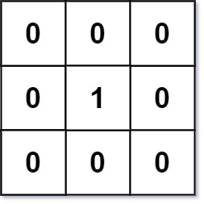
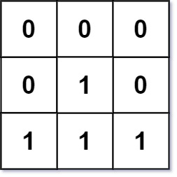

# [01 Matrix](https://leetcode.com/problems/01-matrix/)

**Medium** | **25 minutes** | **Array, Dynamic Programming, BFS, Matrix**

**Pattern:** [Multi-Source BFS](../patterns/grid_bfs_multi_source/intuition.md)

**Practice:** [`practice/01_matrix/solution.py`](../../practice/01_matrix/solution.py)

Given an `m x n` binary matrix `mat`, return the distance of the nearest `0` for each cell.

The distance between two adjacent cells is `1`.

## Examples

### Example 1



**Input:** `mat = [[0,0,0],[0,1,0],[0,0,0]]`

**Output:** `[[0,0,0],[0,1,0],[0,0,0]]`

**Explanation:** All zeros are at distance 0 from themselves, and the 1 in the middle is 1 away from the closest 0.

### Example 2



**Input:** `mat = [[0,0,0],[0,1,0],[1,1,1]]`

**Output:** `[[0,0,0],[0,1,0],[1,2,1]]`

**Explanation:** The cells at (2,0) and (2,2) are at distance 1 from the closest 0, and the cell at (2,1) is at distance 2.

## Constraints

- `m == mat.length`
- `n == mat[i].length`
- `1 <= m, n <= 10^4`
- `1 <= m * n <= 10^4`
- `mat[i][j]` is either `0` or `1`
- There is at least one `0` in `mat`

## Solutions

### Single-Source BFS from Each Cell

```python
from collections import deque
from typing import List


class Solution:
    def updateMatrix(self, mat: List[List[int]]) -> List[List[int]]:
        m, n = len(mat), len(mat[0])
        dist = [[0] * n for _ in range(m)]
        for i in range(m):
            for j in range(n):
                if mat[i][j] == 1:
                    dist[i][j] = self.bfs(mat, i, j, m, n)
        return dist

    def bfs(self, mat: List[List[int]], i: int, j: int, m: int, n: int) -> int:
        visited = [[False] * n for _ in range(m)]
        queue = deque([(i, j, 0)])
        visited[i][j] = True
        while queue:
            x, y, d = queue.popleft()
            if mat[x][y] == 0:
                return d
            for dx, dy in [(-1, 0), (1, 0), (0, -1), (0, 1)]:
                nx, ny = x + dx, y + dy
                if 0 <= nx < m and 0 <= ny < n and not visited[nx][ny]:
                    visited[nx][ny] = True
                    queue.append((nx, ny, d + 1))
        return 0
```

#### Approach

Treat each `1`-cell independently and search outward from it for the closest `0`.

1. Allocate a `dist` matrix of zeros; cells that already hold `0` keep distance `0`.
2. For every cell containing `1`, run a breadth-first search starting at that cell.
3. BFS explores the grid level by level, so the first `0` it dequeues sits at the
   minimum distance; return that level as the cell's answer.
4. Store each result in `dist` and return the completed matrix.

Because BFS expands in order of increasing distance, the first `0` reached is
guaranteed to be the nearest one, which makes the per-cell answer correct.

#### Time and Space Complexity Analysis

##### Time Complexity: `O((mn)^2)`

Each of the up to `mn` cells containing `1` launches a BFS that can visit every
one of the `mn` cells, so the total work is `O(mn * mn) = O((mn)^2)`.

##### Space Complexity: `O(mn)`

Each BFS allocates a fresh `visited` matrix and a queue, both bounded by the grid
size `mn`. The allocation is reused per call, so peak auxiliary space is `O(mn)`.

#### Key Insights

- Simple to understand because each cell is solved in isolation.
- Extremely inefficient for large inputs and will hit Time Limit Exceeded on
  LeetCode for big matrices.
- A single BFS from each source recomputes overlapping work that the multi-source
  variant shares.

### Two-Pass Dynamic Programming

```python
from typing import List


class Solution:
    def updateMatrix(self, mat: List[List[int]]) -> List[List[int]]:
        m, n = len(mat), len(mat[0])
        dist = [[float('inf')] * n for _ in range(m)]
        # First pass: top-left to bottom-right.
        for i in range(m):
            for j in range(n):
                if mat[i][j] == 0:
                    dist[i][j] = 0
                else:
                    if i > 0:
                        dist[i][j] = min(dist[i][j], dist[i - 1][j] + 1)
                    if j > 0:
                        dist[i][j] = min(dist[i][j], dist[i][j - 1] + 1)
        # Second pass: bottom-right to top-left.
        for i in range(m - 1, -1, -1):
            for j in range(n - 1, -1, -1):
                if i < m - 1:
                    dist[i][j] = min(dist[i][j], dist[i + 1][j] + 1)
                if j < n - 1:
                    dist[i][j] = min(dist[i][j], dist[i][j + 1] + 1)
        return dist
```

#### Approach

The nearest `0` reaches a cell from one of four directions, so its distance can be
built up by combining two directional sweeps.

1. Initialize `dist` to infinity everywhere; set each `0`-cell to distance `0`.
2. First pass moves top-left to bottom-right, considering only the top and left
   neighbors: `dist[i][j] = min(dist[i][j], dist[i-1][j] + 1, dist[i][j-1] + 1)`.
3. Second pass moves bottom-right to top-left, considering only the bottom and
   right neighbors: `dist[i][j] = min(dist[i][j], dist[i+1][j] + 1, dist[i][j+1] + 1)`.
4. After both passes every cell has seen the best path from all four directions.

The shortest path to a `0` is monotone in Manhattan steps, so splitting it into a
forward pass (top and left) and a backward pass (bottom and right) captures every
possible approach direction.

#### Time and Space Complexity Analysis

##### Time Complexity: `O(mn)`

Two sweeps over the grid, each visiting every cell once and doing constant work
per cell, give `O(mn)`.

##### Space Complexity: `O(mn)`

A single `dist` matrix of size `mn` is allocated; no queue or recursion stack is
used.

#### Key Insights

- No queue is needed; two directional sweeps suffice.
- Both passes are required: the first fixes distances coming from above and the
  left, and the second corrects them using neighbors below and to the right.
- Slightly less intuitive than BFS, but equally efficient and queue-free.

### Multi-Source BFS

```python
from collections import deque
from typing import List


class Solution:
    def updateMatrix(self, mat: List[List[int]]) -> List[List[int]]:
        m, n = len(mat), len(mat[0])
        dist = [[float('inf')] * n for _ in range(m)]
        queue = deque()
        # Seed the queue with every 0-cell at distance 0.
        for i in range(m):
            for j in range(n):
                if mat[i][j] == 0:
                    dist[i][j] = 0
                    queue.append((i, j))
        directions = [(-1, 0), (1, 0), (0, -1), (0, 1)]
        while queue:
            i, j = queue.popleft()
            for di, dj in directions:
                ni, nj = i + di, j + dj
                if 0 <= ni < m and 0 <= nj < n and dist[ni][nj] > dist[i][j] + 1:
                    dist[ni][nj] = dist[i][j] + 1
                    queue.append((ni, nj))
        return dist
```

#### Approach

Run a single BFS that starts from every `0`-cell at the same time, letting the
distance field grow outward in lockstep.

1. Initialize `dist` to infinity, then set every `0`-cell to `0` and enqueue it.
2. Pop a cell and relax each of its four neighbors: if reaching the neighbor
   through the current cell is shorter, update its distance and enqueue it.
3. Because all sources start at distance `0` and the queue processes cells in
   non-decreasing distance order, the first time a `1`-cell is finalized it holds
   the minimum distance to any `0`.
4. Continue until the queue drains, then return `dist`.

Conceptually this is a single BFS over a graph augmented with a virtual super-source
connected to all zeros, which yields the shortest distance to the nearest `0` for
every cell at once.

#### Time and Space Complexity Analysis

##### Time Complexity: `O(mn)`

Every cell is enqueued and dequeued at most once, and each dequeue inspects four
neighbors, so the total work is linear in the grid size `mn`.

##### Space Complexity: `O(mn)`

The `dist` matrix is size `mn`, and the queue can hold up to `mn` cells in the
worst case.

#### Key Insights

- Starting BFS from all zeros at once shares work across sources and guarantees
  optimal distances in a single sweep.
- Using `collections.deque` keeps each dequeue `O(1)`; a list with `pop(0)` would
  degrade to `O(n)` per removal.
- This is the canonical shortest-path framing and scales cleanly to the largest
  constraints.

## Comparison of Solutions

### Time Complexity

- **Single-Source BFS from Each Cell**: `O((mn)^2)` - a full BFS over the grid is launched from every 1-cell.
- **Two-Pass Dynamic Programming**: `O(mn)` - two sweeps, each visiting every cell a constant number of times.
- **Multi-Source BFS**: `O(mn)` - each cell is enqueued and processed at most once.

### Space Complexity

- **Single-Source BFS from Each Cell**: `O(mn)` - visited matrix and queue allocated per BFS call.
- **Two-Pass Dynamic Programming**: `O(mn)` - distance matrix only, no auxiliary queue.
- **Multi-Source BFS**: `O(mn)` - distance matrix plus a queue that can hold all cells.

### Trade-offs

- The single-source BFS from each 1 gains conceptual simplicity (treat each
  1-cell independently) but gives up all practicality, collapsing to quadratic
  time and causing Time Limit Exceeded on large grids.
- The two-pass DP and multi-source BFS both reach the optimal `O(mn)` bound; the
  BFS is the more natural fit for a shortest-path framing, while the DP trades the
  queue for two simple directional sweeps.
- The two-pass DP gives up the shortest-path mental model in exchange for a purely
  iterative, queue-free implementation.
- Multi-source BFS gains intuitiveness and an obvious correctness argument but pays
  for an explicit queue.

### When to Use Each

- **Single-Source BFS from Each Cell**: Only for learning or tiny grids; never in interviews or production.
- **Two-Pass Dynamic Programming**: When you prefer an iterative solution with no extra queue and want minimal auxiliary structure.
- **Multi-Source BFS**: When you want the canonical shortest-path approach and are comfortable reasoning with a queue (recommended).

### Optimization Notes

- Multi-source BFS and the two-pass DP are the two recommended, optimal solutions; choose by comfort with BFS versus DP.
- In multi-source BFS, prefer `collections.deque` over a list so that dequeuing is `O(1)` rather than the `O(n)` cost of `list.pop(0)`.
- The DP relies on processing order: the first pass fixes distances from the top and left, and the second pass corrects them using bottom and right neighbors, so both passes are required for correctness.
- Avoid the per-1-cell BFS variant entirely; its `O((mn)^2)` cost guarantees Time Limit Exceeded on the largest constraints.
