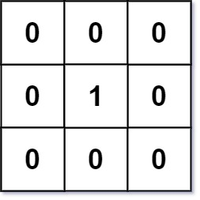
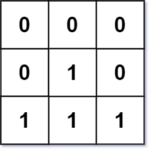

# [01 Matrix](https://leetcode.com/problems/01-matrix/)

**Medium** | **25 minutes** | **Array, Dynamic Programming, BFS, Matrix**

**Pattern:** [Multi-Source BFS](../patterns/grid_bfs_multi_source/intuition.md)

**Algorithm:** [Breadth-first search](https://en.wikipedia.org/wiki/Breadth-first_search) · [Dynamic programming](https://en.wikipedia.org/wiki/Dynamic_programming)

**Practice:** [`practice/01_matrix/solution.py`](../../practice/01_matrix/solution.py)

Given an `m x n` binary matrix `mat`, return the distance of the nearest `0` for each cell.

The distance between two adjacent cells is `1`.

## Examples

### Example 1



**Input:** `mat = [[0,0,0],[0,1,0],[0,0,0]]`

**Output:** `[[0,0,0],[0,1,0],[0,0,0]]`

**Explanation:** All zeros are at distance 0 from themselves, and the 1 in the middle is 1 away from the closest 0.

### Example 2



**Input:** `mat = [[0,0,0],[0,1,0],[1,1,1]]`

**Output:** `[[0,0,0],[0,1,0],[1,2,1]]`

**Explanation:** The cells at (2,0) and (2,2) are at distance 1 from the closest 0, and the cell at (2,1) is at distance 2.

## Constraints

- `m == mat.length`
- `n == mat[i].length`
- `1 <= m, n <= 10^4`
- `1 <= m * n <= 10^4`
- `mat[i][j]` is either `0` or `1`
- There is at least one `0` in `mat`

## Deriving the Solution

Every solution reads the problem as computing a shortest-distance field: each cell
needs the length of the shortest four-directional path to some `0`. The approaches
differ only in who does the searching: each `1`-cell on its own, a pair of
directional sweeps, or all the `0`-cells at once.

1. **Start literal.** Ask the question cell by cell: from each `1`, search outward
   level by level until a `0` appears. Correct, but each search can scan the whole
   grid, costing `O((mn)^2)`: see
   [Single-Source BFS from Each Cell](#single-source-bfs-from-each-cell).
2. **Spot the waste.** Neighboring `1`-cells explore nearly the same region, and
   none of that work is shared. The distance field obeys a local rule (a cell's
   distance is one more than its closest neighbor's), yet every BFS recomputes it
   from nothing.
3. **Evaluate the local rule with sweeps.** The rule is circular as written (each
   cell depends on all four neighbors), but splitting the neighbors by direction
   breaks the cycle: a top-left-to-bottom-right pass and a bottom-right-to-top-left
   pass settle every cell in `O(mn)`: see
   [Two-Pass Dynamic Programming](#two-pass-dynamic-programming).
4. **Flip the search instead.** Return to BFS but reverse its direction: one search
   that starts from every `0` simultaneously grows the distance field outward in
   lockstep, finalizing each cell the first time the frontier reaches it, also in
   `O(mn)`: see [Multi-Source BFS](#multi-source-bfs).

## Solutions

### Single-Source BFS from Each Cell

#### Derivation

The problem asks, for each cell, "how far is the nearest `0`?", so the most literal
idea is to answer exactly that question, one cell at a time. Expanding outward from
a `1`-cell ring by ring visits cells in order of increasing distance, which is
precisely what [breadth-first search](https://en.wikipedia.org/wiki/Breadth-first_search)
does: the first `0` it dequeues is therefore guaranteed to be the nearest one,
which makes the per-cell answer correct.

1. Allocate a `dist` matrix of zeros; cells that already hold `0` keep distance `0`.
2. For every cell containing `1`, run a `bfs` starting at that cell, tracking a
   `visited` matrix and a queue of `(x, y, d)` entries.
3. BFS explores the grid level by level, so the first `0` it dequeues sits at the
   minimum distance; return that level `d` as the cell's answer.
4. Store each result in `dist` and return the completed matrix.

#### Walkthrough

Let us watch this first solution run on Example 2, since Example 1 has only a
single `1`-cell that resolves in one step. The input is
`mat = [[0,0,0],[0,1,0],[1,1,1]]`, so the four `1`-cells are at `(1,1)`, `(2,0)`,
`(2,1)`, and `(2,2)`. The outer loops set `dist` to `0` for every `0`-cell and
launch a `bfs` from each `1`-cell. Cells are tried in row-major order, and each
`bfs` enqueues neighbors in the order `up, down, left, right`.

**`bfs` from `(1,1)`:** start the queue with `(1,1, d=0)`, marked visited.

| pop `(x,y,d)` | `mat[x][y]` | action |
| --- | --- | --- |
| `(1,1, 0)` | `1` | enqueue `(0,1, 1)`, `(2,1, 1)`, `(1,0, 1)`, `(1,2, 1)` |
| `(0,1, 1)` | `0` | hit a `0`: return `1` |

So `dist[1][1] = 1`.

**`bfs` from `(2,0)`:** start with `(2,0, 0)`.

| pop `(x,y,d)` | `mat[x][y]` | action |
| --- | --- | --- |
| `(2,0, 0)` | `1` | enqueue `(1,0, 1)`, `(2,1, 1)` |
| `(1,0, 1)` | `0` | hit a `0`: return `1` |

So `dist[2][0] = 1`.

**`bfs` from `(2,1)`:** start with `(2,1, 0)`. This is the deep case, the cell two
steps from any `0`.

| pop `(x,y,d)` | `mat[x][y]` | action |
| --- | --- | --- |
| `(2,1, 0)` | `1` | enqueue `(1,1, 1)`, `(2,0, 1)`, `(2,2, 1)` |
| `(1,1, 1)` | `1` | enqueue `(0,1, 2)`, `(1,0, 2)`, `(1,2, 2)` |
| `(2,0, 1)` | `1` | (no new unvisited neighbors) |
| `(2,2, 1)` | `1` | (no new unvisited neighbors) |
| `(0,1, 2)` | `0` | hit a `0`: return `2` |

So `dist[2][1] = 2`. Notice BFS exhausts every cell at distance `1` (all still
`1`-cells) before reaching the `0` at distance `2`, which is exactly why the first
`0` dequeued is guaranteed to be the nearest.

**`bfs` from `(2,2)`:** start with `(2,2, 0)`.

| pop `(x,y,d)` | `mat[x][y]` | action |
| --- | --- | --- |
| `(2,2, 0)` | `1` | enqueue `(1,2, 1)`, `(2,1, 1)` |
| `(1,2, 1)` | `0` | hit a `0`: return `1` |

So `dist[2][2] = 1`.

Filling these answers into the all-zero `dist` matrix gives
`[[0,0,0],[0,1,0],[1,2,1]]`, which matches the expected Output.

#### Solution

The code is the walkthrough's per-cell search: the outer loops visit every
`1`-cell and `bfs` returns the level of the first `0` dequeued.

```python
from collections import deque
from typing import List


class Solution:
    def updateMatrix(self, mat: List[List[int]]) -> List[List[int]]:
        m, n = len(mat), len(mat[0])
        dist = [[0] * n for _ in range(m)]
        for i in range(m):
            for j in range(n):
                if mat[i][j] == 1:
                    dist[i][j] = self.bfs(mat, i, j, m, n)
        return dist

    def bfs(self, mat: List[List[int]], i: int, j: int, m: int, n: int) -> int:
        visited = [[False] * n for _ in range(m)]
        queue = deque([(i, j, 0)])
        visited[i][j] = True
        while queue:
            x, y, d = queue.popleft()
            if mat[x][y] == 0:
                return d
            for dx, dy in [(-1, 0), (1, 0), (0, -1), (0, 1)]:
                nx, ny = x + dx, y + dy
                if 0 <= nx < m and 0 <= ny < n and not visited[nx][ny]:
                    visited[nx][ny] = True
                    queue.append((nx, ny, d + 1))
        return 0
```

#### Time and Space Complexity Analysis

##### Time Complexity: `O((mn)^2)`

Each of the up to `mn` cells containing `1` launches a BFS that can visit every
one of the `mn` cells, so the total work is `O(mn * mn) = O((mn)^2)`.

##### Space Complexity: `O(mn)`

Each BFS allocates a fresh `visited` matrix and a queue, both bounded by the grid
size `mn`. The allocation is reused per call, so peak auxiliary space is `O(mn)`.

#### Key Insights

- Simple to understand because each cell is solved in isolation.
- Extremely inefficient for large inputs and will hit Time Limit Exceeded on
  LeetCode for big matrices.
- A single BFS from each source recomputes overlapping work that the multi-source
  variant shares.

### Two-Pass Dynamic Programming

#### Derivation

The per-cell BFS pays for every cell separately: adjacent `1`-cells re-explore the
same region and share none of the work. The repair is to ask what one cell's answer
tells us about its neighbor's. The shortest route from a cell to a `0` steps first
into some neighbor, whose own distance must be exactly one smaller, so the distance
field satisfies a local rule: a cell's distance is `1 +` the minimum of its four
neighbors' distances (and `0` on a `0`-cell). That rule is circular as written,
since each cell depends on neighbors not yet computed, but splitting the
neighborhood by direction breaks the cycle: a forward sweep resolves the up and
left dependencies, and a backward sweep the down and right ones.

1. Initialize `dist` to infinity everywhere; set each `0`-cell to distance `0`.
2. First pass moves top-left to bottom-right, considering only the top and left
   neighbors: `dist[i][j] = min(dist[i][j], dist[i-1][j] + 1, dist[i][j-1] + 1)`.
3. Second pass moves bottom-right to top-left, considering only the bottom and
   right neighbors: `dist[i][j] = min(dist[i][j], dist[i+1][j] + 1, dist[i][j+1] + 1)`.
4. After both passes every cell has seen the best path from all four directions.

The shortest path to a `0` is monotone in Manhattan steps, so splitting it into a
forward pass (top and left) and a backward pass (bottom and right) captures every
possible approach direction.

#### Recurrence

The quantity being computed is a distance transform under the
[taxicab metric](https://en.wikipedia.org/wiki/Taxicab_geometry):

$$
\text{dist}[i][j] = \min_{\substack{(a,b) \\ \text{mat}[a][b] = 0}}
\bigl(|i - a| + |j - b|\bigr)
$$

```text
dist[i][j] = min(abs(i - a) + abs(j - b)) over all (a, b) with mat[a][b] == 0
```

Stated that way it looks quadratic, but the shortest route to a `0` steps
through a neighbor whose own distance is one smaller, which gives a local rule:

$$
\text{dist}[i][j] =
\begin{cases}
0, & \text{mat}[i][j] = 0 \\[4pt]
1 + \displaystyle\min_{(a,b)\,\in\,N(i,j)} \text{dist}[a][b], & \text{otherwise}
\end{cases}
$$

```text
dist[i][j] = 0,                     if mat[i][j] == 0
dist[i][j] = 1 + min(dist[a][b]),   otherwise
             (min over the four neighbors (a, b) of (i, j))
```

where \(N(i,j)\) is the four-neighborhood. This is circular as written (each
cell depends on all four neighbors, including ones not yet computed), so it
cannot be evaluated in a single sweep. Splitting the neighborhood by direction
breaks the cycle: the forward pass resolves the up and left dependencies, and
the backward pass the down and right ones. Every shortest path is monotone in
each axis, so one pass in each direction suffices.

#### Walkthrough

On both official Examples the forward pass alone already produces the final
answer, because every `1`-cell has a nearest `0` above or to its left, so the
backward pass never changes a cell. To see the second pass earn its keep we use a
small tailored input instead: `mat = [[1,1],[0,1]]`, whose only `0` sits below and
left of the top row.

The forward pass walks row-major, reading only the top and left neighbors:

```text
init         dist = [[inf, inf], [inf, inf]]    only 0-cells would start at 0
(0,0) mat=1  no top, no left                    dist[0][0] stays inf
(0,1) mat=1  left is inf, inf + 1 = inf         dist[0][1] stays inf
(1,0) mat=0  zero cell                          dist[1][0] = 0
(1,1) mat=1  min(top inf + 1, left 0 + 1)       dist[1][1] = 1
```

After the forward pass `dist = [[inf, inf], [0, 1]]`: the whole top row is still
infinite, because no `0` lies above or to the left of it. The backward pass walks
bottom-right to top-left, reading only the bottom and right neighbors:

```text
(1,1)        no bottom, no right                dist[1][1] stays 1
(1,0)        right is 1, 1 + 1 = 2 > 0          dist[1][0] stays 0
(0,1)        bottom is 1, 1 + 1 = 2             dist[0][1] = 2
(0,0)        min(bottom 0 + 1, right 2 + 1)     dist[0][0] = 1
```

The final matrix is `[[1, 2], [0, 1]]`, and each value is the Manhattan distance
to the lone `0` at `(1,0)`: for instance `(0,1)` is `|0-1| + |1-0| = 2` away. The
forward pass left both top cells at infinity and the backward pass repaired both,
which is exactly why the two passes are only correct together.

#### Solution

The code is the two sweeps from the walkthrough: the forward pass reads the top
and left neighbors, the backward pass the bottom and right ones.

```python
from typing import List


class Solution:
    def updateMatrix(self, mat: List[List[int]]) -> List[List[int]]:
        m, n = len(mat), len(mat[0])
        dist = [[float('inf')] * n for _ in range(m)]
        # First pass: top-left to bottom-right.
        for i in range(m):
            for j in range(n):
                if mat[i][j] == 0:
                    dist[i][j] = 0
                else:
                    if i > 0:
                        dist[i][j] = min(dist[i][j], dist[i - 1][j] + 1)
                    if j > 0:
                        dist[i][j] = min(dist[i][j], dist[i][j - 1] + 1)
        # Second pass: bottom-right to top-left.
        for i in range(m - 1, -1, -1):
            for j in range(n - 1, -1, -1):
                if i < m - 1:
                    dist[i][j] = min(dist[i][j], dist[i + 1][j] + 1)
                if j < n - 1:
                    dist[i][j] = min(dist[i][j], dist[i][j + 1] + 1)
        return dist
```

#### Time and Space Complexity Analysis

##### Time Complexity: `O(mn)`

Two sweeps over the grid, each visiting every cell once and doing constant work
per cell, give `O(mn)`.

##### Space Complexity: `O(mn)`

A single `dist` matrix of size `mn` is allocated; no queue or recursion stack is
used.

#### Key Insights

- No queue is needed; two directional sweeps suffice.
- Both passes are required: the first fixes distances coming from above and the
  left, and the second corrects them using neighbors below and to the right.
- Slightly less intuitive than BFS, but equally efficient and queue-free.

### Multi-Source BFS

#### Derivation

The two-pass DP reaches `O(mn)` but gives up the shortest-path mental model that
made the per-cell BFS easy to trust. There is a repair that keeps the model: the
waste in the first approach is not the searching itself but its direction. Many
searches run from the `1`-cells toward the `0`s; run one
[BFS](https://en.wikipedia.org/wiki/Breadth-first_search) the other way instead,
starting from every `0`-cell at the same time, and let the distance field grow
outward in lockstep.

1. Initialize `dist` to infinity, then set every `0`-cell to `0` and enqueue it.
2. Pop a cell and relax each of its four neighbors: if reaching the neighbor
   through the current cell is shorter (`dist[ni][nj] > dist[i][j] + 1`), update
   its distance and enqueue it.
3. Because all sources start at distance `0` and the queue processes cells in
   non-decreasing distance order, the first time a `1`-cell is finalized it holds
   the minimum distance to any `0`.
4. Continue until the queue drains, then return `dist`.

Conceptually this is a single BFS over a graph augmented with a virtual super-source
connected to all zeros, which yields the shortest distance to the nearest `0` for
every cell at once.

#### Walkthrough

Let us run the seeded search on Example 2: `mat = [[0,0,0],[0,1,0],[1,1,1]]`. The
seeding loop sets the five `0`-cells to distance `0` and enqueues them in row-major
order, leaving the four `1`-cells at infinity:

```text
seed         queue = (0,0) (0,1) (0,2) (1,0) (1,2)    all at dist 0
pop (0,0)    neighbors (1,0), (0,1) already 0          no change
pop (0,1)    (1,1): inf > 0 + 1                        dist[1][1] = 1, enqueue
pop (0,2)    neighbors (1,2), (0,1) already settled    no change
pop (1,0)    (2,0): inf > 0 + 1                        dist[2][0] = 1, enqueue
pop (1,2)    (2,2): inf > 0 + 1                        dist[2][2] = 1, enqueue
pop (1,1)    (2,1): inf > 1 + 1                        dist[2][1] = 2, enqueue
pop (2,0)    (2,1): 2 not > 1 + 1                      no change
pop (2,2)    (2,1): 2 not > 1 + 1                      no change
pop (2,1)    every neighbor already closer             queue drains
```

The queue processes all five distance-`0` cells before any distance-`1` cell, so
each `1`-cell is finalized the first time the frontier touches it: `(1,1)`,
`(2,0)`, and `(2,2)` at distance `1`, then `(2,1)` at distance `2` through
`(1,1)`. When `(2,0)` and `(2,2)` later offer `(2,1)` the same distance `2`, the
`>` test rejects the update, so no cell is ever enqueued twice with a worse value.

The final field is `dist = [[0,0,0],[0,1,0],[1,2,1]]`, matching the expected
Output.

#### Solution

The code is the walkthrough's seeded queue: every `0`-cell starts at distance `0`
and each pop relaxes its four neighbors.

```python
from collections import deque
from typing import List


class Solution:
    def updateMatrix(self, mat: List[List[int]]) -> List[List[int]]:
        m, n = len(mat), len(mat[0])
        dist = [[float('inf')] * n for _ in range(m)]
        queue = deque()
        # Seed the queue with every 0-cell at distance 0.
        for i in range(m):
            for j in range(n):
                if mat[i][j] == 0:
                    dist[i][j] = 0
                    queue.append((i, j))
        directions = [(-1, 0), (1, 0), (0, -1), (0, 1)]
        while queue:
            i, j = queue.popleft()
            for di, dj in directions:
                ni, nj = i + di, j + dj
                if 0 <= ni < m and 0 <= nj < n and dist[ni][nj] > dist[i][j] + 1:
                    dist[ni][nj] = dist[i][j] + 1
                    queue.append((ni, nj))
        return dist
```

#### Time and Space Complexity Analysis

##### Time Complexity: `O(mn)`

Every cell is enqueued and dequeued at most once, and each dequeue inspects four
neighbors, so the total work is linear in the grid size `mn`.

##### Space Complexity: `O(mn)`

The `dist` matrix is size `mn`, and the queue can hold up to `mn` cells in the
worst case.

#### Key Insights

- Starting BFS from all zeros at once shares work across sources and guarantees
  optimal distances in a single sweep.
- Using `collections.deque` keeps each dequeue `O(1)`; a list with `pop(0)` would
  degrade to `O(n)` per removal.
- This is the canonical shortest-path framing and scales cleanly to the largest
  constraints.

## Comparison of Solutions

### Time Complexity

- **Single-Source BFS from Each Cell**: `O((mn)^2)` - a full BFS over the grid is launched from every 1-cell.
- **Two-Pass Dynamic Programming**: `O(mn)` - two sweeps, each visiting every cell a constant number of times.
- **Multi-Source BFS**: `O(mn)` - each cell is enqueued and processed at most once.

### Space Complexity

- **Single-Source BFS from Each Cell**: `O(mn)` - visited matrix and queue allocated per BFS call.
- **Two-Pass Dynamic Programming**: `O(mn)` - distance matrix only, no auxiliary queue.
- **Multi-Source BFS**: `O(mn)` - distance matrix plus a queue that can hold all cells.

### Trade-offs

- The single-source BFS from each 1 gains conceptual simplicity (treat each
  1-cell independently) but gives up all practicality, collapsing to quadratic
  time and causing Time Limit Exceeded on large grids.
- The two-pass DP and multi-source BFS both reach the optimal `O(mn)` bound; the
  BFS is the more natural fit for a shortest-path framing, while the DP trades the
  queue for two simple directional sweeps.
- The two-pass DP gives up the shortest-path mental model in exchange for a purely
  iterative, queue-free implementation.
- Multi-source BFS gains intuitiveness and an obvious correctness argument but pays
  for an explicit queue.

### When to Use Each

- **Single-Source BFS from Each Cell**: Only for learning or tiny grids; never in interviews or production.
- **Two-Pass Dynamic Programming**: When you prefer an iterative solution with no extra queue and want minimal auxiliary structure.
- **Multi-Source BFS**: When you want the canonical shortest-path approach and are comfortable reasoning with a queue (recommended).

### Optimization Notes

- Multi-source BFS and the two-pass DP are the two recommended, optimal solutions; choose by comfort with BFS versus DP.
- In multi-source BFS, prefer `collections.deque` over a list so that dequeuing is `O(1)` rather than the `O(n)` cost of `list.pop(0)`.
- The DP relies on processing order: the first pass fixes distances from the top and left, and the second pass corrects them using bottom and right neighbors, so both passes are required for correctness.
- Avoid the per-1-cell BFS variant entirely; its `O((mn)^2)` cost guarantees Time Limit Exceeded on the largest constraints.
