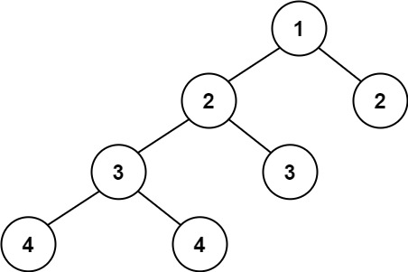

# [Balanced Binary Tree](https://leetcode.com/problems/balanced-binary-tree/)

**Easy** | **20 minutes** | **Tree, DFS, Binary Tree**

**Pattern:** [Tree Traversal](../patterns/tree/intuition.md)

**Algorithm:** [Tree traversal](https://en.wikipedia.org/wiki/Tree_traversal) · [Depth-first search](https://en.wikipedia.org/wiki/Depth-first_search)

**Practice:** [`practice/balanced_binary_tree/solution.py`](../../practice/balanced_binary_tree/solution.py)

Given a binary tree, determine if it is height-balanced.

A height-balanced binary tree is defined as a binary tree in which the left and right subtrees of every node differ in height by no more than `1`.

## Examples

### Example 1


**Input:** `root = [3,9,20,null,null,15,7]`

**Output:** `true`

### Example 2



**Input:** root = `[1,2,2,3,3,null,null,4,4]`

**Output:** `false`

### Example 3

**Input:** `root = []`

**Output:** `true`

## Constraints

- The number of nodes in the tree is in the range `[0, 5000]`.
- `-10^4 <= Node.val <= 10^4`

## Deriving the Solution

Balance is a condition on heights: at every node, the left and right subtree
heights may differ by at most `1`. Every solution below therefore computes
subtree heights and checks that condition at each node; they differ only in
*when* the heights are computed.

1. **Start literal.** Execute the definition as written: at each node, measure
   the height of both subtrees with a helper, compare, and recurse into the
   children. Correct, but the helper re-walks the same nodes at every ancestor
   level, costing `O(n^2)` on a skewed tree: see
   [Top-Down Recursion](#top-down-recursion).
2. **Spot the waste.** A node's height is just `1` plus the larger child
   height, so heights are naturally built from the bottom up. The literal
   version throws that structure away and remeasures whole subtrees from
   scratch at every level.
3. **Fuse the two passes.** Compute heights in a single post-order traversal
   and check balance at the moment each node's child heights are in hand,
   smuggling "unbalanced" upward as the sentinel height `-1`. One pass, `O(n)`:
   see [Bottom-Up Recursion](#bottom-up-recursion).
4. **Drop the recursion.** The same post-order visit order can be driven by an
   explicit stack, which removes the interpreter's recursion limit as a failure
   mode on pathologically deep trees: see
   [Iterative Post-Order](#iterative-post-order).

## Solutions

The solutions below assume the standard LeetCode node definition and
`from typing import Optional`:

```python
class TreeNode:
    def __init__(self, val=0, left=None, right=None):
        self.val = val
        self.left = left
        self.right = right
```

### Top-Down Recursion

#### Derivation

The definition itself is executable: a tree is balanced when the subtree
heights of *every* node differ by at most `1`. So the most direct question to
ask at each node is "does the condition hold here, and in both children?",
answered with a height helper and a [recursive](https://en.wikipedia.org/wiki/Recursion_(computer_science)) call into each child:

1. An empty tree is balanced, so return `True` for a null `root`.
2. Compute the height of the left and right subtrees and compare them. If they
   differ by more than `1`, the current node violates the balance condition, so
   return `False`.
3. Otherwise, recursively require that both the left and right subtrees are also
   balanced.

The `height` helper computes the number of nodes on the longest root-to-leaf
path of a subtree, recurring into both children and taking the larger result.

#### Walkthrough

Let us watch this top-down version run on Example 1, `root = [3,9,20,null,null,15,7]`.
That tree looks like this, where `9` is a leaf and `20` has two leaf children:

```
        3
       / \
      9    20
          /  \
        15    7
```

`isBalanced(node)` does two things at each node: it computes the height of the
left and right subtrees with the `height` helper, compares them, and (if they are
close enough) recurses into both children. Recall `height` returns `0` for an
empty subtree and `1 + max(left, right)` otherwise, so a single leaf has height
`1`.

We trace each `isBalanced` call in the order they run. The `diff` column is
`abs(height(left) - height(right))`; a value greater than `1` would return
`False` on the spot.

| Step | `isBalanced(node)` | `height(left)` | `height(right)` | `diff` | Action |
|------|--------------------|----------------|-----------------|--------|--------|
| 1 | `3` | `1` (just `9`) | `2` (`20`, then `15`/`7`) | `1` | `diff <= 1`: recurse into `9`, then `20` |
| 2 | `9` | `0` (no child) | `0` (no child) | `0` | `diff <= 1`: recurse into its `None` children, both return `True` |
| 3 | `20` | `1` (just `15`) | `1` (just `7`) | `0` | `diff <= 1`: recurse into `15`, then `7` |
| 4 | `15` | `0` | `0` | `0` | `diff <= 1`: both children `None`, return `True` |
| 5 | `7` | `0` | `0` | `0` | `diff <= 1`: both children `None`, return `True` |

No node ever produced a `diff` greater than `1`, so no call returned `False`. The
`and` at node `3` chains the results back up: node `20` is balanced because `15`
and `7` are, node `3` is balanced because `9` and `20` are. The top call returns
`True`, which matches the expected Output `true`.

#### Solution

The code is the definition written down: a height comparison at the current
node, then recursion into both children.

```python
class Solution:
    def isBalanced(self, root: Optional[TreeNode]) -> bool:
        if not root:
            return True
        if abs(self.height(root.left) - self.height(root.right)) > 1:
            return False
        return self.isBalanced(root.left) and self.isBalanced(root.right)

    def height(self, root: Optional[TreeNode]) -> int:
        if not root:
            return 0
        return 1 + max(self.height(root.left), self.height(root.right))
```

#### Time and Space Complexity Analysis

##### Time Complexity: `O(n^2)`

The `height` helper visits every node of a subtree, and `isBalanced` calls it at
every node. In the worst case (a skewed tree) the same nodes are revisited at
every level, producing quadratic work. For a balanced tree the cost is closer to
`O(n log n)`.

##### Space Complexity: `O(h)`

Where `h` is the height of the tree. The recursion stack grows as deep as the
longest path: `O(log n)` for a balanced tree and `O(n)` for a skewed one.

#### Key Insights

- Mirrors the definition directly, which makes it the easiest version to derive.
- Separating height calculation from the balance check keeps each helper simple.
- The redundant height recomputation at each level is the source of the
  quadratic cost and motivates the bottom-up optimization.

### Bottom-Up Recursion

#### Derivation

The top-down version is slow because it recomputes heights: `height` walks an
entire subtree, and every ancestor of that subtree walks it again. Yet a node's
height is only `1` plus the larger child height, so a single [post-order traversal](https://en.wikipedia.org/wiki/Tree_traversal)
that hands each subtree's height upward computes every height exactly once. The
balance check rides along in the same pass, reusing a sentinel value to report
imbalance instead of a height:

1. The inner `check` returns the height of a balanced subtree, or `-1` if any
   part of that subtree is unbalanced.
2. An empty subtree has height `0`.
3. Evaluate the left child first. If it already reported `-1`, propagate `-1`
   upward immediately without inspecting the right child.
4. Evaluate the right child with the same early exit.
5. If the two child heights differ by more than `1`, this node is unbalanced, so
   return `-1`.
6. Otherwise return the real height, `1 + max(left, right)`.

The tree is balanced exactly when `check(root)` is not `-1`.

#### Recurrence

Balance is a condition that must hold at *every* node, not just the root, with
\(h\) the usual height function:

$$
\text{balanced}(T) = \bigwedge_{v \in T} \Bigl(\ \bigl|\,h(v.\text{left}) - h(v.\text{right})\,\bigr| \le 1 \ \Bigr)
$$

```text
balanced(T) == abs(h(v.left) - h(v.right)) <= 1  for all nodes v in T
        where h(null) = 0
              h(v)    = 1 + max(h(v.left), h(v.right))
```

Evaluating the \(\bigwedge\) and the \(h\) separately is what makes the top-down
version \(O(n^2)\): every node recomputes the heights beneath it. This solution
fuses them by overloading the return value. `check` yields a real height when
the subtree is balanced and the sentinel `-1` when it is not:

$$
\text{check}(v) =
\begin{cases}
0, & v = \text{null} \\[4pt]
-1, & \text{check}(v.\text{left}) = -1 \ \vee \ \text{check}(v.\text{right}) = -1 \\[4pt]
-1, & \bigl|\,\text{check}(v.\text{left}) - \text{check}(v.\text{right})\,\bigr| > 1 \\[4pt]
1 + \max\bigl(\text{check}(v.\text{left}),\ \text{check}(v.\text{right})\bigr), & \text{otherwise}
\end{cases}
$$

```text
check(null) = 0
check(v)    = -1, if check(v.left) == -1 or check(v.right) == -1
check(v)    = -1, if abs(check(v.left) - check(v.right)) > 1
check(v)    = 1 + max(check(v.left), check(v.right)), otherwise
```

The sentinel is safe because a genuine height is never negative, so `-1` cannot
collide with a real answer. Once it appears it propagates straight to the root,
which is the short-circuit that makes \(\bigwedge\) cost a single pass.

#### Walkthrough

Example 1 is balanced, so the sentinel never fires there. Example 2,
`root = [1,2,2,3,3,null,null,4,4]`, is the official example that exercises it:

```
          1
         / \
        2   2
       / \
      3   3
     / \
    4   4
```

`check` runs post-order, so children finish before their parents. Each line
below is one call *finishing*, in the order the recursion resolves them, with
the child heights it received and the value it returns:

```text
check(4)   left=0, right=0 -> 1     left leaf 4, both children null
check(4)   left=0, right=0 -> 1     right leaf 4
check(3)   left=1, right=1 -> 2     the 3 holding both 4s
check(3)   left=0, right=0 -> 1     the leaf 3
check(2)   left=2, right=1 -> 3     left 2: heights differ by 1, still fine
check(2)   left=0, right=0 -> 1     right 2, a leaf
check(1)   left=3, right=1 -> -1    diff 2 > 1: sentinel
```

At the root, the left subtree reports height `3` and the right reports `1`.
The difference `2` exceeds `1`, so `check(1)` returns the sentinel `-1`. Here
the imbalance surfaced at the root itself; had it appeared deeper, the
`left == -1` and `right == -1` early exits would have carried the sentinel
straight up without visiting any further nodes. `isBalanced` then evaluates
`check(root) != -1`, which is `False`, matching the expected Output `false`.

#### Solution

The code is the walkthrough's `check` written down: post-order heights with the
`-1` sentinel short-circuiting upward.

```python
class Solution:
    def isBalanced(self, root: Optional[TreeNode]) -> bool:
        def check(node: Optional[TreeNode]) -> int:
            if not node:
                return 0
            left = check(node.left)
            if left == -1:
                return -1
            right = check(node.right)
            if right == -1:
                return -1
            if abs(left - right) > 1:
                return -1
            return 1 + max(left, right)

        return check(root) != -1
```

#### Time and Space Complexity Analysis

##### Time Complexity: `O(n)`

Each node is visited exactly once, and only constant-time work happens per node
because the height and balance check are combined.

##### Space Complexity: `O(h)`

Where `h` is the height of the tree. Only the recursion stack is used: `O(log n)`
for a balanced tree and `O(n)` for a skewed one.

#### Key Insights

- The `-1` sentinel doubles as both "unbalanced" and an impossible height,
  letting one return value carry both pieces of information.
- Post-order traversal processes children before parents, so each height is
  computed once and reused.
- Early termination stops as soon as the first unbalanced subtree is found.

### Iterative Post-Order

#### Derivation

The bottom-up pass is optimal, but it leans on the call stack: a skewed tree of
`5000` nodes recurses `5000` deep, and much deeper trees would hit the
interpreter's recursion limit. The repair is to reproduce the same bottom-up
logic without recursion: an explicit [post-order traversal](https://en.wikipedia.org/wiki/Tree_traversal) with a manual stack,
recording each node's height in a dictionary as it is finished:

1. Keep a `heights` map seeded with `None -> 0` so absent children contribute a
   height of `0`.
2. Walk left as far as possible, pushing every node onto the stack.
3. When the left spine is exhausted, peek at the top of the stack. If it has a
   right child that has not been processed yet, descend into that right subtree.
4. Otherwise both children are finished, so look up their recorded heights. If
   they differ by more than `1`, return `False` immediately.
5. Record the node's height as `1 + max(left, right)`, mark it visited, and pop
   it.
6. If the traversal completes without finding an imbalance, the tree is balanced.

The `last_visited` pointer distinguishes "about to descend right" from "returning
from the right subtree", which is what makes an iterative post-order traversal
correct.

#### Walkthrough

Let us drive the stack by hand on Example 1, `root = [3,9,20,null,null,15,7]`
(the tree drawn in the Top-Down walkthrough). Each line is one event: either a
push while walking left, or a node *finishing* (its height recorded, then
popped). `finish v` reads `left_h` and `right_h` from `heights` and stores
`heights[v] = 1 + max(left_h, right_h)`:

```text
push 3, push 9                              walk left from the root
finish 9    left_h=0, right_h=0 -> heights[9]=1    no children; stack [3]
peek 3      right child 20 not visited -> descend right
push 20, push 15                            walk left inside the right subtree
finish 15   left_h=0, right_h=0 -> heights[15]=1   stack [3, 20]
peek 20     right child 7 not visited -> descend right
push 7
finish 7    left_h=0, right_h=0 -> heights[7]=1    stack [3, 20]
peek 20     last_visited is 7 -> both children done
finish 20   left_h=1, right_h=1 -> heights[20]=2   stack [3]
peek 3      last_visited is 20 -> both children done
finish 3    left_h=1, right_h=2, diff=1 -> heights[3]=3   stack []
```

Every `finish` compared its two child heights before recording; none differed
by more than `1`, so no early `False` fired. The stack is empty and `node` is
`None`, so the loop ends and the function returns `True`, matching the expected
Output `true`. Note the finish order `9, 15, 7, 20, 3` is exactly the
post-order in which the recursive `check` resolves its calls.

#### Solution

The code is the walkthrough's push/finish loop, with `last_visited` telling a
first arrival at a node apart from the return from its right subtree.

```python
class Solution:
    def isBalanced(self, root: Optional[TreeNode]) -> bool:
        heights = {None: 0}
        stack = []
        node = root
        last_visited = None
        while stack or node:
            if node:
                stack.append(node)
                node = node.left
            else:
                peek = stack[-1]
                if peek.right and last_visited is not peek.right:
                    node = peek.right
                else:
                    left_h = heights[peek.left]
                    right_h = heights[peek.right]
                    if abs(left_h - right_h) > 1:
                        return False
                    heights[peek] = 1 + max(left_h, right_h)
                    last_visited = stack.pop()
        return True
```

#### Time and Space Complexity Analysis

##### Time Complexity: `O(n)`

Each node is pushed and popped once, and the per-node work is constant.

##### Space Complexity: `O(n)`

The stack holds at most one root-to-leaf path at a time, which is `O(h)`, but
the `heights` map is never pruned: every node keeps its entry after it is
finished, so the map grows to one entry per node and dominates at `O(n)`.
Deleting child entries once a parent's height is recorded would bring this back
down to `O(h)`.

#### Key Insights

- Converts the recursion into an explicit stack, removing the call-depth limit
  as a failure mode for very deep trees.
- Storing finished heights in a map is the iterative equivalent of returning a
  height from a recursive call.
- The `last_visited` sentinel is the standard trick for iterative post-order
  traversal and is essential for visiting each node only after both children.

## Comparison of Solutions

### Time Complexity

- **Top-Down Recursion**: `O(n^2)` - recomputes subtree heights at every level.
- **Bottom-Up Recursion**: `O(n)` - one combined height-and-balance pass.
- **Iterative Post-Order**: `O(n)` - same single pass, managed with an explicit
  stack.

### Space Complexity

- **Top-Down Recursion**: `O(h)` - proportional to tree height, from the
  recursion stack.
- **Bottom-Up Recursion**: `O(h)` - proportional to tree height, from the
  recursion stack.
- **Iterative Post-Order**: `O(n)` - the explicit stack is `O(h)`, but the
  unpruned `heights` map keeps an entry for every node.

### Trade-offs

- **Top-Down Recursion**: Easiest to derive from the definition, but quadratic
  on large or skewed trees.
- **Bottom-Up Recursion**: Linear and concise, at the cost of a slightly less
  obvious sentinel trick.
- **Iterative Post-Order**: Linear and immune to recursion-depth limits, at the
  cost of more bookkeeping (manual stack, `last_visited`, height map) and `O(n)`
  space for the unpruned height map.

### When to Use Each

- **Top-Down Recursion**: Small trees or when readability outweighs performance.
- **Bottom-Up Recursion**: The default choice for interviews and production code.
- **Iterative Post-Order**: Pathologically deep trees where the recursion limit
  is a real concern.

### Optimization Notes

- The bottom-up pass eliminates the redundant height recomputation that makes the
  top-down version quadratic.
- The `-1` sentinel encodes both imbalance and an impossible height in a single
  return value, enabling early termination.
- The iterative version trades the implicit call stack for an explicit one,
  delivering the same `O(n)` behavior without depending on the interpreter's
  recursion limit.
