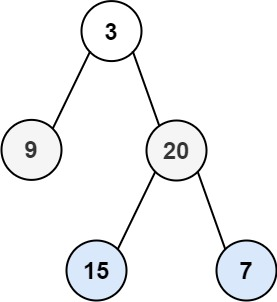

# [Binary Tree Level Order Traversal](https://leetcode.com/problems/binary-tree-level-order-traversal/)

**Medium** | **20 minutes** | **Tree, BFS, Binary Tree**

**Pattern:** [Tree Traversal](../patterns/tree/intuition.md)

**Practice:** [`practice/binary_tree_level_order_traversal/solution.py`](https://github.com/ThoDHa/grind75/blob/main/practice/binary_tree_level_order_traversal/solution.py)

Given the `root` of a binary tree, return the level order traversal of its nodes' values. (i.e., from left to right, level by level).

## Examples

### Example 1

**Input:** `root = [3,9,20,null,null,15,7]`

**Output:** `[[3],[9,20],[15,7]]`

### Example 2

**Input:** `root = [1]`

**Output:** `[[1]]`

### Example 3

**Input:** `root = []`

**Output:** `[]`

## Constraints

- The number of nodes in the tree is in the range `[0, 2000]`.
- `-1000 <= Node.val <= 1000`
