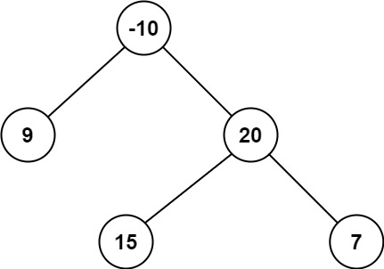

# [Binary Tree Maximum Path Sum](https://leetcode.com/problems/binary-tree-maximum-path-sum/)

**Hard** | **35 minutes** | **Tree**

**Pattern:** [Tree DP](../patterns/tree_dp/intuition.md)

**Practice:** [`practice/binary_tree_maximum_path_sum/solution.py`](../../practice/binary_tree_maximum_path_sum/solution.py)

A **path** in a binary tree is a sequence of nodes where each pair of adjacent nodes in the sequence has an edge connecting them. A node can only appear in the sequence **at most once**. Note that the path does not need to pass through the root.

The **path sum** of a path is the sum of the node's values in the path.

Given the `root` of a binary tree, return the **maximum path sum** of any **non-empty** path.

## Examples

### Example 1


**Input:** `root = [1,2,3]`

**Output:** `6`

**Explanation:** The optimal path is `2 -> 1 -> 3` with a path sum of `2 + 1 + 3 = 6`.

### Example 2



**Input:** `root = [-10,9,20,null,null,15,7]`

**Output:** `42`

**Explanation:** The optimal path is `15 -> 20 -> 7` with a path sum of `15 + 20 + 7 = 42`.

## Constraints

- The number of nodes in the tree is in the range `[1, 3 * 10^4]`.
- `-1000 <= Node.val <= 1000`

## Solutions

### Brute Force

```python
# Definition for a binary tree node.
# class TreeNode:
#     def __init__(self, val=0, left=None, right=None):
#         self.val = val
#         self.left = left
#         self.right = right
class Solution:
    def maxPathSum(self, root: Optional[TreeNode]) -> int:
        # Best downward path that starts at node and descends one side only.
        # Negative branches are dropped by clamping at 0.
        def max_down(node: Optional[TreeNode]) -> int:
            if not node:
                return 0
            return node.val + max(max_down(node.left), max_down(node.right), 0)

        self.best = float("-inf")

        # Try every node as the highest point (the "bend") of the path.
        def visit(node: Optional[TreeNode]) -> None:
            if not node:
                return
            left_gain = max(max_down(node.left), 0)
            right_gain = max(max_down(node.right), 0)
            self.best = max(self.best, node.val + left_gain + right_gain)
            visit(node.left)
            visit(node.right)

        visit(root)
        return self.best
```

#### Approach

Every path has a single highest node where it bends from one branch into the
other (or stays straight on one side). The most direct idea is to try each node
as that bend point and, for each one, find the best downward path into its left
and right subtrees independently.

1. Define `max_down(node)`: the largest sum of a path that starts at `node` and
   descends through at most one child. Clamp the chosen child at `0` so a
   negative branch is simply skipped.
2. For each node in the tree, compute the best left descent and best right
   descent, then form `node.val + left_gain + right_gain` as the path that bends
   at this node.
3. Track the maximum of these bent sums across every node and return it.

This recomputes `max_down` from scratch at every node, which is wasteful but
needs no insight beyond the definition of a path.

#### Time and Space Complexity Analysis

##### Time Complexity: `O(n^2)`

`visit` touches all `n` nodes, and at each node `max_down` walks the entire
subtree below it. In a skewed tree this is `O(n)` work per node, giving
`O(n^2)` in the worst case.

##### Space Complexity: `O(h)`

Both recursions descend at most to the tree height `h` at once: `O(log n)` for a
balanced tree and `O(n)` for a skewed one.

#### Key Insights

- Naming the bend point as the path's highest node makes the enumeration
  concrete: every path is counted exactly once, at its peak.
- `max_down` already captures the "drop a negative branch" rule by clamping at
  `0`, the same rule the optimal solution reuses.
- The waste is purely the repeated `max_down` calls; the gain values it produces
  do not change between visits, which is exactly what the next solution exploits.

#### Walkthrough

Let us trace the Brute Force on Example 1: the tree `[1,2,3]`, where `1` is the
root with left child `2` and right child `3`. We expect the answer `6`.

`self.best` starts at `-inf`. The call `visit(root)` walks the tree as a call
tree, and for each node it asks `max_down` to measure the best downward path into
each child:

```
visit(1):
    max_down(2): leaf, returns 2 + max(0, 0, 0) = 2
    max_down(3): leaf, returns 3 + max(0, 0, 0) = 3
    left_gain  = max(2, 0) = 2
    right_gain = max(3, 0) = 3
    bent sum   = 1 + 2 + 3 = 6   ->  best = max(-inf, 6) = 6
    visit(2):
        no children, left_gain = right_gain = 0
        bent sum = 2 + 0 + 0 = 2  ->  best = max(6, 2) = 6
    visit(3):
        no children, left_gain = right_gain = 0
        bent sum = 3 + 0 + 0 = 3  ->  best = max(6, 3) = 6
```

The table below shows `self.best` after each node is visited as a bend point:

| Node visited | `left_gain` | `right_gain` | bent sum | `self.best` |
|--------------|-------------|--------------|----------|-------------|
| `1` (root)   | `2`         | `3`          | `6`      | `6`         |
| `2`          | `0`         | `0`          | `2`      | `6`         |
| `3`          | `0`         | `0`          | `3`      | `6`         |

The best bend happens at the root, where the path descends into both children:
`2 -> 1 -> 3`. After every node has been tried, `visit` returns and the method
returns `self.best`, which is `6`: matching the expected Output.

### Post-Order DFS

```python
# Definition for a binary tree node.
# class TreeNode:
#     def __init__(self, val=0, left=None, right=None):
#         self.val = val
#         self.left = left
#         self.right = right
class Solution:
    def maxPathSum(self, root: Optional[TreeNode]) -> int:
        self.max_sum = float("-inf")

        def max_gain(node: Optional[TreeNode]) -> int:
            if not node:
                return 0

            # Best downward path from each child, clamped at 0 so a
            # negative branch is simply dropped rather than dragging us down
            left_gain = max(max_gain(node.left), 0)
            right_gain = max(max_gain(node.right), 0)

            # A path that bends through this node uses both children
            self.max_sum = max(self.max_sum, node.val + left_gain + right_gain)

            # But a path returned to the parent can only descend one side
            return node.val + max(left_gain, right_gain)

        max_gain(root)
        return self.max_sum
```

#### Approach

A maximum path can take two shapes at any node: it can **bend** through the node,
descending into both the left and right subtrees, or it can **pass straight
through**, continuing up to the node's parent on only one side. We handle this by
having the recursion return the best straight (single-side) path while a global
maximum captures the best bent path seen anywhere.

1. Define `max_gain(node)` to return the largest sum of a downward path that
   starts at `node` and goes through at most one child. An empty node
   contributes `0`.
2. Recurse into both children, clamping each gain with `max(..., 0)`. If a
   subtree's best contribution is negative, we drop it: a single positive node
   beats a node plus a negative branch.
3. The best path that *peaks* at this node is `node.val + left_gain +
   right_gain`. Compare it against the running global `max_sum`.
4. Return `node.val + max(left_gain, right_gain)` to the parent, because a path
   the parent extends can only pass through one of this node's sides.

Tracking the bent sum separately from the returned straight sum is what lets a
single post-order traversal consider every possible path.

#### Time and Space Complexity Analysis

##### Time Complexity: `O(n)`

Each node is visited once, performing constant work (two comparisons and two
additions) per visit.

##### Space Complexity: `O(h)`

The recursion stack grows with the tree height `h`: `O(log n)` for a balanced
tree and `O(n)` for a skewed one.

#### Key Insights

- The path returned upward and the path measured for the answer differ: only the
  measured one may use both children, since a node can appear at most once.
- Clamping negative gains to `0` cleanly expresses "skip this branch" without
  special-casing.
- Initializing `max_sum` to negative infinity is required because every value
  can be negative and the path must be non-empty.
- One post-order traversal suffices: children must be evaluated before the
  parent can decide its best bent and straight sums.

## Comparison of Solutions

### Time Complexity

- **Brute Force**: `O(n^2)` - recomputes the downward maximum for every node, re-walking each subtree.
- **Post-Order DFS**: `O(n)` - one traversal computes every node's gain exactly once.

### Space Complexity

- **Brute Force**: `O(h)` - two stacked recursions, each bounded by the tree height.
- **Post-Order DFS**: `O(h)` - a single recursion bounded by the tree height.

### Trade-offs

- Brute Force gains a direct mental model (every node is a candidate bend point) but repeats the same downward-path work at every node.
- Post-Order DFS gives up the separate enumeration pass by returning each node's gain to its parent, computing the answer in a single sweep.

### When to Use Each

- **Brute Force**: As a teaching baseline that makes the "bend at the highest node" idea explicit.
- **Post-Order DFS**: The recommended default; linear time on inputs up to `3 * 10^4` nodes.

### Optimization Notes

- The key optimization is recognizing that `max_down(node)` does not change between visits, so it can be returned upward during the same traversal that measures the bent sums.
- Both solutions share the clamp-at-`0` rule to drop negative branches and both initialize the global best to negative infinity, since every node value can be negative and the path must be non-empty.
