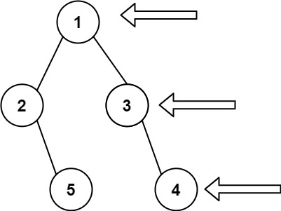

# [Binary Tree Right Side View](https://leetcode.com/problems/binary-tree-right-side-view/)

**Medium** | **20 minutes** | **Tree**

**Pattern:** [Tree Traversal](../patterns/tree/intuition.md)

**Practice:** [`practice/binary_tree_right_side_view/solution.py`](../../practice/binary_tree_right_side_view/solution.py)

Given the `root` of a binary tree, imagine yourself standing on the **right side** of it, return the values of the nodes you can see ordered from top to bottom.

## Examples

### Example 1



**Input:** `root = [1,2,3,null,5,null,4]`

**Output:** `[1,3,4]`

### Example 2

**Input:** `root = [1,null,3]`

**Output:** `[1,3]`

### Example 3

**Input:** `root = []`

**Output:** `[]`

## Constraints

- The number of nodes in the tree is in the range `[0, 100]`.
- `-100 <= Node.val <= 100`

## Solutions

### Brute Force

```python
# Definition for a binary tree node.
# class TreeNode:
#     def __init__(self, val=0, left=None, right=None):
#         self.val = val
#         self.left = left
#         self.right = right
class Solution:
    def rightSideView(self, root: Optional[TreeNode]) -> List[int]:
        levels = []

        def collect(node: Optional[TreeNode], depth: int) -> None:
            if not node:
                return
            # Grow the list of levels until it has a slot for this depth
            if depth == len(levels):
                levels.append([])
            levels[depth].append(node.val)
            collect(node.left, depth + 1)
            collect(node.right, depth + 1)

        collect(root, 0)
        # The viewer on the right sees the last value recorded at each level
        return [level[-1] for level in levels]
```

#### Approach

The most direct reading of the problem is literal: group every node by its level, then the rightmost node of each level is simply the last one written when we walk left to right. This needs no clever ordering trick, just an honest bucket-per-depth collection.

1. Walk the tree with a plain depth-first traversal, carrying the current `depth`.
2. The first time a `depth` is reached, append a fresh empty list so `levels[depth]` exists.
3. Append the current node's value to its depth's bucket, then recurse left child before right child so each bucket fills left to right.
4. After the walk, take the last value of every bucket: that is the node visible from the right.

#### Time and Space Complexity Analysis

##### Time Complexity: `O(n)`

Every node is visited once with constant work, and the final pass reads each bucket's last element across all `n` nodes, so the total stays linear.

##### Space Complexity: `O(n)`

The `levels` structure stores every node's value, so it grows to `O(n)` overall, on top of the `O(h)` recursion stack.

#### Key Insights

- Mirrors the problem statement directly: bucket nodes by level, then read the rightmost of each.
- Requires no ordering trick, which makes it the easiest version to derive but the most wasteful in space.
- Storing whole levels is redundant when only the last node of each is needed, which the next approaches eliminate.

### Recursive DFS

```python
# Definition for a binary tree node.
# class TreeNode:
#     def __init__(self, val=0, left=None, right=None):
#         self.val = val
#         self.left = left
#         self.right = right
class Solution:
    def rightSideView(self, root: Optional[TreeNode]) -> List[int]:
        result = []

        def visit(node: Optional[TreeNode], depth: int) -> None:
            if not node:
                return
            # First node reached at this depth is the rightmost, because
            # we always descend the right child before the left
            if depth == len(result):
                result.append(node.val)
            visit(node.right, depth + 1)
            visit(node.left, depth + 1)

        visit(root, 0)
        return result
```

#### Approach

If a depth-first traversal always explores the right subtree before the left, then the first node it reaches at any depth is the rightmost node on that level:

1. Track the current `depth`, starting at `0` for the root.
2. When `depth == len(result)`, no node has been recorded for this level yet, so the current node is the first (and therefore rightmost) one seen there. Append its value.
3. Recurse into the right child first, then the left child, both at `depth + 1`.

Because the right branch is always visited before the left, deeper-right nodes are recorded ahead of any left node at the same depth. The `depth == len(result)` guard ensures only that first node per level is captured, which is exactly the right side view.

#### Time and Space Complexity Analysis

##### Time Complexity: `O(n)`

Every node is visited once with constant work, so the traversal is linear in the number of nodes.

##### Space Complexity: `O(h)`

No queue is used; the only auxiliary space is the recursion stack, which reaches the tree height `h`. This is `O(n)` for a skewed tree and `O(log n)` when balanced.

#### Key Insights

- Visiting right before left makes "first node at a depth" equivalent to "rightmost node at that level."
- The `depth == len(result)` check records exactly one node per level, with no need to track level sizes.
- Auxiliary space is `O(h)` rather than the brute force's `O(n)` storage, trimming the per-level buckets down to a single value each.
- The mirror version (visit left before right with the same guard) yields the left side view.

### Iterative BFS

```python
# Definition for a binary tree node.
# class TreeNode:
#     def __init__(self, val=0, left=None, right=None):
#         self.val = val
#         self.left = left
#         self.right = right
from collections import deque

class Solution:
    def rightSideView(self, root: Optional[TreeNode]) -> List[int]:
        if not root:
            return []

        result = []
        queue = deque([root])
        while queue:
            level_size = len(queue)
            for i in range(level_size):
                node = queue.popleft()
                # The last node dequeued at this level is the rightmost
                if i == level_size - 1:
                    result.append(node.val)
                if node.left:
                    queue.append(node.left)
                if node.right:
                    queue.append(node.right)
        return result
```

#### Approach

The right side view is exactly the last node of each level when scanning left to right. A breadth-first traversal that processes the tree one level at a time gives us that node directly:

1. Return an empty list immediately when the tree is empty.
2. Seed a queue with `root` and process the tree level by level.
3. Before draining a level, record its size (`level_size`) so we know how many nodes belong to the current level.
4. Dequeue exactly `level_size` nodes; the final one (index `level_size - 1`) is the rightmost node visible from the right.
5. Enqueue each node's left child then right child so the next level stays ordered left to right.

Because children are enqueued left before right, the last node dequeued on every level is guaranteed to be the rightmost, which is precisely the node a viewer on the right would see.

#### Time and Space Complexity Analysis

##### Time Complexity: `O(n)`

Each of the `n` nodes is enqueued and dequeued exactly once, and the work per node is constant.

##### Space Complexity: `O(n)`

The queue holds at most one full level at a time. In the worst case (a complete tree), the widest level contains up to `n/2` nodes, so the queue grows to `O(n)`.

#### Key Insights

- The right side view question reduces to "last node of each level," which BFS surfaces naturally.
- Capturing `level_size` before the inner loop cleanly separates levels without extra marker nodes.
- Enqueuing left before right keeps each level in left-to-right order, so the rightmost node is always last.
- A right-first DFS that records the first node seen at each new depth solves it too, but BFS maps more directly to the level-by-level framing.

## Comparison of Solutions

### Time Complexity

- **Brute Force**: `O(n)` - Each node is visited once, then each level's last value is read
- **Recursive DFS**: `O(n)` - Each node is visited once
- **Iterative BFS**: `O(n)` - Each node is enqueued and dequeued once

### Space Complexity

- **Brute Force**: `O(n)` - Buckets every node's value by level, plus the `O(h)` recursion stack
- **Recursive DFS**: `O(h)` - Recursion stack equal to the tree height
- **Iterative BFS**: `O(n)` - Queue holds up to one full level, which can be `O(n)` wide

### Trade-offs

- Brute Force reads straight off the problem statement (group by level, take the rightmost) but stores entire levels it never needs.
- Recursive DFS uses no queue and only `O(h)` stack space, which is cheaper for tall, narrow trees but can overflow on extreme depth.
- BFS reads directly as "last node of each level," matching how the problem is usually framed, and peaks at the widest level while DFS peaks at the tallest path.

### When to Use Each

- **Brute Force**: When deriving a first correct solution and clarity matters more than space.
- **Recursive DFS**: When a concise recursive solution is preferred and the tree depth is bounded.
- **Iterative BFS**: When the level-by-level reading is clearest, or when the tree is deep enough to risk recursion limits.

### Optimization Notes

- All three approaches are `O(n)` time, so the decision hinges on auxiliary space and tree shape.
- Brute Force keeps full per-level buckets; the right-first DFS trims each bucket down to a single recorded value, reaching `O(h)` space.
- The right-first visit order is the key idea that lets DFS capture exactly the rightmost node per level.
- The DFS `O(h)` space is strictly better than the BFS `O(n)` width for skewed trees.
