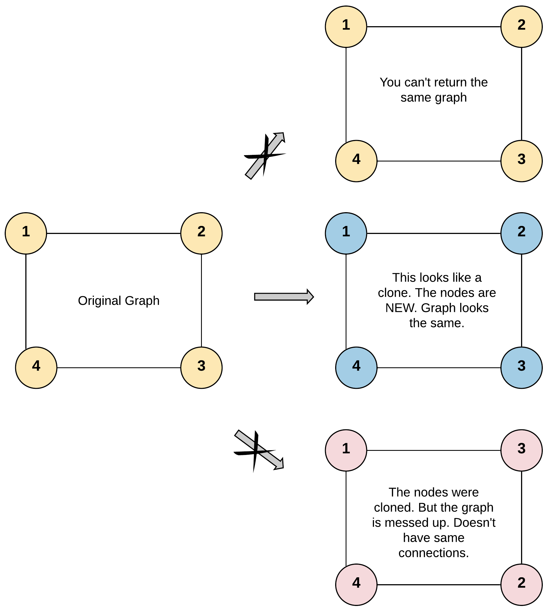

# [Clone Graph](https://leetcode.com/problems/clone-graph/)

**Medium** | **20 minutes** | **Hash Table, DFS, BFS, Graph**

**Pattern:** [Graph Traversal](../patterns/graph/intuition.md)

**Practice:** [`practice/clone_graph/solution.py`](../../practice/clone_graph/solution.py)

Given a reference of a node in a connected undirected graph, return a deep copy (clone) of the graph. Each node in the graph contains a value (`int`) and a list of its neighbors.

Each node in the graph contains a value (int) and a list (List[Node]) of its neighbors.

```
class Node {
    public int val;
    public List<Node> neighbors;
}
```

Test case format:

For simplicity, each node's value is the same as the node's index (1-indexed). For example, the first node with `val == 1`, the second node with `val == 2`, and so on. The graph is represented in the test case using an adjacency list. An adjacency list is a collection of unordered lists used to represent a finite graph. Each list describes the set of neighbors of a node in the graph. The given node will always be the first node with `val = 1`. You must return the copy of the given node as a reference to the cloned graph.

## Examples

### Example 1



**Input:** `adjList = [[2,4],[1,3],[2,4],[1,3]]`

**Output:** `[[2,4],[1,3],[2,4],[1,3]]`

**Explanation:** There are 4 nodes in the graph.
1st node (val = 1)'s neighbors are 2nd node (val = 2) and 4th node (val = 4).
2nd node (val = 2)'s neighbors are 1st node (val = 1) and 3rd node (val = 3).
3rd node (val = 3)'s neighbors are 2nd node (val = 2) and 4th node (val = 4).
4th node (val = 4)'s neighbors are 1st node (val = 1) and 3rd node (val = 3).

### Example 2


**Input:** `adjList = [[]]`

**Output:** `[[]]`

**Explanation:** Note that the input contains one empty list. The graph has only one node with val = 1 and it has no neighbors.

### Example 3

**Input:** `adjList = []`

**Output:** `[]`

**Explanation:** This is an empty graph with no nodes.

## Constraints

- The number of nodes in the graph is in the range `[0, 100]`.
- `1 <= Node.val <= 100`
- `Node.val` is unique for each node.
- There are no repeated edges and no self-loops in the graph.
- The Graph is connected and all nodes can be visited starting from the given node.

## Solutions

### Recursive DFS

```python
"""
# Definition for a Node.
class Node:
    def __init__(self, val = 0, neighbors = None):
        self.val = val
        self.neighbors = neighbors if neighbors is not None else []
"""


class Solution:
    def cloneGraph(self, node: Optional['Node']) -> Optional['Node']:
        if node is None:
            return None

        # Maps each original node to its clone, doubling as a visited set.
        cloned = {}

        def dfs(original: 'Node') -> 'Node':
            # Return the existing clone if we have seen this node before.
            if original in cloned:
                return cloned[original]

            # Create the clone first, then register it before recursing so
            # cycles resolve to the already-created copy.
            copy = Node(original.val)
            cloned[original] = copy

            for neighbor in original.neighbors:
                copy.neighbors.append(dfs(neighbor))

            return copy

        return dfs(node)
```

#### Approach

A deep copy must reproduce every node and every edge exactly once, but the graph
is undirected and may contain cycles, so we need to remember which originals we
have already cloned. A hash map from each original node to its clone does double
duty: it is the lookup table for wiring up neighbors and the visited set that
stops infinite recursion around cycles.

1. Handle the empty graph: if the input `node` is `None`, return `None`.
2. Keep a `cloned` dictionary mapping each original node to its copy.
3. In the DFS, if the current original is already in `cloned`, return its
   existing copy immediately.
4. Otherwise create the copy, **register it in `cloned` before recursing**, then
   recurse into each neighbor and append the returned clones to
   `copy.neighbors`.
5. Return the clone of the entry node.

Registering the copy before recursing into neighbors is the crucial step.
Because the graph is undirected, a neighbor will eventually try to clone us back;
finding our half-built copy already in the map breaks the cycle and lets the two
clones reference each other correctly.

#### Time and Space Complexity Analysis

##### Time Complexity: `O(V + E)`

Each node is created exactly once (guarded by the `cloned` map) and each edge is
traversed exactly once when copying a node's neighbor list. With an undirected
graph stored as `2E` directed entries, the total work is linear in nodes plus
edges.

##### Space Complexity: `O(V)`

The `cloned` map holds one entry per node, and the DFS recursion stack can reach
a depth of `V` for a path-shaped graph. The cloned graph itself also uses
`O(V + E)` space, but that is required output rather than auxiliary overhead.

#### Key Insights

- The original-to-clone hash map is both the memo for neighbor wiring and the
  visited set that tames cycles, so one structure solves two problems.
- Inserting the clone into the map *before* recursing is what prevents infinite
  loops; doing it after would let a cycle recreate the node endlessly.
- Returning early when a node is already cloned guarantees each node and edge is
  processed once, keeping the algorithm linear.
- The `node is None` guard handles the empty-graph test case (`adjList = []`)
  that would otherwise crash on attribute access.

#### Walkthrough

Let us watch the Recursive DFS run on Example 1, `adjList = [[2,4],[1,3],[2,4],[1,3]]`.
That is four nodes: `1`'s neighbors are `2` and `4`, `2`'s are `1` and `3`, `3`'s
are `2` and `4`, and `4`'s are `1` and `3`.

`node` is not `None`, so we start `dfs(1)`. Because the graph is cyclic, the key
moment to watch is when a recursive call hits a node already in `cloned` and
returns the existing copy instead of recursing again. The indented call tree
below shows each call, indenting deeper on every recursion and returning back up:

```
dfs(1): not in cloned -> create copy(1), cloned = {1}, recurse neighbors [2,4]
  dfs(2): not in cloned -> create copy(2), cloned = {1,2}, recurse neighbors [1,3]
    dfs(1): already in cloned -> return existing copy(1)   # cycle broken
    dfs(3): not in cloned -> create copy(3), cloned = {1,2,3}, recurse neighbors [2,4]
      dfs(2): already in cloned -> return existing copy(2) # cycle broken
      dfs(4): not in cloned -> create copy(4), cloned = {1,2,3,4}, recurse neighbors [1,3]
        dfs(1): already in cloned -> return existing copy(1)
        dfs(3): already in cloned -> return existing copy(3)
      dfs(4) returns copy(4), neighbors = [1,3]
    dfs(3) returns copy(3), neighbors = [2,4]
  dfs(2) returns copy(2), neighbors = [1,3]
  dfs(4): already in cloned -> return existing copy(4)     # copy(4) was made deep inside dfs(2)
dfs(1) returns copy(1), neighbors = [2,4]
```

Trace the `cloned` map as it grows: `{1}`, then `{1,2}`, then `{1,2,3}`, then
`{1,2,3,4}`: four entries, one per original node, each created exactly once.
Every `already in cloned` line is a cycle that registering the copy *before*
recursing turned into a harmless lookup instead of infinite recursion. Notice the
last neighbor of node `1`, the second call `dfs(4)`, finds `4` already cloned
because it was built deep inside the `dfs(2)` branch.

Reading each clone's wired neighbors back out gives `[[2,4],[1,3],[2,4],[1,3]]`,
which matches the example's expected Output.

### Iterative BFS

```python
from collections import deque

"""
# Definition for a Node.
class Node:
    def __init__(self, val = 0, neighbors = None):
        self.val = val
        self.neighbors = neighbors if neighbors is not None else []
"""


class Solution:
    def cloneGraph(self, node: Optional['Node']) -> Optional['Node']:
        if node is None:
            return None

        # Clone the entry node up front so the map is never empty.
        cloned = {node: Node(node.val)}
        queue = deque([node])

        while queue:
            original = queue.popleft()
            for neighbor in original.neighbors:
                # First time we see a neighbor: create its clone and enqueue it.
                if neighbor not in cloned:
                    cloned[neighbor] = Node(neighbor.val)
                    queue.append(neighbor)
                # Wire the current node's clone to the neighbor's clone.
                cloned[original].neighbors.append(cloned[neighbor])

        return cloned[node]
```

#### Approach

This variant replaces recursion with an explicit queue while keeping the same
original-to-clone map at the heart of the algorithm. The map still serves the
dual role of visited set and lookup table for wiring neighbors.

1. Handle the empty graph: if `node` is `None`, return `None`.
2. Clone the entry node immediately and seed both the `cloned` map and the queue
   with the original.
3. Pop a node, then for each of its neighbors: create and enqueue the neighbor's
   clone the first time it is seen, and always append the neighbor's clone to the
   current node's clone neighbor list.
4. Return the clone of the entry node once the queue drains.

Creating a neighbor's clone the moment it is first encountered (and only then
enqueuing it) guarantees each node is processed once. Because the clone exists in
the map before we wire edges, cycles resolve correctly: when a later node points
back to an already-cloned node, the connection uses the existing copy.

#### Time and Space Complexity Analysis

##### Time Complexity: `O(V + E)`

Each node is enqueued and dequeued exactly once, and every edge is examined once
when iterating a node's neighbor list. The total is linear in nodes plus edges,
identical to the recursive version.

##### Space Complexity: `O(V)`

The `cloned` map holds one entry per node and the queue holds at most `O(V)`
nodes. Unlike the recursive approach, no call stack is consumed, so very large or
deeply chained graphs cannot trigger a recursion-depth error.

#### Key Insights

- The same original-to-clone map drives both approaches; only the traversal
  mechanism (call stack versus explicit queue) differs.
- Cloning a neighbor on first sight before enqueuing prevents the same node from
  being added to the queue twice.
- Wiring `cloned[original].neighbors` on every neighbor visit reproduces the
  undirected edges in both directions naturally.
- Avoiding recursion makes this the safer choice for graphs deep enough to exceed
  Python's recursion limit, though with `V ≤ 100` here either is fine.

## Comparison of Solutions

### Time Complexity

- **Recursive DFS**: `O(V + E)` - Each node is created once and each edge traversed once.
- **Iterative BFS**: `O(V + E)` - Each node is enqueued once and each edge examined once.

### Space Complexity

- **Recursive DFS**: `O(V)` - The clone map plus a recursion stack up to depth `V` on a path-shaped graph.
- **Iterative BFS**: `O(V)` - The clone map plus a queue holding at most `V` nodes, with no call-stack usage.

### Trade-offs

- **Recursive DFS**: Concise and naturally expresses the deep-copy recursion, but it relies on the call stack and can hit recursion limits on very long graphs.
- **Iterative BFS**: Slightly more verbose with explicit queue management, but it sidesteps recursion-depth limits entirely.

### When to Use Each

- **Recursive DFS (Recommended)**: Best for interviews and the given constraints (`V ≤ 100`) - the clearest statement of the clone logic.
- **Iterative BFS**: When the graph could be deep enough to overflow the recursion stack, or when an explicit iterative solution is preferred.

### Optimization Notes

- Both approaches share the single insight that one map serves as visited set and clone lookup; neither can improve on the `O(V + E)` time, which is required to touch every node and edge.
- The BFS variant trades stack frames for an explicit queue, which is the standard way to make any DFS-based graph routine recursion-safe.
- Registering a clone the instant a node is first seen (before exploring its edges) is what keeps both versions correct on cyclic, undirected graphs.
