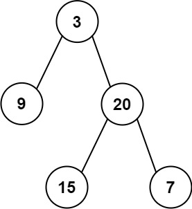

# [Construct Binary Tree from Preorder and Inorder Traversal](https://leetcode.com/problems/construct-binary-tree-from-preorder-and-inorder-traversal/)

**Medium** | **25 minutes** | **Tree**

**Pattern:** [Tree Traversal](../patterns/tree/intuition.md)

**Practice:** [`practice/construct_binary_tree_from_preorder_and_inorder_traversal/solution.py`](https://github.com/ThoDHa/grind75/blob/main/practice/construct_binary_tree_from_preorder_and_inorder_traversal/solution.py)

Given two integer arrays `preorder` and `inorder` where `preorder` is the preorder traversal of a binary tree and `inorder` is the inorder traversal of the same tree, construct and return the binary tree.

## Examples

**Example 1:**



```
Input: preorder = [3,9,20,15,7], inorder = [9,3,15,20,7]
Output: [3,9,20,null,null,15,7]
```

**Example 2:**

```
Input: preorder = [-1], inorder = [-1]
Output: [-1]
```

## Constraints

- `1 <= preorder.length <= 3000`
- `inorder.length == preorder.length`
- `-3000 <= preorder[i], inorder[i] <= 3000`
- `preorder` and `inorder` consist of unique values.
- Each value of `inorder` also appears in `preorder`.
- `preorder` is guaranteed to be the preorder traversal of the tree.
- `inorder` is guaranteed to be the inorder traversal of the tree.

## Solutions

### Recursive Slicing

```python
class Solution:
    def buildTree(self, preorder: List[int], inorder: List[int]) -> Optional[TreeNode]:
        if not preorder:
            return None

        # The first preorder value is the root of the current subtree
        root_val = preorder[0]
        root = TreeNode(root_val)

        # The root's position in inorder splits the left and right subtrees
        mid = inorder.index(root_val)

        # Left subtree: inorder[:mid] with the matching preorder[1 : mid + 1]
        root.left = self.buildTree(preorder[1 : mid + 1], inorder[:mid])
        # Right subtree: inorder[mid + 1:] with the remaining preorder
        root.right = self.buildTree(preorder[mid + 1 :], inorder[mid + 1 :])
        return root
```

#### Approach

The two traversals encode the tree in complementary ways. Preorder visits the
root before its subtrees, so the first preorder value is always the root of the
current subtree. Inorder visits the left subtree, then the root, then the right
subtree, so once we know the root we can split inorder into its left and right
halves by locating the root's position.

1. If `preorder` is empty, the subtree is empty, so return `None`.
2. Take `root_val = preorder[0]` and create the root node.
3. Find `mid = inorder.index(root_val)`. Everything in `inorder[:mid]` belongs to
   the left subtree and everything in `inorder[mid + 1:]` belongs to the right
   subtree.
4. The left subtree contains exactly `mid` nodes, so its preorder values are the
   next `mid` entries: `preorder[1 : mid + 1]`. The remaining preorder values,
   `preorder[mid + 1:]`, form the right subtree.
5. Recurse on each half and attach the results as `root.left` and `root.right`.

This is the most direct reading of the definitions, and it stays library-free by
using nothing more than list slicing and `index`.

#### Time and Space Complexity Analysis

##### Time Complexity: `O(n^2)`

Each call does an `O(n)` `inorder.index` search and builds `O(n)`-sized slices.
For a balanced tree the recurrence is `T(n) = 2T(n/2) + O(n)`, giving `O(n log n)`,
but a skewed tree degrades the search and slicing to `O(n)` work at every level
over `n` levels, producing the `O(n^2)` worst case.

##### Space Complexity: `O(n^2)`

The slices created at each level copy `O(n)` elements, and a skewed tree creates
`O(n)` levels of live slices, so the slice copies dominate at `O(n^2)` in the
worst case. The recursion stack alone is `O(n)`.

#### Key Insights

- The head of preorder is the root; the position of that root in inorder splits
  the remaining values into the two subtrees.
- The left subtree's node count equals `mid`, which is exactly how many preorder
  values to peel off for the left recursion.
- It is the cleanest expression of the idea but pays for repeated `index` scans
  and slice copies.

### Hash Map with Index Bounds

```python
class Solution:
    def buildTree(self, preorder: List[int], inorder: List[int]) -> Optional[TreeNode]:
        # Map each value to its index in inorder for O(1) root lookups
        inorder_index = {val: i for i, val in enumerate(inorder)}

        def build(pre_start: int, pre_end: int, in_start: int, in_end: int) -> Optional[TreeNode]:
            # Empty preorder range means an empty subtree
            if pre_start >= pre_end:
                return None

            # The first value in the preorder range is the root
            root_val = preorder[pre_start]
            root = TreeNode(root_val)

            # Split inorder at the root; left_size counts the left subtree's nodes
            mid = inorder_index[root_val]
            left_size = mid - in_start

            root.left = build(pre_start + 1, pre_start + 1 + left_size, in_start, mid)
            root.right = build(pre_start + 1 + left_size, pre_end, mid + 1, in_end)
            return root

        return build(0, len(preorder), 0, len(inorder))
```

#### Approach

The slicing approach repeats two expensive operations: scanning inorder for the
root and copying slices. Both disappear once we precompute root positions and pass
array bounds instead of physical slices.

1. Build a hash map `inorder_index` from each value to its index in `inorder`.
   Because all values are unique, this gives `O(1)` root-position lookups.
2. Describe each subtree by two half-open ranges: `[pre_start, pre_end)` into
   `preorder` and `[in_start, in_end)` into `inorder`. A range with
   `pre_start >= pre_end` is empty and returns `None`.
3. The root is `preorder[pre_start]`. Look up `mid = inorder_index[root_val]` and
   compute `left_size = mid - in_start`, the number of nodes in the left subtree.
4. The left subtree occupies preorder `[pre_start + 1, pre_start + 1 + left_size)`
   and inorder `[in_start, mid)`. The right subtree occupies the rest of preorder
   `[pre_start + 1 + left_size, pre_end)` and inorder `[mid + 1, in_end)`.
5. Recurse on both ranges and attach the children.

#### Time and Space Complexity Analysis

##### Time Complexity: `O(n)`

We create each of the `n` nodes exactly once, and each recursive call does
constant work thanks to the `O(1)` inorder-index map and the absence of slicing.
Building the map is also `O(n)`.

##### Space Complexity: `O(n)`

The hash map stores all `n` values. The recursion stack adds `O(h)` where `h` is
the tree height (`O(n)` for a skewed tree, `O(log n)` when balanced), which is
dominated by the map.

#### Key Insights

- Passing index bounds instead of slices removes all copying, collapsing the
  space from `O(n^2)` to `O(n)`.
- The index map turns the repeated linear `index` search into a constant-time
  lookup, removing the other source of the `O(n^2)` time.
- `left_size = mid - in_start` is what keeps the two preorder ranges aligned with
  the inorder split.

### Hash Map with Shared Preorder Pointer

```python
class Solution:
    def buildTree(self, preorder: List[int], inorder: List[int]) -> Optional[TreeNode]:
        # Map each value to its index in inorder for O(1) root lookups
        inorder_index = {val: i for i, val in enumerate(inorder)}
        self.pre_pos = 0

        def build(left: int, right: int) -> Optional[TreeNode]:
            # No values remain for this subtree
            if left > right:
                return None

            # The next unconsumed preorder value is always this subtree's root
            root_val = preorder[self.pre_pos]
            self.pre_pos += 1
            root = TreeNode(root_val)

            # Inorder splits into left and right subtrees around the root
            mid = inorder_index[root_val]
            root.left = build(left, mid - 1)
            root.right = build(mid + 1, right)
            return root

        return build(0, len(inorder) - 1)
```

#### Approach

The bounds approach still threads four indices through every call. We can shrink
that to a single inorder range plus one shared preorder pointer by exploiting the
order in which preorder lays nodes out: the entire left subtree appears before any
right-subtree node.

1. Build the same `inorder_index` map for `O(1)` lookups.
2. Keep one moving pointer `pre_pos` into `preorder`, starting at `0`. Each node
   we create consumes exactly one preorder value and advances the pointer.
3. Recurse with the inclusive inorder bounds `[left, right]` for the current
   subtree. When `left > right` the subtree is empty, so return `None`.
4. Take the root from `preorder[pre_pos]`, advance the pointer, find its index
   `mid` in inorder, then build the left child from `[left, mid - 1]` and the
   right child from `[mid + 1, right]`.

Building the left subtree fully before the right subtree is essential: it keeps
the preorder pointer synchronized, since preorder lays out the entire left subtree
before any right-subtree node.

#### Time and Space Complexity Analysis

##### Time Complexity: `O(n)`

We create each of the `n` nodes exactly once, and each recursive call does
constant work thanks to the `O(1)` inorder-index map. Building that map is also
`O(n)`.

##### Space Complexity: `O(n)`

The hash map stores all `n` values. The recursion stack adds `O(h)` where `h` is
the tree height (`O(n)` for a skewed tree, `O(log n)` when balanced), which is
dominated by the map.

#### Key Insights

- A single shared preorder pointer, advanced left-subtree-first, removes the need
  to track preorder ranges at all.
- The left-before-right recursion order is what makes the shared pointer correct:
  preorder finishes the whole left subtree before touching the right.
- Only the inorder bounds need to be passed, since preorder is consumed strictly
  in order.

## Comparison of Solutions

### Time Complexity

- **Recursive Slicing**: `O(n^2)` worst case - `index` searches and slice copies
  repeat linear work on skewed trees.
- **Hash Map with Index Bounds**: `O(n)` - constant-time lookups, no slicing.
- **Hash Map with Shared Preorder Pointer**: `O(n)` - constant-time lookups, no
  slicing.

### Space Complexity

- **Recursive Slicing**: `O(n^2)` - layered slice copies dominate the `O(n)` stack.
- **Hash Map with Index Bounds**: `O(n)` - index map plus `O(h)` recursion stack.
- **Hash Map with Shared Preorder Pointer**: `O(n)` - index map plus `O(h)`
  recursion stack.

### Trade-offs

- **Recursive Slicing** is the easiest to read and derive but allocates new lists
  and rescans inorder at every node.
- **Hash Map with Index Bounds** keeps each subtree self-contained through four
  indices, which is explicit but verbose.
- **Hash Map with Shared Preorder Pointer** is the most compact optimal form but
  relies on mutable shared state and a strict left-to-right traversal order.

### When to Use Each

- **Recursive Slicing**: When clarity matters more than performance, or `n` is
  small and the inputs are not adversarially skewed.
- **Hash Map with Index Bounds**: When you want optimal performance with purely
  local state and no reliance on traversal-order side effects (Recommended).
- **Hash Map with Shared Preorder Pointer**: When you want the tightest optimal
  code and are comfortable reasoning about the shared pointer's invariant.

### Optimization Notes

- The `inorder_index` map is the single change that removes the `O(n)` root search;
  it is well defined precisely because all values are unique.
- Passing index bounds instead of slices is what cuts both time and space from
  `O(n^2)` to `O(n)`; the same trick applies to building a tree from postorder and
  inorder.
- For very deep (skewed) inputs near the `3000`-node limit, the `O(n)` recursion
  depth is well within Python's default recursion limit, so no iterative rewrite
  is needed here.
