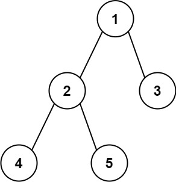

# [Diameter of Binary Tree](https://leetcode.com/problems/diameter-of-binary-tree/)

**Easy** | **20 minutes** | **Tree, Depth-First Search, Binary Tree**

**Pattern:** [Tree DP](../patterns/tree_dp/intuition.md)

**Algorithm:** [Depth-first search](https://en.wikipedia.org/wiki/Depth-first_search) · [Tree traversal](https://en.wikipedia.org/wiki/Tree_traversal)

**Practice:** [`practice/diameter_of_binary_tree/solution.py`](../../practice/diameter_of_binary_tree/solution.py)

Given the `root` of a binary tree, return the length of the **diameter** of the tree.

The **diameter** of a binary tree is the **length** of the longest path between any two nodes in a tree. This path may or may not pass through the root.

The **length** of a path between two nodes is represented by the number of edges between them.

## Examples

### Example 1



**Input:** `root = [1,2,3,4,5]`

**Output:** `3`

**Explanation:** The length of the diameter from node 4 to node 3 is 3.

### Example 2

**Input:** `root = [1,2]`

**Output:** `1`

## Constraints

- The number of nodes in the tree is in the range `[1, 10^4]`.
- `-100 <= Node.val <= 100`

## Deriving the Solution

Every path in a tree bends at exactly one highest node, and the path that
bends at a node spans `height(left) + height(right)` edges, one leg down each
side. The diameter is therefore the maximum of that bend over all nodes; the
solutions differ only in how many times they compute each height.

1. **Start literal.** For each node, compute the bend with a fresh height
   recursion into both subtrees, and take the maximum over all nodes. Each
   height call walks a whole subtree, so a skewed tree costs `O(n^2)`: see
   [Brute Force](#brute-force).
2. **Spot the waste.** The height of any subtree is recomputed at every one of
   its ancestors, yet the recursion that measures diameters already visits
   every node once and could report heights on the way back up.
3. **Fold the two into one pass.** A single post-order traversal returns each
   subtree's height to its parent while folding `left_h + right_h` into a
   running maximum, cutting the work to `O(n)`. The accumulator can live on
   the instance or in a closed-over local: see
   [Recursive DFS with Instance Variable](#recursive-dfs-with-instance-variable)
   and
   [Recursive DFS with Nonlocal Variable](#recursive-dfs-with-nonlocal-variable).
4. **Remove the shared state.** Returning the pair `(height, diameter)` from
   every call threads both values purely through return values, with no
   accumulator at all: see [Return Pair Approach](#return-pair-approach).

## Solutions

### Brute Force

#### Derivation

The most direct reading of the definition is to consider every node in turn as
the bend point of a path. For a path that turns at a given node, its edge length
is the height of the left subtree plus the height of the right subtree. The
diameter is the largest such value over all nodes, or, equivalently, the best
path either bends at the current node or sits entirely within one of its
subtrees.

1. Write a `height(node)` helper that recomputes a subtree's height (in edges)
   from scratch every time it is called.
2. Write a `diameter(node)` helper that, for the current node, measures the path
   bending here as `height(node.left) + height(node.right)`.
3. Take the maximum of that bending path and the diameters of the left and right
   subtrees, recursing on each.
4. Return the diameter of the whole tree from `diameter(root)`.

This separates the two questions (how tall is a subtree, how wide is its best
path) into two independent [recursions](https://en.wikipedia.org/wiki/Recursion_(computer_science)), which is the straightforward but wasteful
way to reach a correct answer.

#### Walkthrough

Let us trace the brute force on Example 1: `root = [1,2,3,4,5]`. That array
describes this tree: node `1` has children `2` (left) and `3` (right), and node
`2` has children `4` (left) and `5` (right). Nodes `3`, `4`, and `5` are leaves.

The call is `diameter(1)`. Because `diameter` recurses into its children before
combining, the deepest nodes finish first. We follow each call as it returns, and
for every node we record `lh = height(node.left)`, `rh = height(node.right)`,
`through = lh + rh`, and the returned `diameter`. Remember that an empty child has
height `0`, and `height` is recomputed from scratch each time it is asked.

| Call | `lh` | `rh` | `through = lh + rh` | returns `max(through, left_d, right_d)` |
|------|------|------|---------------------|-----------------------------------------|
| `diameter(4)` | `0` | `0` | `0` | `0` (leaf) |
| `diameter(5)` | `0` | `0` | `0` | `0` (leaf) |
| `diameter(2)` | `1` | `1` | `2` | `max(2, 0, 0) = 2` |
| `diameter(3)` | `0` | `0` | `0` | `0` (leaf) |
| `diameter(1)` | `2` | `1` | `3` | `max(3, 2, 0) = 3` |

At node `2`, both children are leaves of height `1`, so the path bending there
spans `2` edges (`4 -> 2 -> 5`). At the root, the left subtree has height `2` (down
to `4` or `5`) and the right subtree has height `1` (down to `3`), so the path
bending at the root spans `3` edges (`4 -> 2 -> 1 -> 3`). Taking the maximum of
that bend (`3`) against the best diameters found inside the subtrees (`2` and `0`)
gives `3`.

`diameter(1)` returns `3`, which matches the expected Output of `3`.

#### Solution

The code is the walkthrough's two recursions: `height` measured from scratch,
`diameter` maximized over every bend point.

```python
# Definition for a binary tree node.
# class TreeNode:
#     def __init__(self, val=0, left=None, right=None):
#         self.val = val
#         self.left = left
#         self.right = right
from typing import Optional


class Solution:
    def diameterOfBinaryTree(self, root: Optional[TreeNode]) -> int:
        def height(node: Optional[TreeNode]) -> int:
            if not node:
                return 0
            return 1 + max(height(node.left), height(node.right))

        def diameter(node: Optional[TreeNode]) -> int:
            if not node:
                return 0
            # Longest path bending at this node: edges down each side
            through = height(node.left) + height(node.right)
            # Or the best path lies entirely in one of the subtrees
            return max(through, diameter(node.left), diameter(node.right))

        return diameter(root)
```

#### Time and Space Complexity Analysis

##### Time Complexity: `O(n^2)`

For every node, `diameter` calls `height` on its children, and `height` itself
walks the entire subtree below that node. In the worst case (a skewed tree) the
height computation costs `O(n)` and it is repeated for `O(n)` nodes, giving
`O(n^2)`.

##### Space Complexity: `O(h)`

Where `h` is the tree height. Both recursions descend at most to the depth of the
tree, and they are not active at the same level simultaneously, so the call stack
is bounded by `O(h)`.

#### Key Insights

- Directly encodes the definition: try every node as the path's bend point and
  take the widest.
- The waste is structural: heights are recomputed from scratch at every node
  instead of being reused, which is exactly the redundancy the single-pass
  solutions remove.
- Splitting height and diameter into two separate recursions keeps the logic easy
  to read at the cost of doing the same descent many times over.

### Recursive DFS with Instance Variable

#### Derivation

The brute force pays quadratically because it asks for heights it has already
computed: the height of every subtree is re-derived at each of its ancestors.
Yet a single traversal already visits every node; if it reports each subtree's
height to its parent on the way back up, the parent has both `left_h` and
`right_h` in hand and can score the bend `left_h + right_h` on the spot. One
[post-order DFS](https://en.wikipedia.org/wiki/Depth-first_search) therefore
computes both quantities together: it returns heights upward while a shared
accumulator records the widest bend seen anywhere.

1. Define a helper `height(node)` that returns the height of the subtree rooted
   at `node`, measured in edges (an empty subtree has height `0`).
2. For each node, recurse into the left and right children to get `left_h` and
   `right_h`.
3. Update the running maximum `self.diameter` with `left_h + right_h`, the
   length of the path that bends at this node.
4. Return `1 + max(left_h, right_h)` to the parent, since only one branch can
   continue a path upward.
5. After `height(root)` finishes, return `self.diameter`.

The instance variable `self.diameter` accumulates the best path seen anywhere in
the tree while the return value feeds the parent's own height computation.

#### Recurrence

As in Binary Tree Maximum Path Sum, two quantities travel together. The height
of a subtree, in edges:

$$
h(v) =
\begin{cases}
0, & v = \text{null} \\[4pt]
1 + \max\bigl(h(v.\text{left}),\ h(v.\text{right})\bigr), & \text{otherwise}
\end{cases}
$$

```text
height(None) = 0
height(node) = 1 + max(height(node.left), height(node.right))
```

The longest path that *bends* at `v` joins the deepest reach on each side:

$$
\text{bend}(v) = h(v.\text{left}) + h(v.\text{right})
$$

Every path has exactly one highest node, so maximizing over all of them gives
the diameter:

$$
\text{answer} = \max_{v \in T} \text{bend}(v)
$$

```text
bend(node)    = height(node.left) + height(node.right)
self.diameter = max bend(node) over all nodes in the tree
```

Only \(h\) is returned upward: \(\text{bend}(v)\) already spends both children
and cannot be extended through `v`'s parent. Computing the two in one pass is
what separates this from the brute force, which recomputes \(h\) at every node
and pays \(O(n^2)\) for it.

#### Walkthrough

Let us run the single pass on Example 1: `root = [1,2,3,4,5]`, which is this
tree:

```text
        1
       / \
      2   3
     / \
    4   5
```

The traversal is post-order, so children resolve before parents. Each line
shows one `height` call as it returns, with the accumulator update it
performs:

```text
height(4)   left_h=0, right_h=0   self.diameter = max(0, 0+0) = 0   return 1
height(5)   left_h=0, right_h=0   self.diameter stays 0             return 1
height(2)   left_h=1, right_h=1   self.diameter = max(0, 1+1) = 2   return 2
height(3)   left_h=0, right_h=0   self.diameter stays 2             return 1
height(1)   left_h=2, right_h=1   self.diameter = max(2, 2+1) = 3   return 3
```

At node `2` the bend `4 -> 2 -> 5` sets the accumulator to `2`; at the root the
bend `4 -> 2 -> 1 -> 3` raises it to `3`. Note that each height is computed
exactly once and handed upward: node `1` receives `left_h = 2` instead of
re-walking the subtree under `2` as the brute force would. The final return
value of `height(1)` is discarded; the answer is `self.diameter = 3`, matching
the expected Output for Example 1.

#### Solution

The code is the walkthrough's single pass: heights flow up through return
values while `self.diameter` records the widest bend.

```python
# Definition for a binary tree node.
# class TreeNode:
#     def __init__(self, val=0, left=None, right=None):
#         self.val = val
#         self.left = left
#         self.right = right
from typing import Optional


class Solution:
    def diameterOfBinaryTree(self, root: Optional[TreeNode]) -> int:
        self.diameter = 0

        def height(node: Optional[TreeNode]) -> int:
            if not node:
                return 0
            left_h = height(node.left)
            right_h = height(node.right)
            self.diameter = max(self.diameter, left_h + right_h)
            return 1 + max(left_h, right_h)

        height(root)
        return self.diameter
```

#### Time and Space Complexity Analysis

##### Time Complexity: `O(n)`

Each of the `n` nodes is visited exactly once, with constant work per node.

##### Space Complexity: `O(h)`

Where `h` is the height of the tree, consumed by the recursion call stack. This is
`O(log n)` for a balanced tree and `O(n)` for a fully skewed tree.

#### Key Insights

- The longest path need not pass through the root, so tracking a global maximum
  across all nodes is required rather than reading the answer off the root alone.
- Height and diameter are computed together in one traversal: the function returns
  height while the side effect records diameter.
- A path bends at exactly one node, which is why each node contributes
  `left_h + right_h` and why the parent receives only `1 + max(left_h, right_h)`.

### Recursive DFS with Nonlocal Variable

#### Derivation

The instance-variable version leaves its accumulator on `self`, where it
persists between calls and can surprise a caller that reuses the `Solution`
object. The repair is purely one of scope: keep the same single-pass
[post-order DFS](https://en.wikipedia.org/wiki/Depth-first_search), but let the
shared maximum live in a local variable captured by the closure. The
`nonlocal` keyword lets the inner `height` function rebind the enclosing
`diameter`, keeping all state confined to the method call.

1. Initialize `diameter` to `0` in the method body.
2. Declare it `nonlocal` inside `height` so updates mutate the captured variable.
3. At each node, update `diameter` with `left_h + right_h` and return
   `1 + max(left_h, right_h)`.
4. After `height(root)` finishes, return `diameter`.

#### Walkthrough

The mechanism is identical to the instance-variable pass, so Example 2 keeps
the trace minimal: `root = [1,2]`, which is this tree:

```text
    1
   /
  2
```

Post-order again resolves the child first:

```text
height(2)   left_h=0, right_h=0   diameter = max(0, 0+0) = 0   return 1
height(1)   left_h=1, right_h=0   diameter = max(0, 1+0) = 1   return 2
```

Node `2` is a leaf: both legs are empty, so its bend is `0` and it hands
height `1` up. At the root, `left_h = 1` and the missing right child
contributes `0`, so the bend `2 -> 1` sets `diameter = 1`. The function
returns `diameter = 1`, matching the expected Output for Example 2.

#### Solution

The code is the same pass with the accumulator captured by `nonlocal` instead
of stored on `self`.

```python
# Definition for a binary tree node.
# class TreeNode:
#     def __init__(self, val=0, left=None, right=None):
#         self.val = val
#         self.left = left
#         self.right = right
from typing import Optional


class Solution:
    def diameterOfBinaryTree(self, root: Optional[TreeNode]) -> int:
        diameter = 0

        def height(node: Optional[TreeNode]) -> int:
            nonlocal diameter
            if not node:
                return 0
            left_h = height(node.left)
            right_h = height(node.right)
            diameter = max(diameter, left_h + right_h)
            return 1 + max(left_h, right_h)

        height(root)
        return diameter
```

#### Time and Space Complexity Analysis

##### Time Complexity: `O(n)`

Every node is visited once with constant work, identical to the instance-variable
version.

##### Space Complexity: `O(h)`

The recursion stack uses space proportional to the tree height.

#### Key Insights

- `nonlocal` avoids leaving state on the instance, so repeated calls to the same
  `Solution` object cannot interfere with one another.
- The accumulation pattern is otherwise identical: one traversal computes height
  while recording the widest bend seen.

### Return Pair Approach

#### Derivation

Both accumulator versions still mutate a shared variable from inside the
recursion. That last piece of shared state can be removed as well: since every
call already knows its subtree's height and best diameter, let it return both.
Each [recursive call](https://en.wikipedia.org/wiki/Recursion_(computer_science))
returns a tuple `(height, diameter)` describing the subtree it just processed,
and every value flows purely through return values.

1. An empty subtree returns `(0, 0)`: height `0` and diameter `0`.
2. For an internal node, recurse to obtain `(left_h, left_d)` and
   `(right_h, right_d)`.
3. The node's height is `1 + max(left_h, right_h)`.
4. The best diameter within this subtree is the maximum of the left subtree's
   diameter, the right subtree's diameter, and the path bending at this node,
   `left_h + right_h`.
5. The final answer is the diameter component returned for the whole tree,
   `dfs(root)[1]`.

#### Walkthrough

Let us thread the pairs on Example 1: `root = [1,2,3,4,5]`, which is this
tree:

```text
        1
       / \
      2   3
     / \
    4   5
```

Each line shows one `dfs` call as it returns its `(height, diameter)` pair;
empty children contribute `(0, 0)`:

```text
dfs(4)   children (0,0), (0,0)     height=1, diameter=max(0, 0, 0+0)=0   -> (1, 0)
dfs(5)   children (0,0), (0,0)     height=1, diameter=0                  -> (1, 0)
dfs(2)   left (1,0), right (1,0)   height=1+max(1,1)=2, diameter=max(0, 0, 1+1)=2   -> (2, 2)
dfs(3)   children (0,0), (0,0)     height=1, diameter=0                  -> (1, 0)
dfs(1)   left (2,2), right (1,0)   height=1+max(2,1)=3, diameter=max(2, 0, 2+1)=3   -> (3, 3)
```

At node `2` the bend of its two leaf children yields the pair `(2, 2)`, and at
the root the bend `2 + 1 = 3` beats the inherited diameters `2` and `0`,
producing `(3, 3)`. No shared variable was touched: the answer rode up inside
the tuples. `dfs(root)[1]` extracts `3`, matching the expected Output for
Example 1.

#### Solution

The code is the walkthrough's pair threading: combine the children's tuples,
return one of your own.

```python
# Definition for a binary tree node.
# class TreeNode:
#     def __init__(self, val=0, left=None, right=None):
#         self.val = val
#         self.left = left
#         self.right = right
from typing import Optional


class Solution:
    def diameterOfBinaryTree(self, root: Optional[TreeNode]) -> int:
        def dfs(node: Optional[TreeNode]) -> tuple[int, int]:
            if not node:
                return (0, 0)  # (height, diameter)
            left_h, left_d = dfs(node.left)
            right_h, right_d = dfs(node.right)
            height = 1 + max(left_h, right_h)
            diameter = max(left_d, right_d, left_h + right_h)
            return (height, diameter)

        return dfs(root)[1]
```

#### Time and Space Complexity Analysis

##### Time Complexity: `O(n)`

Each node is visited once, with constant work to combine its children's results.

##### Space Complexity: `O(h)`

Space is bounded by the recursion depth, which equals the tree height.

#### Key Insights

- A "pure functional" style with no side effects: all information is threaded
  through return values, which can be easier to reason about and test.
- The tuple return generalizes naturally to problems that need to propagate
  several aggregates up the tree in a single traversal.
- Functionally equivalent to the accumulator versions; the difference is purely in
  how the maximum is communicated.

## Comparison of Solutions

### Time Complexity

- **Brute Force**: `O(n^2)` - heights are recomputed from scratch at every node.
- **Recursive DFS with Instance Variable**: `O(n)` - each node visited once.
- **Recursive DFS with Nonlocal Variable**: `O(n)` - each node visited once.
- **Return Pair Approach**: `O(n)` - each node visited once.

### Space Complexity

- **Brute Force**: `O(h)` - recursion stack bounded by the tree height.
- **Recursive DFS with Instance Variable**: `O(h)` - recursion stack.
- **Recursive DFS with Nonlocal Variable**: `O(h)` - recursion stack.
- **Return Pair Approach**: `O(h)` - recursion stack, plus a constant-size tuple
  per frame.

### Trade-offs

- The brute force is the most literal translation of the definition but pays for
  that clarity by recomputing every subtree height repeatedly, making it `O(n^2)`.
- The instance-variable version is concise but leaves mutable state on `self`,
  which can surprise callers that reuse a `Solution` object.
- The nonlocal version keeps the shared maximum local to the call while remaining
  just as compact, at the cost of the `nonlocal` declaration.
- The return-pair version eliminates shared state entirely but must pack and unpack
  a tuple at every node.

### When to Use Each

- **Brute Force**: As a teaching baseline that mirrors the definition directly;
  too slow for the upper constraint of `10^4` nodes on a skewed tree.
- **Recursive DFS with Instance Variable**: When brevity matters and the object is
  used for a single call.
- **Recursive DFS with Nonlocal Variable**: When avoiding instance state is
  preferred but a single accumulator is still the clearest expression.
- **Return Pair Approach**: When side-effect-free code is valued, or as a template
  for problems that aggregate multiple values up the tree.

### Optimization Notes

- The key optimization over the brute force is computing height and diameter in a
  single post-order traversal, reusing each subtree's height instead of recomputing
  it. This collapses `O(n^2)` into `O(n)`.
- The three single-pass versions rely on the same core idea: one traversal that
  computes subtree height and simultaneously tracks the widest bend.
- Measuring height in edges (empty subtree height `0`) makes `left_h + right_h`
  directly equal to the edge count of the path through a node, avoiding off-by-one
  corrections.
- The path that realizes the diameter bends at exactly one node, so each parent
  only ever extends one branch upward via `1 + max(left_h, right_h)`.

The three single-pass solutions share identical asymptotic time and space behavior;
the choice among them is primarily a matter of how state is managed.
