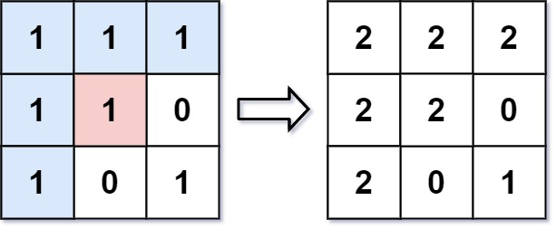

# [Flood Fill](https://leetcode.com/problems/flood-fill/)

**Easy** | **20 minutes** | **Array, DFS, BFS, Matrix**

**Pattern:** [Graph Traversal](../patterns/graph/intuition.md)

**Algorithm:** [Flood fill](https://en.wikipedia.org/wiki/Flood_fill) · [Depth-first search](https://en.wikipedia.org/wiki/Depth-first_search) · [Breadth-first search](https://en.wikipedia.org/wiki/Breadth-first_search)

**Practice:** [`practice/flood_fill/solution.py`](../../practice/flood_fill/solution.py)

You are given an image represented by an m x n grid of integers `image`, where `image[i][j]` represents the pixel value of the image. You are also given three integers `sr`, `sc`, and `color`. Your task is to perform a flood fill on the image starting from the pixel `image[sr][sc]`.

To perform a flood fill:

- Begin with the starting pixel and change its color to `color`.
- Perform the same process for each pixel that is directly adjacent (pixels that share a side with the original pixel, either horizontally or vertically) and shares the same color as the starting pixel.
- Keep repeating this process by checking neighboring pixels of the updated pixels and modifying their color if it matches the original color of the starting pixel.
- The process stops when there are no more adjacent pixels of the original color to update.

Return the modified image after performing the flood fill.

## Examples

### Example 1



**Input:** `image = [[1,1,1],[1,1,0],[1,0,1]]`, `sr = 1`, `sc = 1`, `color = 2`

**Output:** `[[2,2,2],[2,2,0],[2,0,1]]`

**Explanation:** From the center of the image with position `(sr, sc) = (1, 1)` (i.e., the red pixel), all pixels connected by a path of the same color as the starting pixel (i.e., the blue pixels) are colored with the new color. Note the bottom corner is not colored `2`, because it is not horizontally or vertically connected to the starting pixel.

### Example 2

**Input:** `image = [[0,0,0],[0,0,0]]`, `sr = 0`, `sc = 0`, `color = 0`

**Output:** `[[0,0,0],[0,0,0]]`

**Explanation:** The starting pixel is already colored with `0`, which is the same as the target color. Therefore, no changes are made to the image.

## Constraints

- `m == image.length`
- `n == image[i].length`
- `1 <= m, n <= 50`
- `0 <= image[i][j], color < 2^16`
- `0 <= sr < m`
- `0 <= sc < n`

## Deriving the Solution

The pixels to recolor are exactly the connected component of `initial_color` pixels
that contains `(sr, sc)`, so every solution is a graph traversal of that component,
recoloring as it goes. All four share one structural trick: the recolor itself is
the visited mark, which is why the `initial_color == color` early return is
load-bearing in each of them.

1. **Start literal.** The statement already describes a repeatable process: recolor
   a pixel, then "perform the same process" on each same-colored neighbor. A
   function that calls itself on its four neighbors is that process verbatim, a
   recursive depth-first search: see [Recursive DFS](#recursive-dfs). Its cost: the
   call stack grows as deep as the component, risking `RecursionError` on large,
   snake-shaped regions.
2. **Own the stack.** The call stack is doing nothing but remembering which pixels
   still await a visit, so replace it with an explicit list of coordinates. The
   traversal is unchanged and the recursion limit disappears: see
   [Iterative DFS](#iterative-dfs).
3. **Change the order.** Nothing in the problem requires depth-first order.
   Processing pixels in waves of increasing distance from the start covers the same
   component breadth-first, either by recursing on whole levels at a time, in
   [Recursive BFS](#recursive-bfs), or with a first-in-first-out queue, in
   [Iterative BFS](#iterative-bfs). The queue variant hides a pitfall: `list.pop(0)`
   shifts every remaining element, degrading the pass to `O(n²)`.
4. **Let the library hold the queue.** The wave order was already right; only the
   container was wrong. Handing the queue to `deque` makes each dequeue `O(1)`
   instead of `O(n)`, which repairs the pitfall rather than merely tidying the
   code: the pass drops from `O(n²)` back to `O(n)` with a one-word change at the
   dequeue site, see [Iterative BFS with Deque](#iterative-bfs-with-deque).

## Solutions

### Recursive DFS

#### Derivation

Read the problem statement as pseudocode: change the starting pixel, then perform
"the same process" on each adjacent pixel of the original color. A process that
invokes itself on its neighbors is a recursive
[depth-first search (DFS)](https://en.wikipedia.org/wiki/Depth-first_search), so the
most direct translation is a helper `fill` that recolors its pixel and recurses into
the four neighbors.

Two details need care. First, every traversal needs a visited mark, and this one has
no set and no auxiliary grid: the write `image[sr][sc] = color` is itself the mark,
and the guard `image[sr][sc] != initial_color` is what reads it back. Second, that
choice makes the early check `initial_color == color` a termination requirement
rather than an optimization: when the two colors are equal the recolor is a no-op,
no pixel is ever marked, and the recursion never reaches its base case. The
[Termination Condition](#termination-condition) below makes this precise. The steps:

1. Record `initial_color = image[sr][sc]`. If it already equals `color`, return
   `image` unchanged.
2. Call `fill(sr, sc)`. A call returns immediately when its coordinates leave the
   grid or its pixel no longer equals `initial_color`.
3. Otherwise set `image[sr][sc] = color` and recurse into the four neighbors, in
   the order up, down, left, right.
4. Once every recursive call has unwound, return `image`.

#### Termination Condition

The guard `if initial_color == color: return image` is not an optimization. It is
what makes the recursion terminate at all.

Look for a visited marker in `fill` and there is none: no set, no auxiliary grid,
no parent parameter. The only thing distinguishing a processed pixel from an
unprocessed one is its own value. The write `image[sr][sc] = color` doubles as the
visited mark, and the bounds-and-color guard that reads it back is the base case:

$$
\textit{image}[r][c] \ne \textit{initial\_color} \;\Longrightarrow\; \text{return}
$$

```text
image[r][c] != initial_color  implies  return
```

Recursion bottoms out only when this fires, or when the coordinates leave the
grid. Progress therefore requires that recoloring a pixel actually falsify the
test for that pixel, which holds exactly when
\(\textit{color} \ne \textit{initial\_color}\). Under that condition, every `fill`
call that gets past the guard strictly decreases the number of pixels still equal
to `initial_color`, and that count is a non-negative integer, so the recursion is
finite.

When \(\textit{color} = \textit{initial\_color}\) the write is a no-op. The pixel
still matches, so nothing is ever marked, the count never decreases, and
`fill(sr, sc)` recurses up into `fill(sr - 1, sc)`, which recurses back down into
`fill(sr, sc)`, and so on until Python raises `RecursionError`. Two adjacent
matching pixels are enough to trap it; the four-way recursion never reaches a
base case.

The early return also happens to give the right answer on its own terms, since
filling a region with the color it already holds changes nothing, which is what
Example 2 shows. But answering correctly is the smaller half of its job.

Every other solution on this page marks visited pixels the same way, so the same
guard is load-bearing in each of them for the same reason.

#### Walkthrough

Let us trace the Recursive DFS solution on Example 1: `image = [[1,1,1],[1,1,0],[1,0,1]]`, `sr = 1`, `sc = 1`, `color = 2`.

First, `initial_color = image[1][1] = 1`. Since `1 != 2`, we do not take the early return, and we call `fill(1, 1, ...)`. Each `fill` call colors its pixel (if it is in bounds and still equals `1`), then recurses into its four neighbors in the fixed order up, down, left, right. A call returns immediately when the pixel is out of bounds or no longer equals the initial color `1`.

The call tree below shows each call, indented by recursion depth. `set 2` means the pixel matched `1` and was recolored; `stop` means the call returned without doing anything.

```text
fill(1,1)  set 2        image = [[1,1,1],[1,2,0],[1,0,1]]
  fill(0,1)  set 2      image = [[1,2,1],[1,2,0],[1,0,1]]   (up)
    fill(-1,1)  stop    (out of bounds)
    fill(1,1)   stop    (now 2, not 1)
    fill(0,0)  set 2    image = [[2,2,1],[1,2,0],[1,0,1]]   (left)
      fill(-1,0)  stop  (out of bounds)
      fill(1,0)  set 2  image = [[2,2,1],[2,2,0],[1,0,1]]   (down)
        fill(0,0)   stop   (now 2, not 1)
        fill(2,0)  set 2  image = [[2,2,1],[2,2,0],[2,0,1]] (down)
          fill(1,0),(3,0),(2,-1),(2,1)  all stop
        fill(1,-1),(1,1)  stop
      fill(0,-1),(0,1)  stop
    fill(0,2)  set 2    image = [[2,2,2],[2,2,0],[2,0,1]]   (right)
      fill(-1,2),(1,2),(0,1),(0,3)  all stop
  fill(2,1)  stop       (value is 0, not 1)
  fill(1,0)  stop       (now 2, not 1)
  fill(1,2)  stop       (value is 0, not 1)
```

Notice the pixel at `(2,2)` (the bottom-right `1`) is never reached: every path to it is blocked by `0` pixels, which never match the initial color `1`. The `0` at `(1,2)` and the `0` at `(2,1)` wall it off.

After every recursion unwinds, the image is `[[2,2,2],[2,2,0],[2,0,1]]`, which matches the expected Output.

#### Solution

The code is the call tree from the walkthrough written down: the termination guard,
the bounds-and-color base case, the recolor, then the four recursive calls.

```python
from typing import List


class Solution:
    def floodFill(self, image: List[List[int]], sr: int, sc: int, color: int) -> List[List[int]]:
        initial_color = image[sr][sc]
        # If the starting color is already the target color, return the image as is
        if initial_color == color:
            return image
        self.fill(image, sr, sc, initial_color, color)
        return image

    def fill(self, image: List[List[int]], sr: int, sc: int, initial_color: int, color: int):
        # Check if coordinates are out of bounds or pixel is not the initial color
        if sr < 0 or sr >= len(image) or sc < 0 or sc >= len(image[0]) or image[sr][sc] != initial_color:
            return

        # Change the color of the current pixel
        image[sr][sc] = color

        # Recursively fill the adjacent pixels
        self.fill(image, sr-1, sc, initial_color, color)  # Up
        self.fill(image, sr+1, sc, initial_color, color)  # Down
        self.fill(image, sr, sc-1, initial_color, color)  # Left
        self.fill(image, sr, sc+1, initial_color, color)  # Right
```

#### Time and Space Complexity Analysis

##### Time Complexity: `O(n)`

- In the worst case, we might need to visit all pixels in the image
- Each pixel is visited at most once, where `n` is the total number of pixels (`m × n` for an `m×n` image)

##### Space Complexity: `O(n)`

- The recursion stack can go as deep as the number of pixels in the worst case
- This occurs in scenarios where the image consists of a snake-like path of connected pixels

#### Key Insights

- The early check for `initial_color == color` is a termination requirement rather than an optimization: recoloring a pixel is the only visited marker here, so without the guard nothing is ever marked and the recursion runs until `RecursionError`
- Using recursion provides an elegant solution for traversing connected components
- The algorithm only modifies pixels that match the initial color, precisely implementing the flood fill behavior

### Iterative DFS

#### Derivation

The recursive version has one weakness: its bookkeeping lives on the call stack,
which grows one frame per pixel along a path and can hit Python's recursion limit on
a large snake-shaped region. Ask what the call stack is actually doing: it only
remembers which pixels still need visiting. A plain list of coordinate tuples can do
that job explicitly, with no depth limit.

Popping from the end of the list visits the most recently discovered pixel first,
so the traversal order is still
[depth-first](https://en.wikipedia.org/wiki/Depth-first_search). One structural
shift: the recursive version tested validity before recursing (the base case at the
top of `fill`); here, neighbors are pushed unconditionally and the same
bounds-and-color test runs when a coordinate is popped. Invalid or already-recolored
entries are simply discarded at that point. The steps:

1. Record `initial_color` and return early when it equals `color`; recoloring is
   still the only visited mark, so the guard is as essential as before.
2. Seed `stack = [(sr, sc)]` and cache `rows, cols`.
3. While `stack` is non-empty, pop `(r, c)`. If it is in bounds and
   `image[r][c] == initial_color`, set the pixel to `color` and append the four
   neighbors, in the order down, up, right, left.
4. When the stack drains, every reachable pixel has been recolored: return `image`.

#### Walkthrough

Let us run the pop loop on Example 1: `image = [[1,1,1],[1,1,0],[1,0,1]]`, `sr = 1`,
`sc = 1`, `color = 2`. Since `initial_color = 1` differs from `2`, we seed
`stack = [(1, 1)]`. The trace below shows one popped coordinate per line: `set 2`
means the pixel passed the bounds-and-color check and was recolored (its four
neighbors were then pushed), and `skip` means the pop was discarded. Because a pop
takes the most recently pushed entry, the left neighbor (pushed last) is explored
before right, up, and down.

```text
pop (1,1)   set 2   push (2,1)(0,1)(1,2)(1,0)    image [[1,1,1],[1,2,0],[1,0,1]]
pop (1,0)   set 2   push (2,0)(0,0)(1,1)(1,-1)   image [[1,1,1],[2,2,0],[1,0,1]]
pop (1,-1)  skip    out of bounds
pop (1,1)   skip    now 2, not 1
pop (0,0)   set 2   push (1,0)(-1,0)(0,1)(0,-1)  image [[2,1,1],[2,2,0],[1,0,1]]
pop (0,-1)  skip    out of bounds
pop (0,1)   set 2   push (1,1)(-1,1)(0,2)(0,0)   image [[2,2,1],[2,2,0],[1,0,1]]
pop (0,0)   skip    now 2, not 1
pop (0,2)   set 2   push (1,2)(-1,2)(0,3)(0,1)   image [[2,2,2],[2,2,0],[1,0,1]]
pop (0,1)   skip    now 2, not 1
pop (0,3)   skip    out of bounds
pop (-1,2)  skip    out of bounds
pop (1,2)   skip    value 0, not 1
pop (-1,1)  skip    out of bounds
pop (1,1)   skip    now 2, not 1
pop (-1,0)  skip    out of bounds
pop (1,0)   skip    now 2, not 1
pop (2,0)   set 2   push (3,0)(1,0)(2,1)(2,-1)   image [[2,2,2],[2,2,0],[2,0,1]]
pop (2,-1)  skip    out of bounds
pop (2,1)   skip    value 0, not 1
pop (1,0)   skip    now 2, not 1
pop (3,0)   skip    out of bounds
pop (1,2)   skip    value 0, not 1
pop (0,1)   skip    now 2, not 1
pop (2,1)   skip    value 0, not 1
```

Six pops recolor a pixel, one per pixel of the component; every other pop is
filtered by the same test the recursive base case performed. When the stack
empties, the image is `[[2,2,2],[2,2,0],[2,0,1]]`, matching the expected Output.

#### Solution

The code is the pop loop from the walkthrough, with the recursive base case
reappearing as the pop-time validity check.

```python
from typing import List


class Solution:
    def floodFill(self, image: List[List[int]], sr: int, sc: int, color: int) -> List[List[int]]:
        initial_color = image[sr][sc]
        if initial_color == color:
            return image

        stack = [(sr, sc)]
        rows, cols = len(image), len(image[0])

        while stack:
            r, c = stack.pop()  # Pop from the end - stack behavior

            if 0 <= r < rows and 0 <= c < cols and image[r][c] == initial_color:
                image[r][c] = color

                # Push all 4 neighbors onto the stack
                stack.append((r+1, c))  # Down
                stack.append((r-1, c))  # Up
                stack.append((r, c+1))  # Right
                stack.append((r, c-1))  # Left

        return image
```

#### Time and Space Complexity Analysis

##### Time Complexity: `O(n)`

- Each pixel is examined at most once
- All stack operations (`append` and `pop`) are `O(1)`

##### Space Complexity: `O(n)`

- In the worst case, we might need to store many pixels in the stack
- The maximum stack size depends on the image structure, but is bounded by the number of pixels

#### Key Insights

- Eliminates the risk of stack overflow errors that could occur with recursive approaches
- Maintains the same traversal pattern as recursive DFS
- The order of neighbor addition affects the traversal path

### Recursive BFS

#### Derivation

Both DFS variants dive as deep as possible along one path before backing up. Nothing
about flood fill requires that order: the component can equally be covered in
concentric waves, visiting every pixel at distance 1 from the start, then every
pixel at distance 2, and so on. That order is a
[breadth-first search](https://en.wikipedia.org/wiki/Breadth-first_search), and it
can still be expressed recursively by making each call process an entire wave, a
`level` list of coordinates, rather than a single pixel. The recursion depth then
equals the number of waves (the component's radius) instead of the length of the
deepest path.

A pixel can be appended to `next_level` twice within one wave when two of its
neighbors are recolored in the same pass; the second occurrence fails the color
check and is skipped, so the duplicate is harmless. The steps:

1. Record `initial_color` and return early when it equals `color`; the recolor is
   still the only visited mark.
2. Call `bfs_level` with the initial level `[(sr, sc)]`.
3. In `bfs_level`, return when `level` is empty. Otherwise, for each `(r, c)` in
   `level` that is in bounds and still equals `initial_color`, set it to `color`
   and append its four neighbors (down, up, right, left) to `next_level`.
4. Recurse on `next_level`; the base case fires when a wave produces no new pixels.

#### Walkthrough

Let us run the level recursion on Example 1: `image = [[1,1,1],[1,1,0],[1,0,1]]`,
`sr = 1`, `sc = 1`, `color = 2`. Each line below is one call to `bfs_level`,
showing which pixels in `level` recolor (`set`) or fail the check (`skip`), the
image after the wave, and the `next_level` handed to the next call.

```text
level 0  [(1,1)]
         (1,1) set                              image [[1,1,1],[1,2,0],[1,0,1]]
         next_level [(2,1),(0,1),(1,2),(1,0)]
level 1  [(2,1),(0,1),(1,2),(1,0)]
         (2,1) skip value 0; (0,1) set; (1,2) skip value 0; (1,0) set
                                                image [[1,2,1],[2,2,0],[1,0,1]]
         next_level [(1,1),(-1,1),(0,2),(0,0),(2,0),(0,0),(1,1),(1,-1)]
level 2  (1,1) skip now 2; (-1,1) skip out of bounds; (0,2) set; (0,0) set;
         (2,0) set; (0,0) skip now 2; (1,1) skip now 2; (1,-1) skip out of bounds
                                                image [[2,2,2],[2,2,0],[2,0,1]]
         next_level [(1,2),(-1,2),(0,3),(0,1),(1,0),(-1,0),(0,1),(0,-1),
                     (3,0),(1,0),(2,1),(2,-1)]
level 3  every entry skips (value 0, now 2, or out of bounds)
         next_level []
level 4  level is empty -> return
```

Note the duplicate `(0,0)` in level 2: both `(0,1)` and `(1,0)` appended it during
level 1. The first occurrence recolors it; the second fails the color check. After
the empty level returns, the image is `[[2,2,2],[2,2,0],[2,0,1]]`, matching the
expected Output.

#### Solution

The code is the wave loop from the walkthrough: each `bfs_level` call processes one
level and recurses on the pixels it discovered.

```python
from typing import List


class Solution:
    def floodFill(self, image: List[List[int]], sr: int, sc: int, color: int) -> List[List[int]]:
        initial_color = image[sr][sc]
        if initial_color == color:
            return image

        # Initial level contains just the starting pixel
        self.bfs_level(image, [(sr, sc)], initial_color, color)
        return image

    def bfs_level(self, image: List[List[int]], level: List[tuple], initial_color: int, color: int):
        if not level:  # Base case: no more pixels to process
            return

        next_level = []  # Will contain pixels for the next recursive call
        rows, cols = len(image), len(image[0])

        for r, c in level:
            if 0 <= r < rows and 0 <= c < cols and image[r][c] == initial_color:
                image[r][c] = color

                # Add all 4 neighbors to the next level
                next_level.append((r+1, c))  # Down
                next_level.append((r-1, c))  # Up
                next_level.append((r, c+1))  # Right
                next_level.append((r, c-1))  # Left

        # Process the next level recursively
        self.bfs_level(image, next_level, initial_color, color)
```

#### Time and Space Complexity Analysis

##### Time Complexity: `O(n)`

- Each pixel is processed exactly once
- Building the next level list is an `O(1)` operation per pixel

##### Space Complexity: `O(n)`

- The recursion stack depth is at most the diameter of the connected component
- The level lists can collectively contain at most `n` pixels

#### Key Insights

- Provides a level-order traversal pattern while still using recursion
- Generally has shallower recursion depth than DFS, reducing stack overflow risk
- Each recursive call processes a "wave" of pixels at equal distance from the start

### Iterative BFS

#### Derivation

The level-list recursion is an unusual shape; the textbook way to get
breadth-first order is a first-in-first-out queue. Where the Iterative DFS popped
the newest entry, popping the *oldest* entry visits pixels in exactly the order
they were discovered, which is the same wave-by-wave order as the level recursion
with no level bookkeeping and no recursion at all.

This implementation uses a plain Python list as the queue, which is where its flaw
lives: `queue.pop(0)` removes the first element by shifting every remaining element
one slot left, an `O(n)` operation per dequeue (a `collections.deque` would restore
`O(1)`). The steps:

1. Record `initial_color` and return early when it equals `color`.
2. Seed `queue = [(sr, sc)]`.
3. While `queue` is non-empty, dequeue `r, c = queue.pop(0)`. If it is in bounds
   and `image[r][c] == initial_color`, set it to `color` and append the four
   neighbors: down, up, right, left.
4. When the queue drains, return `image`.

#### Walkthrough

Let us run the queue on Example 1: `image = [[1,1,1],[1,1,0],[1,0,1]]`, `sr = 1`,
`sc = 1`, `color = 2`. We seed `queue = [(1, 1)]`. One dequeued coordinate per
line; `set 2` recolors and appends four neighbors, `skip` discards. Because
`pop(0)` takes the oldest entry, pixels leave the queue in discovery order:
compare with the Iterative DFS trace, which recolored the same six pixels in a
different order.

```text
pop (1,1)   set 2   push (2,1)(0,1)(1,2)(1,0)    image [[1,1,1],[1,2,0],[1,0,1]]
pop (2,1)   skip    value 0, not 1
pop (0,1)   set 2   push (1,1)(-1,1)(0,2)(0,0)   image [[1,2,1],[1,2,0],[1,0,1]]
pop (1,2)   skip    value 0, not 1
pop (1,0)   set 2   push (2,0)(0,0)(1,1)(1,-1)   image [[1,2,1],[2,2,0],[1,0,1]]
pop (1,1)   skip    now 2, not 1
pop (-1,1)  skip    out of bounds
pop (0,2)   set 2   push (1,2)(-1,2)(0,3)(0,1)   image [[1,2,2],[2,2,0],[1,0,1]]
pop (0,0)   set 2   push (1,0)(-1,0)(0,1)(0,-1)  image [[2,2,2],[2,2,0],[1,0,1]]
pop (2,0)   set 2   push (3,0)(1,0)(2,1)(2,-1)   image [[2,2,2],[2,2,0],[2,0,1]]
pop (0,0)   skip    now 2, not 1
pop (1,1)   skip    now 2, not 1
pop (1,-1)  skip    out of bounds
pop (1,2)   skip    value 0, not 1
pop (-1,2)  skip    out of bounds
pop (0,3)   skip    out of bounds
pop (0,1)   skip    now 2, not 1
pop (1,0)   skip    now 2, not 1
pop (-1,0)  skip    out of bounds
pop (0,1)   skip    now 2, not 1
pop (0,-1)  skip    out of bounds
pop (3,0)   skip    out of bounds
pop (1,0)   skip    now 2, not 1
pop (2,1)   skip    value 0, not 1
pop (2,-1)  skip    out of bounds
```

The recolors arrive in waves: `(1,1)` at distance 0; `(0,1)` and `(1,0)` at
distance 1; `(0,2)`, `(0,0)`, `(2,0)` at distance 2. When the queue empties, the
image is `[[2,2,2],[2,2,0],[2,0,1]]`, matching the expected Output.

#### Solution

The code is the dequeue loop from the walkthrough; the only change from Iterative
DFS is `pop(0)` in place of `pop()`.

```python
from typing import List


class Solution:
    def floodFill(self, image: List[List[int]], sr: int, sc: int, color: int) -> List[List[int]]:
        initial_color = image[sr][sc]
        if initial_color == color:
            return image

        rows, cols = len(image), len(image[0])
        queue = [(sr, sc)]

        while queue:
            r, c = queue.pop(0)  # Pop from the beginning - queue behavior

            if 0 <= r < rows and 0 <= c < cols and image[r][c] == initial_color:
                image[r][c] = color

                # Add all 4 neighbors to the queue
                queue.append((r+1, c))  # Down
                queue.append((r-1, c))  # Up
                queue.append((r, c+1))  # Right
                queue.append((r, c-1))  # Left

        return image
```

#### Time and Space Complexity Analysis

##### Time Complexity: `O(n²)`

- Each pixel is examined at most once: `O(n)`
- However, using `list.pop(0)` is an `O(n)` operation
- This results in an overall `O(n²)` time complexity

##### Space Complexity: `O(n)`

- In the worst case, the queue might contain many pixels
- The maximum queue size depends on the image structure but is bounded by the number of pixels

#### Key Insights

- Processes pixels in order of their distance from the starting point
- Without a proper queue implementation, the time complexity suffers
- Using a list as a queue is inefficient due to the `O(n)` cost of `pop(0)`

### Iterative BFS with Deque

#### Derivation

The Iterative BFS has the right traversal and the wrong container. Nothing about
its wave order needs fixing: pixels still leave the queue in discovery order,
each pixel is still examined once, and the recolor is still the only visited
mark. The single defect is that a Python list stores its elements in one
contiguous block, so removing the front element with `pop(0)` must slide every
surviving element one slot left, an `O(n)` shift on every dequeue.

[`collections.deque`](https://docs.python.org/3/library/collections.html#collections.deque)
is a doubly linked sequence of blocks rather than one contiguous array, so it can
detach an element from either end without touching the rest. Its `popleft` is
`O(1)`, and that is the whole of the change: `deque([(sr, sc)])` in place of the
list literal and `popleft()` in place of `pop(0)`. This is the one place on this
page where the standard library moves the complexity class rather than leaving it
alone. The traversal was already `O(n)` in pixel visits; the container was
inflating it to `O(n²)`, and the swap restores the true `O(n)` BFS. The steps:

1. Record `initial_color` and return early when it equals `color`; the recolor is
   still the only visited mark, so this guard remains a termination requirement.
2. Seed `queue = deque([(sr, sc)])` and cache `rows, cols`.
3. While `queue` is non-empty, dequeue `r, c = queue.popleft()`. If the pixel is
   in bounds and equals `initial_color`, set it to `color` and append the four
   neighbors, in the order down, up, right, left.
4. When the queue drains, return `image`.

#### Walkthrough

Let us run the deque on Example 1: `image = [[1,1,1],[1,1,0],[1,0,1]]`, `sr = 1`,
`sc = 1`, `color = 2`. Since `initial_color = 1` differs from `2`, we seed
`queue = deque([(1, 1)])`. One dequeued coordinate per line; `set 2` recolors and
appends four neighbors, `skip` discards. Compare this trace line for line with
the Iterative BFS trace above: it is identical, because `popleft` returns exactly
what `pop(0)` returned, only without the shifting.

```text
popleft (1,1)   set 2   push (2,1)(0,1)(1,2)(1,0)    image [[1,1,1],[1,2,0],[1,0,1]]
popleft (2,1)   skip    value 0, not 1
popleft (0,1)   set 2   push (1,1)(-1,1)(0,2)(0,0)   image [[1,2,1],[1,2,0],[1,0,1]]
popleft (1,2)   skip    value 0, not 1
popleft (1,0)   set 2   push (2,0)(0,0)(1,1)(1,-1)   image [[1,2,1],[2,2,0],[1,0,1]]
popleft (1,1)   skip    now 2, not 1
popleft (-1,1)  skip    out of bounds
popleft (0,2)   set 2   push (1,2)(-1,2)(0,3)(0,1)   image [[1,2,2],[2,2,0],[1,0,1]]
popleft (0,0)   set 2   push (1,0)(-1,0)(0,1)(0,-1)  image [[2,2,2],[2,2,0],[1,0,1]]
popleft (2,0)   set 2   push (3,0)(1,0)(2,1)(2,-1)   image [[2,2,2],[2,2,0],[2,0,1]]
popleft (0,0)   skip    now 2, not 1
popleft (1,1)   skip    now 2, not 1
popleft (1,-1)  skip    out of bounds
popleft (1,2)   skip    value 0, not 1
popleft (-1,2)  skip    out of bounds
popleft (0,3)   skip    out of bounds
popleft (0,1)   skip    now 2, not 1
popleft (1,0)   skip    now 2, not 1
popleft (-1,0)  skip    out of bounds
popleft (0,1)   skip    now 2, not 1
popleft (0,-1)  skip    out of bounds
popleft (3,0)   skip    out of bounds
popleft (1,0)   skip    now 2, not 1
popleft (2,1)   skip    value 0, not 1
popleft (2,-1)  skip    out of bounds
```

The recolors arrive in the same waves as before: `(1,1)` at distance 0; `(0,1)`
and `(1,0)` at distance 1; `(0,2)`, `(0,0)`, `(2,0)` at distance 2. What differs
is invisible in the trace and visible in the clock: each of these 25 dequeues now
costs constant time instead of shifting the queue's remaining entries. When the
queue empties, the image is `[[2,2,2],[2,2,0],[2,0,1]]`, matching the expected
Output.

#### Solution

The same dequeue loop as the Iterative BFS, with the queue delegated to the
standard library.

```python
from collections import deque
from typing import List


class Solution:
    def floodFill(self, image: List[List[int]], sr: int, sc: int, color: int) -> List[List[int]]:
        initial_color = image[sr][sc]
        if initial_color == color:
            return image

        rows, cols = len(image), len(image[0])
        queue = deque([(sr, sc)])

        while queue:
            r, c = queue.popleft()  # O(1) dequeue, unlike list.pop(0)

            if 0 <= r < rows and 0 <= c < cols and image[r][c] == initial_color:
                image[r][c] = color

                # Add all 4 neighbors to the queue
                queue.append((r+1, c))  # Down
                queue.append((r-1, c))  # Up
                queue.append((r, c+1))  # Right
                queue.append((r, c-1))  # Left

        return image
```

#### Time and Space Complexity Analysis

##### Time Complexity: `O(n)`

Each of the `n` pixels is recolored at most once and enqueues four neighbors, so
the queue handles `O(n)` entries in total. Both `append` and `popleft` are `O(1)`
on a deque, so no dequeue carries the `O(n)` shift that `list.pop(0)` performs.
The total is linear, which is the bound the Iterative BFS aims for and misses.

##### Space Complexity: `O(n)`

The queue holds at most a constant multiple of the pixel count, since each
recolored pixel contributes four entries. A deque carries slightly more per-entry
overhead than a list because of its block structure, which does not change the
bound.

#### Key Insights

- The algorithm is untouched: the dequeue order, the bounds-and-color test, and
  the recolor-as-visited-mark are identical, which shows the `O(n²)` blowup was
  never in the BFS but purely in the container holding it.
- A deque is a linked sequence of blocks, so detaching the front element leaves
  the remaining entries in place; a list must slide them, which is why `popleft`
  is `O(1)` and `pop(0)` is `O(n)`.
- This is the only approach on the page where reaching for the standard library
  improves the asymptotic bound rather than only the line count, taking the pass
  from `O(n²)` to `O(n)`.
- Write `deque` reflexively whenever a queue is needed: the list version reads
  almost identically, so the cost is invisible at the call site and only shows up
  as a timeout on large inputs.

## Comparison of Solutions

### Time Complexity

- **Recursive DFS**: `O(n)` - each of the `n` pixels is visited at most once.
- **Iterative DFS**: `O(n)` - each pixel is pushed and popped a constant number of times with `O(1)` stack operations.
- **Recursive BFS**: `O(n)` - each pixel is processed once across the level lists.
- **Iterative BFS**: `O(n²)` - each pixel is visited once, but `list.pop(0)` costs `O(n)` per dequeue.
- **Iterative BFS with Deque**: `O(n)` - the same wave-by-wave traversal, with `deque.popleft()` costing `O(1)` instead of `O(n)`.

### Space Complexity

- **Recursive DFS**: `O(n)` - recursion stack can reach the size of the connected component.
- **Iterative DFS**: `O(n)` - explicit stack bounded by the number of pixels.
- **Recursive BFS**: `O(n)` - recursion depth plus level lists holding up to all pixels.
- **Iterative BFS**: `O(n)` - queue bounded by the number of pixels.
- **Iterative BFS with Deque**: `O(n)` - the same queue contents, held in a deque whose block structure costs marginally more per entry than a list.

### Trade-offs

- Recursive DFS gains the most concise, readable code but gives up control over stack depth, risking overflow on large images.
- Iterative DFS gives up brevity to gain an explicit stack that sidesteps recursion limits.
- Recursive BFS gains a level-order traversal while keeping recursion, trading a slightly unusual structure for shallower recursion depth than DFS.
- Iterative BFS gains the classic queue-based BFS shape but gives up performance, degrading to `O(n²)` because a list is used as a queue.
- Iterative BFS with Deque gains back that lost performance for the price of one import, keeping the identical loop while restoring `O(n)`; it gives up nothing, which is why it is the version to write in practice.

### When to Use Each

- **Recursive DFS**: When simplicity and readability matter and the grid is small enough that stack depth is not a concern.
- **Iterative DFS**: When DFS traversal is desired but recursion limits must be avoided.
- **Recursive BFS**: When level-order processing is wanted while keeping recursive logic.
- **Iterative BFS**: Instructive as a demonstration of the list-as-queue pitfall; in real code prefer the deque form below.
- **Iterative BFS with Deque**: The default whenever distance-ordered processing is wanted, and the shape to reuse for BFS on any grid or graph.

### Optimization Notes

- For flood fill the recursive DFS is the common practical choice for its simplicity; iterative DFS is the safer pick when input size could exhaust the call stack.
- The `initial_color == color` early return is essential in every variant; without it the BFS and DFS would loop forever since recolored pixels would still match the target.
- The Iterative BFS approach's `O(n²)` cost comes entirely from `list.pop(0)`; [Iterative BFS with Deque](#iterative-bfs-with-deque) makes that swap and restores true `O(n)` BFS, and it is the only change on this page that improves an approach's complexity class rather than its readability.
- Given the small constraints (`m, n <= 50`), all five run fast enough, but the Iterative BFS approach's list-as-queue pattern is the pitfall to avoid in larger graph problems.
