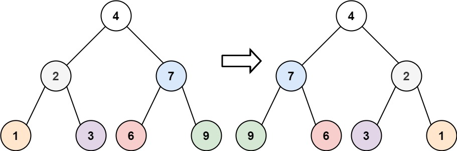

# [Invert Binary Tree](https://leetcode.com/problems/invert-binary-tree/)

**Easy** | **15 minutes** | **Tree, Depth-First Search, Breadth-First Search**

**Pattern:** [Tree Traversal](../patterns/tree/intuition.md)

**Practice:** [`practice/invert_binary_tree/solution.py`](https://github.com/ThoDHa/grind75/blob/main/practice/invert_binary_tree/solution.py)

Given the `root` of a binary tree, invert the tree, and return its root.

## Examples

### Example 1



**Input:** `root = [4,2,7,1,3,6,9]`

**Output:** `[4,7,2,9,6,3,1]`

### Example 2


**Input:** `root = [2,1,3]`

**Output:** `[2,3,1]`

### Example 3

**Input:** `root = []`

**Output:** `[]`

## Constraints

- The number of nodes in the tree is in the range `[0, 100]`
- `-100 <= Node.val <= 100`

## Solutions

### Recursive DFS

```python
class Solution:
    def invertTree(self, root: Optional[TreeNode]) -> Optional[TreeNode]:
        if not root:
            return None

        root.left, root.right = root.right, root.left
        self.invertTree(root.left)
        self.invertTree(root.right)
        return root
```

#### Approach

Inverting a binary tree is self-similar: the inverted tree is the one whose root children are swapped and whose two subtrees are themselves inverted. That recursive definition translates directly into code:

1. Base case: when `root` is `None`, there is nothing to invert, so return `None`.
2. Swap the current node's `left` and `right` children with a single tuple assignment.
3. Recursively invert what is now the left subtree and what is now the right subtree.
4. Return `root`, which is the root of the fully inverted tree.

The swap can happen before or after the recursive calls because each node's swap is independent of its descendants; this version swaps first (a pre-order shape), but a post-order swap produces the identical result.

#### Time and Space Complexity Analysis

##### Time Complexity: `O(n)`

Every node is visited exactly once, and each visit does a constant-time swap, so the total work is linear in the number of nodes `n`.

##### Space Complexity: `O(h)`, where `h` is the height of the tree

The only extra space is the recursion stack, whose depth equals the height of the tree. A balanced tree gives `O(log n)`; a skewed tree degrades to `O(n)`.

#### Key Insights

- The inversion is defined recursively in terms of itself: swap the children, then invert both subtrees.
- Tuple assignment swaps the two children without an explicit temporary variable.
- Because each swap is local and independent, the relative order of the swap and the recursive calls does not change the outcome.
- Inverting an already inverted tree restores the original, so the operation is its own inverse.

### Iterative BFS

```python
from collections import deque

class Solution:
    def invertTree(self, root: Optional[TreeNode]) -> Optional[TreeNode]:
        if not root:
            return None

        queue = deque([root])
        while queue:
            node = queue.popleft()
            node.left, node.right = node.right, node.left
            if node.left:
                queue.append(node.left)
            if node.right:
                queue.append(node.right)
        return root
```

#### Approach

Because each node's swap is independent, the nodes can be visited in any order rather than via recursion. A queue gives a level-order (breadth-first) traversal:

1. Return `None` immediately when the tree is empty.
2. Seed a queue with `root`.
3. While the queue is non-empty, dequeue a node and swap its `left` and `right` references.
4. Enqueue both children (after the swap, either order is fine) so their subtrees are inverted in turn.
5. Return the original `root`, now the root of the fully inverted tree.

The explicit queue replaces the implicit recursion stack, so the traversal works on trees deep enough to exceed Python's recursion limit.

#### Time and Space Complexity Analysis

##### Time Complexity: `O(n)`

Each node is enqueued and dequeued exactly once and performs a constant-time swap, giving linear time in the number of nodes.

##### Space Complexity: `O(n)`

The queue holds at most one full level at a time. For a complete tree the widest level is up to `n/2` nodes, so the auxiliary space is `O(n)`.

#### Key Insights

- The inversion is purely local: swapping each node's children in any order inverts the whole tree.
- An explicit queue replaces the implicit recursion stack, avoiding recursion-depth limits on very deep trees.
- Swapping with tuple assignment removes the need for an explicit temporary variable.
- BFS is chosen here only to contrast with the recursive depth-first version; the traversal order is otherwise irrelevant.

### Iterative DFS

```python
class Solution:
    def invertTree(self, root: Optional[TreeNode]) -> Optional[TreeNode]:
        if not root:
            return None

        stack = [root]
        while stack:
            node = stack.pop()
            node.left, node.right = node.right, node.left
            if node.left:
                stack.append(node.left)
            if node.right:
                stack.append(node.right)
        return root
```

#### Approach

Swapping the queue for a stack turns the breadth-first walk into a depth-first one while keeping the logic identical:

1. Return `None` when the tree is empty.
2. Seed a stack with `root`.
3. While the stack is non-empty, pop a node and swap its `left` and `right` references.
4. Push both children so their subtrees are inverted in turn.
5. Return the original `root`.

This is the explicit-stack equivalent of the recursive version, useful when recursion depth is a concern but a depth-first order is still preferred over the wide frontier a queue can build.

#### Time and Space Complexity Analysis

##### Time Complexity: `O(n)`

Each node is pushed and popped exactly once and performs a constant-time swap, giving linear time.

##### Space Complexity: `O(h)`, where `h` is the height of the tree

A depth-first stack holds at most one root-to-leaf path plus pending siblings, so its size tracks the tree height rather than its width. This is `O(log n)` for a balanced tree and `O(n)` for a skewed one.

#### Key Insights

- A stack and a queue differ only in which pending node is processed next; both invert the whole tree.
- The explicit stack avoids recursion-depth limits while keeping the smaller height-bounded space of depth-first traversal.
- The swap is again local, so neither the data structure nor the visit order affects correctness.

## Comparison of Solutions

### Time Complexity

- **Recursive DFS**: `O(n)` - Each node is visited once.
- **Iterative BFS**: `O(n)` - Each node is enqueued and dequeued once.
- **Iterative DFS**: `O(n)` - Each node is pushed and popped once.

### Space Complexity

- **Recursive DFS**: `O(h)` - Recursion stack equal to the tree height.
- **Iterative BFS**: `O(n)` - Queue holds up to one full level, which can be `O(n)` wide.
- **Iterative DFS**: `O(h)` - Explicit stack tracks a path, bounded by the tree height.

### Trade-offs

- The recursive version is the most concise and reads naturally as "swap, then invert each subtree."
- The iterative BFS version uses an explicit queue, sidestepping the recursion-depth ceiling, but its frontier can grow to the widest level.
- The iterative DFS version also avoids recursion limits yet keeps the smaller height-bounded space of a depth-first walk.

### When to Use Each

- **Recursive DFS**: When code clarity is valued and the tree depth is bounded.
- **Iterative BFS**: When a breadth-first order is wanted and the tree is not pathologically deep.
- **Iterative DFS**: When the tree may be deep enough to risk a recursion-limit error and the smaller depth-first frontier is preferable to a queue.

### Optimization Notes

- All three approaches are `O(n)` time, so the choice is driven by space and recursion-depth concerns.
- Because each node's swap is independent, any traversal order works; the data structure (recursion stack, queue, or explicit stack) only changes the visit order, not the result.
- For skewed trees the height-bounded `O(h)` stack of the depth-first approaches degrades to `O(n)`, matching the BFS queue; for balanced trees the depth-first space stays at `O(log n)` while the BFS frontier reaches `O(n)`.
