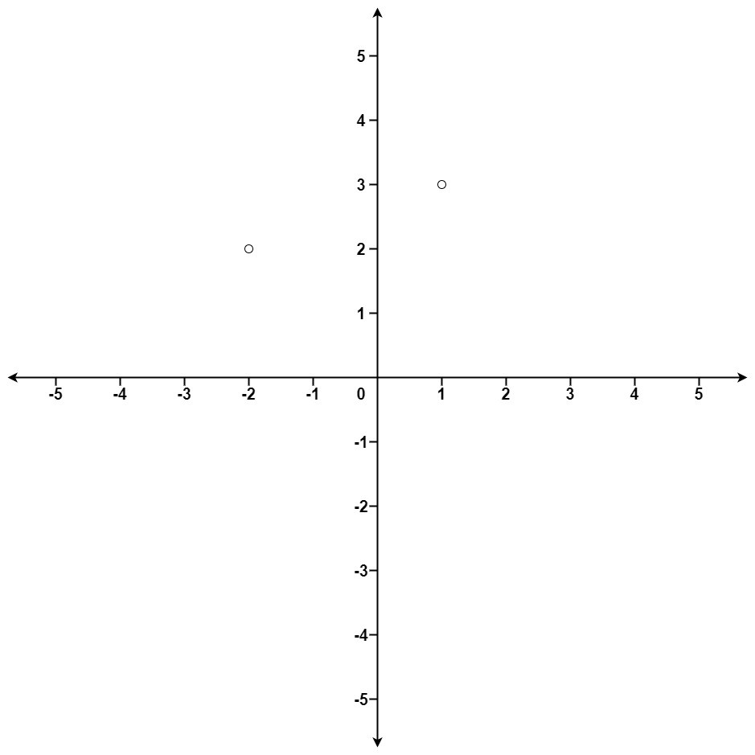

# [K Closest Points to Origin](https://leetcode.com/problems/k-closest-points-to-origin/)

**Medium** | **25 minutes** | **Array, Math, Divide and Conquer, Geometry, Sorting, Heap (Priority Queue), Quickselect**

**Pattern:** [Heap / Priority Queue](../patterns/heap/intuition.md)

**Practice:** [`practice/k_closest_points_to_origin/solution.py`](../../practice/k_closest_points_to_origin/solution.py)

Given an array of points where `points[i] = [xi, yi]` represents a point on the X-Y plane and an integer `k`, return the `k` closest points to the origin `(0, 0)`.

The distance between two points on the X-Y plane is the Euclidean distance (i.e., `√(x1 - x2)² + (y1 - y2)²`).

You may return the answer in any order. The answer is guaranteed to be unique (except for the order that it is in).

## Examples

### Example 1


**Input:** `points = [[1,3],[-2,2]], k = 1`

**Output:** `[[-2,2]]`

**Explanation:** The distance between `(1, 3)` and the origin is `sqrt(10)`.
The distance between `(-2, 2)` and the origin is `sqrt(8)`.
Since `sqrt(8) < sqrt(10)`, `(-2, 2)` is closer to the origin.
We only want the closest `k = 1` points from the origin, so the answer is just [[-2,2]].

### Example 2

**Input:** `points = [[3,3],[5,-1],[-2,4]], k = 2`

**Output:** `[[3,3],[-2,4]]`

**Explanation:** The answer `[[-2,4],[3,3]]` would also be accepted.

## Constraints

- `1 <= k <= points.length <= 10^4`
- `-10^4 <= xi, yi <= 10^4`

## Solutions

### Brute Force

```python
from typing import List


class Solution:
    def kClosest(self, points: List[List[int]], k: int) -> List[List[int]]:
        def dist(p: List[int]) -> int:
            # Squared distance preserves ordering and avoids a costly sqrt.
            return p[0] * p[0] + p[1] * p[1]

        remaining = list(points)
        closest = []
        # Pick the single closest remaining point k times by hand.
        for _ in range(k):
            best = 0
            for i in range(1, len(remaining)):
                if dist(remaining[i]) < dist(remaining[best]):
                    best = i
            closest.append(remaining.pop(best))
        return closest
```

#### Approach

The most direct idea, with no sort or heap: to find the `k` closest points,
repeatedly scan the remaining points for the single nearest one and remove it,
doing this `k` times. Comparing squared distances `x*x + y*y` is sufficient
because `√a < √b` iff `a < b` for non-negative values, so the square root adds
cost without changing the order.

1. Copy `points` into a working list so the input is left intact.
2. Repeat `k` times: scan every remaining point, track the index of the smallest
   squared distance, then pop that point and append it to the result.
3. After `k` rounds the result holds exactly the `k` closest points.

#### Time and Space Complexity Analysis

##### Time Complexity: `O(n * k)`

Each of the `k` selection rounds scans up to `n` remaining points, so the total
work is `O(n * k)`. When `k` approaches `n` this degrades toward `O(n^2)`.

##### Space Complexity: `O(n)`

The working copy of the points holds up to `n` entries; the result aside, no
other storage grows with the input.

#### Key Insights

- This is the most self-evident correct solution: find the nearest, remove it,
  repeat. It selects by hand rather than delegating to a sort or heap.
- It wastes work by rescanning the entire remaining list on every round, which
  motivates the heap and selection approaches that follow.
- Always key on squared distance; computing `sqrt` adds floating-point cost and
  rounding risk for no benefit to the ordering.

#### Walkthrough

Trace the Brute Force on Example 1: `points = [[1,3],[-2,2]]`, `k = 1`.

First, set up the working state: `remaining = [[1,3],[-2,2]]` (a copy of the
input) and `closest = []`. We then run the outer loop `k = 1` time, so just one
selection round.

In that round, `best` starts at `0` (pointing at `[1,3]`), and the inner loop
scans the rest of `remaining` to find the smallest squared distance. The keys
are `dist([1,3]) = 1*1 + 3*3 = 10` and `dist([-2,2]) = (-2)*(-2) + 2*2 = 8`:

| inner `i` | `remaining[i]` | `dist(remaining[i])` | `dist(remaining[best])` | smaller? | `best` after |
| --------- | -------------- | -------------------- | ----------------------- | -------- | ------------ |
| start     | -              | -                    | `10` (`best = 0`)       | -        | `0`          |
| `1`       | `[-2,2]`       | `8`                  | `10`                    | yes      | `1`          |

The scan ends with `best = 1`, so `remaining.pop(1)` removes `[-2,2]` and
appends it: `closest = [[-2,2]]`, leaving `remaining = [[1,3]]`. With `k = 1`
the loop is done.

The function returns `closest = [[-2,2]]`, which matches the example's expected
Output `[[-2,2]]`.

### Max-Heap of Size K

```python
import heapq
from typing import List


class Solution:
    def kClosest(self, points: List[List[int]], k: int) -> List[List[int]]:
        # Max-heap keyed by negative squared distance, capped at k entries.
        heap: list[tuple[int, List[int]]] = []
        for x, y in points:
            dist = x * x + y * y
            if len(heap) < k:
                heapq.heappush(heap, (-dist, [x, y]))
            elif -dist > heap[0][0]:
                # Closer than the current farthest in the heap: swap it in.
                heapq.heapreplace(heap, (-dist, [x, y]))
        return [point for _, point in heap]
```

#### Approach

Comparing squared distances avoids the square root entirely, since `√a < √b`
iff `a < b` for non-negative values. To keep only the `k` closest points we hold
a max-heap of size `k` keyed by negated squared distance, so the heap's top is
the farthest of the current candidates.

1. Iterate over the points, computing each squared distance `x*x + y*y`.
2. While the heap holds fewer than `k` points, push the point with key
   `-dist` (negation turns Python's min-heap into a max-heap).
3. Once the heap is full, if a new point is closer than the heap's farthest
   (`-dist > heap[0][0]`), replace the top with `heapreplace`.
4. After processing all points, the heap holds exactly the `k` closest; return
   their coordinates.

#### Time and Space Complexity Analysis

##### Time Complexity: `O(n log k)`

Each of the `n` points triggers at most one heap push or replace, and every heap
operation costs `O(log k)` because the heap never exceeds `k` elements.

##### Space Complexity: `O(k)`

The heap stores at most `k` points; output aside, no other storage grows with
the input.

#### Key Insights

- Keeping the heap bounded at `k` makes this superior to sorting when `k` is much
  smaller than `n`.
- Negating the squared distance turns `heapq` into a max-heap so the farthest
  candidate is always evictable in `O(1)` time at the top.
- `heapreplace` performs the pop-then-push in one balanced operation rather than
  two.

### Quickselect

```python
import random
from typing import List


class Solution:
    def kClosest(self, points: List[List[int]], k: int) -> List[List[int]]:
        def dist(p: List[int]) -> int:
            return p[0] * p[0] + p[1] * p[1]

        def partition(left: int, right: int, pivot_idx: int) -> int:
            pivot_dist = dist(points[pivot_idx])
            # Move pivot to the end, then gather smaller elements on the left.
            points[pivot_idx], points[right] = points[right], points[pivot_idx]
            store = left
            for i in range(left, right):
                if dist(points[i]) < pivot_dist:
                    points[store], points[i] = points[i], points[store]
                    store += 1
            points[right], points[store] = points[store], points[right]
            return store

        left, right = 0, len(points) - 1
        # Target the boundary so the first k slots are the k smallest distances.
        while left < right:
            pivot_idx = random.randint(left, right)
            mid = partition(left, right, pivot_idx)
            if mid == k:
                break
            elif mid < k:
                left = mid + 1
            else:
                right = mid - 1
        return points[:k]
```

#### Approach

Quickselect rearranges the array so the `k` smallest-distance points occupy the
first `k` slots, without fully sorting the rest. It reuses the partition step of
quicksort but recurses into only one side.

1. Pick a random pivot and partition the points so everything with a smaller
   squared distance sits to its left.
2. Let `mid` be the pivot's final index. If `mid == k`, the first `k` elements
   are exactly the answer.
3. If `mid < k`, the boundary lies to the right, so continue with `left = mid+1`;
   if `mid > k`, continue with `right = mid-1`.
4. When the loop ends, the first `k` points are the closest (in arbitrary order),
   which the problem permits.

#### Time and Space Complexity Analysis

##### Time Complexity: `O(n)` average, `O(n^2)` worst case

Each partition is linear, and random pivots shrink the search range by a constant
fraction on average, yielding `O(n)` expected work. A pathological pivot sequence
degrades to `O(n^2)`, made unlikely by randomization.

##### Space Complexity: `O(1)`

Partitioning happens in place; only a constant number of indices are tracked, so
no extra storage scales with the input.

#### Key Insights

- Quickselect beats sorting because it only orders enough of the array to fix the
  `k`-th boundary, never fully sorting either side.
- Randomizing the pivot guards against adversarial inputs that would otherwise
  trigger the quadratic worst case.
- Mutating `points` in place keeps auxiliary space constant, at the cost of
  reordering the caller's list.

### Sort by Distance

```python
from typing import List


class Solution:
    def kClosest(self, points: List[List[int]], k: int) -> List[List[int]]:
        # Squared distance preserves ordering and avoids a costly sqrt.
        points.sort(key=lambda p: p[0] * p[0] + p[1] * p[1])
        return points[:k]
```

#### Approach

Let the language do the work: sort every point by its squared distance from the
origin, then slice off the first `k`. Comparing squared distances `x*x + y*y` is
sufficient because `√a < √b` iff `a < b` for non-negative values, so the square
root adds cost without changing the order.

1. Sort `points` in place using the squared distance as the key.
2. Slice off the first `k` entries, which are now the closest.

#### Time and Space Complexity Analysis

##### Time Complexity: `O(n log n)`

The sort dominates: every one of the `n` points is compared during an
`O(n log n)` comparison sort.

##### Space Complexity: `O(1)` or `O(n)`

Python's `list.sort` is in place, so the extra space is `O(1)` beyond the output
slice. Sorting algorithms that allocate temporary buffers would use `O(n)`.

#### Key Insights

- The shortest solution to write, leaning on the built-in sort, and perfectly
  acceptable given the constraint `n <= 10^4`.
- Sorting the entire array does more work than necessary when `k` is much smaller
  than `n`, which the heap and Quickselect approaches avoid.
- Always key on squared distance; computing `sqrt` adds floating-point cost and
  rounding risk for no benefit to the ordering.

## Comparison of Solutions

### Time Complexity

- **Brute Force**: `O(n * k)` - `k` selection rounds, each scanning up to `n` points.
- **Max-Heap of Size K**: `O(n log k)` - one bounded heap operation per point.
- **Quickselect**: `O(n)` average, `O(n^2)` worst case - partial
  in-place selection.
- **Sort by Distance**: `O(n log n)` - one comparison sort over all points.

### Space Complexity

- **Brute Force**: `O(n)` - a working copy of the points to remove from.
- **Max-Heap of Size K**: `O(k)` - the heap holds at most `k` points.
- **Quickselect**: `O(1)` - partitions the input in place.
- **Sort by Distance**: `O(1)` with in-place sort, otherwise `O(n)`.

### Trade-offs

- Brute Force is the most self-evident to derive (find nearest, remove, repeat)
  but rescans the entire remaining list every round, wasting work when `k` is large.
- The heap gives a stable, predictable bound and never mutates the input, but
  carries a `log k` factor and `O(k)` extra space.
- Quickselect achieves linear average time and constant space but has a quadratic
  worst case and reorders the original array.
- Sorting is the shortest to write, but does full `O(n log n)` work even when `k`
  is tiny relative to `n`, and leans on the built-in sort to do the core selection.

### When to Use Each

- **Brute Force**: When `k` is tiny and clarity of derivation matters more than
  speed, or as a teaching baseline that selects by hand.
- **Max-Heap of Size K**: Streaming or very large `n` with small `k`, or when
  the input must not be modified and worst-case stability matters.
- **Quickselect**: When the whole array is in memory, average-case
  speed is the priority, and mutating the input is acceptable.
- **Sort by Distance**: When `n` is modest (as here, `n <= 10^4`) and the
  shortest correct code matters more than shaving the `log` factor.

### Optimization Notes

- Always compare squared distances; computing `sqrt` adds floating-point cost and
  rounding risk for no benefit to the ordering.
- Brute Force is the intuitive baseline; the heap improves to `O(n log k)` when
  `k` is small, Quickselect reaches `O(n)` average by ordering only enough of the
  array to fix the `k`-th boundary, and Sort by Distance trades the extra `log`
  factor for the brevity of a built-in sort.
