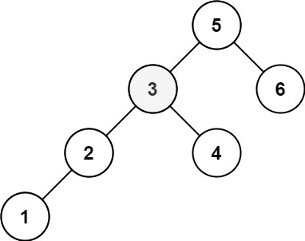

# [Kth Smallest Element in a BST](https://leetcode.com/problems/kth-smallest-element-in-a-bst/)

**Medium** | **25 minutes** | **Tree, Depth-First Search, Binary Search Tree**

**Pattern:** [Tree Traversal](../patterns/tree/intuition.md)

**Algorithm:** [Tree traversal](https://en.wikipedia.org/wiki/Tree_traversal) · [Binary search tree](https://en.wikipedia.org/wiki/Binary_search_tree) · [Morris traversal](https://en.wikipedia.org/wiki/Tree_traversal#Morris_in-order_traversal_using_threading) · [Threaded binary tree](https://en.wikipedia.org/wiki/Threaded_binary_tree)

**Practice:** [`practice/kth_smallest_element_in_a_bst/solution.py`](../../practice/kth_smallest_element_in_a_bst/solution.py)

Given the `root` of a binary search tree, and an integer `k`, return the `kth` smallest value (1-indexed) of all the values of the nodes in the tree.

## Examples

### Example 1


**Input:** `root = [3,1,4,null,2]`, `k = 1`

**Output:** `1`

### Example 2



**Input:** `root = [5,3,6,2,4,null,null,1]`, `k = 3`

**Output:** `3`

## Constraints

- The number of nodes in the tree is `n`.
- `1 <= k <= n <= 10^4`
- `0 <= Node.val <= 10^4`

## Follow-up

If the BST is modified often (i.e., we can do insert and delete operations) and you need to find the kth smallest frequently, how would you optimize?

## Deriving the Solution

A BST stores order structurally: everything in a node's left subtree is smaller
than the node, everything in its right subtree is larger. An in-order walk
(left subtree, node, right subtree) therefore visits the values in ascending
order, so the kth smallest value is simply the kth node an in-order traversal
visits. Every solution below is that same walk; they differ in how much of it
runs and what it costs in space.

1. **Start literal.** Run the full in-order walk, collect every value into a
   sorted list, and index it at `k - 1`. Correct, but it always touches all `n`
   nodes and stores all `n` values, even for `k = 1`: see
   [Recursive In-Order Traversal](#recursive-in-order-traversal).
2. **Spot the waste.** Nothing after the kth visit matters. To stop mid-walk,
   count visits as they happen and return at count `k`. An explicit stack makes
   the walk pausable at any node, unlike a plain recursion that must unwind:
   see [Iterative In-Order Traversal](#iterative-in-order-traversal).
3. **Shrink the space.** The stack exists only to find the way back up after a
   left descent. Morris traversal removes it: temporarily thread each subtree's
   rightmost node back to its root, follow the thread instead of a stack, and
   erase it on the way through, achieving the same early-stopping walk in
   `O(1)` extra space: see [Morris Traversal](#morris-traversal).

## Solutions

### Recursive In-Order Traversal

#### Derivation

The question this approach asks is where sorted order can come from without
sorting. The answer is the structure itself: because everything smaller than a
node lives in its left subtree and everything larger in its right subtree, an
in-order traversal of a [BST](https://en.wikipedia.org/wiki/Binary_search_tree)
yields the values in ascending order. That reduces the problem to producing the
full sorted list and reading one entry:

1. Recurse into the left subtree, then visit the node, then recurse into the
   right subtree, accumulating values in a list.
2. Because an in-order walk of a BST yields values in ascending order, the
   resulting list `sorted_values` is sorted.
3. Return the value at index `k - 1`, converting the 1-indexed `k` to a
   0-indexed lookup.

The approach is conceptually simple but processes every node regardless of how
small `k` is.

#### Walkthrough

Let us trace the Recursive In-Order Traversal on Example 1: `root = [3,1,4,null,2]`, `k = 1`. The tree looks like this: the root is `3`, its left child is `1`, its right child is `4`, and node `1` has a right child `2`.

```
      3
     / \
    1   4
     \
      2
```

The key idea: `inorder(node)` returns `inorder(node.left) + [node.val] + inorder(node.right)`. Each call must finish its left subtree before it can hand back its own value. We show the call tree, with each call returning a list that combines on the way back up.

```
inorder(3)
├─ inorder(1)                  # 3's left subtree
│  ├─ inorder(None)  -> []     # 1 has no left child
│  ├─ value [1]
│  └─ inorder(2)               # 1's right child
│     ├─ inorder(None) -> []   # 2 has no left child
│     ├─ value [2]
│     └─ inorder(None) -> []   # 2 has no right child
│     => [] + [2] + []  = [2]
│  => [] + [1] + [2]    = [1, 2]
├─ value [3]
└─ inorder(4)                  # 3's right subtree
   ├─ inorder(None) -> []      # 4 has no left child
   ├─ value [4]
   └─ inorder(None) -> []      # 4 has no right child
   => [] + [4] + []   = [4]
=> [1, 2] + [3] + [4]  = [1, 2, 3, 4]
```

So `sorted_values = [1, 2, 3, 4]`, the node values in ascending order. With `k = 1`, the code returns `sorted_values[k - 1]`, which is `sorted_values[0]`, giving `1`. This matches the expected Output of `1`.

#### Solution

The code is the walkthrough's call tree written down: concatenate left list,
own value, right list, then index the result.

```python
# Definition for a binary tree node.
# class TreeNode:
#     def __init__(self, val=0, left=None, right=None):
#         self.val = val
#         self.left = left
#         self.right = right
from typing import List, Optional


class Solution:
    def kthSmallest(self, root: Optional[TreeNode], k: int) -> int:
        def inorder(node: Optional[TreeNode]) -> List[int]:
            if not node:
                return []
            return inorder(node.left) + [node.val] + inorder(node.right)

        sorted_values = inorder(root)
        return sorted_values[k - 1]
```

#### Time and Space Complexity Analysis

##### Time Complexity: `O(n * H)`

The traversal always visits all `n` nodes regardless of `k`, and the
concatenation at each node copies every value already collected in its subtree.
Summed over the tree that copying costs `O(n * H)`: `O(n log n)` when the tree
is balanced, degrading to `O(n^2)` on a fully skewed tree. Appending each value
to one shared list instead of concatenating (`values.append(node.val)` at the
visit step) removes the copying and restores a true `O(n)`.

##### Space Complexity: `O(n)`

The final list holds all `n` node values, and the recursion stack adds `O(H)` for the tree height, which is dominated by the `O(n)` list.

#### Key Insights

- The BST property guarantees that an in-order traversal produces a sorted sequence, removing the need for an explicit sort.
- Concatenating lists at every node (`inorder(left) + [val] + inorder(right)`) is the most readable form but copies intermediate lists at every level; the standard `O(n)` variant appends into a single shared list instead.
- The `k - 1` index conversion is the single place where the 1-indexed problem statement meets 0-indexed Python lists.

### Iterative In-Order Traversal

#### Derivation

The recursive version's flaw is that it cannot stop: it builds the entire
sorted list even when only the first entry is needed. The repair is to count
visits during the walk and return the moment the count reaches `k`. That calls
for an [in-order traversal](https://en.wikipedia.org/wiki/Tree_traversal) that
can pause at any node, which an explicit stack provides:

1. Use an explicit stack to simulate the recursion: push nodes while descending left, so the top of the stack is always the smallest unvisited value.
2. Pop a node to "visit" it and increment a running counter.
3. When the counter reaches `k`, the popped node holds the answer, so return its value immediately.
4. Otherwise move into the popped node's right subtree and repeat.

Because the traversal stops the moment the kth node is visited, it never explores the rest of the tree.

#### Walkthrough

Let us run the stack-driven walk on Example 2, whose deeper left spine
exercises the descent: `root = [5,3,6,2,4,null,null,1]`, `k = 3`. The tree is

```text
        5
       / \
      3   6
     / \
    2   4
   /
  1
```

`current` starts at the root and `stack` starts empty. The inner loop pushes
nodes while walking left; each pop visits the smallest unprocessed node and
bumps `count`:

```text
descend left    push 5, 3, 2, 1        stack = [5, 3, 2, 1], current = None
pop 1           count = 1              not k; current = 1.right = None
pop 2           count = 2              not k; current = 2.right = None
pop 3           count = 3 == k         return current.val = 3
```

The first descent stacks the whole left spine `5, 3, 2, 1`, leaving the
smallest value on top. The pops then deliver values in ascending order: `1`,
then `2` (whose right subtree is empty, so nothing new is pushed), then `3`.
At `count == k` the function returns `3` immediately: node `4`, still hanging
off `3`'s right side, and node `6` are never visited. The returned `3` matches
the expected Output for Example 2.

#### Solution

The code is the walkthrough's two loops: push while descending left, pop to
visit, and return at the kth pop.

```python
# Definition for a binary tree node.
# class TreeNode:
#     def __init__(self, val=0, left=None, right=None):
#         self.val = val
#         self.left = left
#         self.right = right
from typing import List, Optional


class Solution:
    def kthSmallest(self, root: Optional[TreeNode], k: int) -> int:
        stack: List[TreeNode] = []
        current = root
        count = 0

        while current or stack:
            # Walk to the leftmost unvisited node
            while current:
                stack.append(current)
                current = current.left

            # Visit the smallest unprocessed node
            current = stack.pop()
            count += 1

            if count == k:
                return current.val

            # Continue into the right subtree
            current = current.right

        return -1  # Unreachable for valid inputs
```

#### Time and Space Complexity Analysis

##### Time Complexity: `O(H + k)` where `H` is the height of the tree

The work is the descent down the leftmost path plus `k` visits. For a balanced BST this is `O(log n + k)`; for a skewed BST it degrades to `O(n)`. Early termination is decisive when `k` is small.

##### Space Complexity: `O(H)`

The stack holds at most one path from root to leaf, which is `O(log n)` for a balanced tree and `O(n)` for a skewed tree.

#### Key Insights

- Replacing recursion with an explicit stack makes early termination natural: there is no recursion to unwind once the answer is found.
- The inner `while current` loop is what guarantees the next popped node is the smallest unprocessed value.
- This is the best general-purpose choice: it keeps the simple in-order logic while avoiding the full traversal cost of the recursive version.

### Morris Traversal

#### Derivation

The iterative walk still pays `O(H)` space for its stack, whose only job is to
remember the way back up after a left descent. The question
[Morris traversal](https://en.wikipedia.org/wiki/Tree_traversal#Morris_in-order_traversal_using_threading)
asks is whether the tree itself can store that return path. It can: the node
visited immediately before a root in an [in-order walk](https://en.wikipedia.org/wiki/Tree_traversal)
is its predecessor, the rightmost node of its left subtree, and that node's
right pointer is always unused (`None`). Pointing it back at the root creates a
temporary thread to follow instead of popping a stack:

1. For a node with no left child, visit it (increment the counter) and move right.
2. For a node with a left child, find its in-order predecessor: the rightmost node of the left subtree.
3. If that predecessor has no right link yet, create a temporary link back to the current node and descend left.
4. If the predecessor already links back to the current node, the left subtree is done: remove the temporary link, visit the current node, and move right.
5. Return as soon as the visit counter reaches `k`.

The temporary links let the traversal find its way back up the tree without a stack, and removing them restores the original structure.

#### Walkthrough

Let us thread our way through Example 2: `root = [5,3,6,2,4,null,null,1]`,
`k = 3`, the same tree as in the iterative walkthrough:

```text
        5
       / \
      3   6
     / \
    2   4
   /
  1
```

Each event below is one iteration of the outer loop: either a thread is
created and `current` descends left, or a node is visited and `current` moves
right (possibly along a thread):

```text
current = 5   has left; predecessor = 4 (rightmost of 5's left subtree)
              4.right is None -> thread 4.right = 5; descend: current = 3
current = 3   has left; predecessor = 2 (2.right is None)
              thread 2.right = 3; descend: current = 2
current = 2   has left; predecessor = 1 (1.right is None)
              thread 1.right = 2; descend: current = 1
current = 1   no left -> visit: count = 1; follow 1.right (thread) -> current = 2
current = 2   has left; predecessor walk finds 1.right == current
              left side done -> unthread 1.right = None
              visit: count = 2; follow 2.right (thread) -> current = 3
current = 3   has left; predecessor walk finds 2.right == current
              unthread 2.right = None; visit: count = 3 == k -> return 3
```

The first three iterations lay threads while descending the left spine, so
that after visiting `1` the walk can climb back to `2` and then `3` with no
stack at all. On each return the thread is recognized (the predecessor's right
pointer already targets `current`), erased, and the node is visited: the values
arrive in the sorted order `1`, `2`, `3`, and at `count == k` the function
returns `3`, the expected Output. Note that the early return leaves the
outermost thread `4.right = 5` in place: stopping mid-walk trades a fully
restored tree for speed, which is the corruption risk the Key Insights below
warn about.

#### Solution

The code is the walkthrough's event loop: thread on first arrival, unthread
and visit on second, count toward `k`.

```python
# Definition for a binary tree node.
# class TreeNode:
#     def __init__(self, val=0, left=None, right=None):
#         self.val = val
#         self.left = left
#         self.right = right
from typing import Optional


class Solution:
    def kthSmallest(self, root: Optional[TreeNode], k: int) -> int:
        current = root
        count = 0

        while current:
            if not current.left:
                # No left child, process current node
                count += 1
                if count == k:
                    return current.val
                current = current.right
            else:
                # Find inorder predecessor
                predecessor = current.left
                while predecessor.right and predecessor.right != current:
                    predecessor = predecessor.right

                if not predecessor.right:
                    # Make current the right child of predecessor
                    predecessor.right = current
                    current = current.left
                else:
                    # Revert the changes - process current node
                    predecessor.right = None
                    count += 1
                    if count == k:
                        return current.val
                    current = current.right

        return -1
```

#### Time and Space Complexity Analysis

##### Time Complexity: `O(n)` worst case

Each edge is traversed at most a constant number of times (once to create the temporary link, once to remove it), so the total work is linear in the number of nodes in the worst case. Like the iterative version, the loop returns as soon as the visit counter reaches `k`, so only the portion of the tree up to the kth node is walked.

##### Space Complexity: `O(1)`

No stack or output list is used; the only extra storage is a constant number of pointers, with the tree itself temporarily rewired and then restored.

#### Key Insights

- Morris traversal trades pointer mutation for space: it threads predecessor-to-successor links instead of storing the path on a stack.
- Every temporary link must be removed once the left subtree is exhausted; otherwise the tree is left corrupted with cycles.
- Like the iterative approach, it stops as soon as the count reaches `k`; its real cost difference is the constant-factor overhead of threading and unthreading predecessor links, not a lack of early exit.

## Comparison of Solutions

### Time Complexity

- **Recursive In-Order Traversal**: `O(n * H)` as written - Always processes all nodes, and the per-node list concatenation copies subtree results; appending into one shared list brings it down to `O(n)`
- **Iterative In-Order Traversal**: `O(H + k)` - Optimal for small k values
- **Morris Traversal**: `O(n)` worst case - Stops at the kth node like the iterative version, with extra constant-factor threading work

### Space Complexity

- **Recursive In-Order Traversal**: `O(n)` - Stores all values plus recursion stack
- **Iterative In-Order Traversal**: `O(H)` - Stack space proportional to height
- **Morris Traversal**: `O(1)` - Constant space complexity

### Trade-offs

- **Recursive In-Order Traversal**: Simple implementation complexity with excellent code readability, but no early termination and poor space efficiency since it always builds the full sorted list. Its practical performance is good for learning.
- **Iterative In-Order Traversal**: Medium implementation complexity with good code readability, supports early termination, and offers good space efficiency. Its practical performance is best for most cases.
- **Morris Traversal**: Complex implementation with poor code readability, but supports early termination and delivers excellent space efficiency. Its practical performance is best when space is critical.

### When to Use Each

- **Recursive In-Order Traversal**: When learning BST concepts or when code simplicity is paramount
- **Iterative In-Order Traversal**: Best general-purpose solution for interviews and production code
- **Morris Traversal**: When space constraints are critical and implementation complexity is acceptable

### Optimization Notes

- **Recommended solution**: Iterative In-Order Traversal is the best general-purpose choice, leveraging the BST property that in-order traversal yields values in sorted order and stopping as soon as the kth node is reached.
- **Key implementation detail**: Early termination is the decisive optimization. The Iterative In-Order Traversal and Morris Traversal approaches halt at the kth element instead of processing the entire tree, while Recursive In-Order Traversal always builds the full sorted list. Morris Traversal achieves optimal `O(1)` space by temporarily rewiring tree links, at the cost of implementation complexity.
- **Pitfall**: Morris traversal mutates the tree during traversal and must restore every link it creates; failing to revert these links leaves the tree corrupted. For interviews, start with Iterative In-Order Traversal and mention Morris Traversal when asked about space optimization.
- **Follow-up handling**: For frequently modified BSTs with repeated queries, augment nodes with subtree size information to support `O(log n)` queries.
