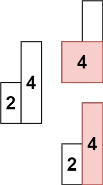

# [Largest Rectangle in Histogram](https://leetcode.com/problems/largest-rectangle-in-histogram/)

**Hard** | **60 minutes** | **Array, Stack, Monotonic Stack**

**Pattern:** [Monotonic Stack](../patterns/monotonic_stack/intuition.md)

**Algorithm:** [Monotonic stack](https://www.geeksforgeeks.org/introduction-to-monotonic-stack-data-structure-and-algorithm/) · [Divide and conquer](https://en.wikipedia.org/wiki/Divide-and-conquer_algorithm)

**Practice:** [`practice/largest_rectangle_in_histogram/solution.py`](../../practice/largest_rectangle_in_histogram/solution.py)

Given an array of integers `heights` representing the histogram's bar height where the width of each bar is `1`, return the area of the largest rectangle in the histogram.

## Examples

### Example 1


**Input:** `heights = [2,1,5,6,2,3]`

**Output:** `10`

**Explanation:** The above is a histogram where width of each bar is `1`.
The largest rectangle is shown in the red area, which has an area = `10` units.

### Example 2



**Input:** `heights = [2,4]`

**Output:** `4`

## Constraints

- `1 <= heights.length <= 10^5`
- `0 <= heights[i] <= 10^4`

## Deriving the Solution

Any rectangle drawn inside the histogram is capped by the shortest bar it
covers, so every candidate is described by a limiting bar and how far that
bar's height extends left and right before something shorter blocks it. Every
solution below searches that space; they differ in what drives the enumeration.

1. **Start literal.** Try every bar as the limiting one: fix its height as the
   ceiling and expand left and right until a strictly shorter bar blocks each
   side. Correct, but the expansions rescan overlapping spans, costing `O(n²)`:
   see [Brute Force: Expand Around Each Bar](#brute-force-expand-around-each-bar).
2. **Flip the enumeration.** Enumerate spans instead of bars: every subarray
   supports one maximal rectangle, its running minimum times its width. The
   sweep is more uniform, with constant work per span, but there are `O(n²)`
   spans to visit: see
   [Brute Force over All Subarrays](#brute-force-over-all-subarrays).
3. **Prune with the minimum.** The minimum bar of a range is the only bar that
   can span it fully, so the best rectangle either uses the minimum across the
   whole range or avoids it entirely on one side. Recursing on that split costs
   `O(n log n)` when the minima balance the halves, but degrades to `O(n²)` on
   sorted input: see [Divide and Conquer](#divide-and-conquer).
4. **Resolve boundaries in one pass.** All any bar needs is its nearest shorter
   bar on each side. A stack of indices kept in increasing height order answers
   both questions the moment a shorter bar arrives, giving each bar one push
   and one pop: `O(n)` total: see [Monotonic Stack](#monotonic-stack).

## Solutions

### Brute Force: Expand Around Each Bar

#### Derivation

What does a rectangle in a histogram look like? Its height is capped by the
shortest bar inside its span: anything taller would poke above that bar. So
every candidate rectangle is described by the bar that limits it, and the widest
rectangle limited by bar `i` stretches from the first strictly shorter bar on
its left to the first strictly shorter bar on its right. That dictates the most
literal enumeration: treat each bar in turn as the limiting one and measure how
far it reaches.

1. For each bar `i`, fix `current_height = heights[i]` as the rectangle's
   ceiling.
2. Walk `left` outward while the neighbor is at least as tall, stopping at the
   first strictly shorter bar.
3. Walk `right` outward the same way.
4. The area is `current_height * width` with `width = right - left + 1`; keep
   the running `max_area`.

#### Walkthrough

Let us trace this solution on Example 1: `heights = [2,1,5,6,2,3]`, so `n = 6`. We treat each bar `i` as the rectangle's ceiling, walk `left` while neighbors are at least as tall, walk `right` the same way, then compute `area = current_height * width` and keep the running `max_area`.

| `i` | `current_height` | `left` | `right` | `width` | `area` | `max_area` |
|-----|------------------|--------|---------|---------|--------|------------|
| 0 | 2 | 0 | 0 | 1 | 2 | 2 |
| 1 | 1 | 0 | 5 | 6 | 6 | 6 |
| 2 | 5 | 2 | 3 | 2 | 10 | 10 |
| 3 | 6 | 3 | 3 | 1 | 6 | 10 |
| 4 | 2 | 2 | 5 | 4 | 8 | 10 |
| 5 | 3 | 5 | 5 | 1 | 3 | 10 |

Reading a few rows to make the expansion concrete:

- `i = 1` (`current_height = 1`): bar `1` is the shortest of all, so the left walk reaches index `0` and the right walk runs all the way to index `5`. The span covers every bar, giving `width = 5 - 0 + 1 = 6` and `area = 1 * 6 = 6`.
- `i = 2` (`current_height = 5`): walking left stops immediately because `heights[1] = 1` is shorter than `5`, so `left = 2`. Walking right stops at index `3` because `heights[4] = 2` is shorter, so `right = 3`. That gives `width = 2` and `area = 5 * 2 = 10`, the new maximum.
- `i = 3` (`current_height = 6`): both neighbors (`5` on the left, `2` on the right) are shorter, so the rectangle is just the single bar: `width = 1`, `area = 6`. `max_area` stays at `10`.

After the final bar, `max_area = 10`, which matches the example's expected Output of `10`.

#### Solution

The code is the expansion from the walkthrough, run once per bar.

```python
class Solution:
    def largestRectangleArea(self, heights: List[int]) -> int:
        max_area = 0
        n = len(heights)

        for i in range(n):
            # Treat bar i as the limiting (shortest) bar of the rectangle
            current_height = heights[i]

            # Extend left while neighbors are at least as tall
            left = i
            while left > 0 and heights[left - 1] >= current_height:
                left -= 1

            # Extend right while neighbors are at least as tall
            right = i
            while right < n - 1 and heights[right + 1] >= current_height:
                right += 1

            width = right - left + 1
            max_area = max(max_area, current_height * width)

        return max_area
```

#### Time and Space Complexity Analysis

##### Time Complexity: `O(n²)`

For each bar, we potentially scan the entire array in both directions, giving `n` bars times `O(n)` expansion.

##### Space Complexity: `O(1)`

Uses only a constant amount of extra space.

#### Key Insights

- Every maximal rectangle is bounded by some bar acting as its shortest member, so iterating over candidate limiting bars covers all rectangles.
- The expansion stops at the first strictly shorter neighbor on each side, which defines the rectangle's natural left and right walls.
- Simple to reason about but quadratic, since adjacent bars of equal height force repeated re-scanning of the same span.

### Brute Force over All Subarrays

#### Derivation

The expansion approach rediscovers the same spans repeatedly: adjacent bars of
equal height expand to the identical rectangle, and each expansion rescans bars
that earlier expansions already visited. A more uniform enumeration flips the
roles: instead of picking the limiting bar and finding its span, pick the span
and find its limiting bar. Every contiguous subarray `[i, j]` supports exactly
one maximal rectangle, whose height is the minimum bar inside it, and growing
`j` rightward lets that minimum be maintained in constant time per step.

1. Fix a left boundary `i`.
2. Extend the right boundary `j` one bar at a time.
3. Update `min_height` to the smallest bar in `[i, j]`.
4. The candidate area is `min_height * (j - i + 1)`; keep the running maximum.

#### Walkthrough

Trace the double loop on Example 1: `heights = [2,1,5,6,2,3]`. Each line is one
`(i, j)` pair; runs where nothing decisive happens are condensed to their area
sequence:

```text
i=0  j=0   min_height=2  width=1  area=2    max_area=2
     j=1   min_height=1  width=2  area=2    max_area=2    (min drops: bar 1 is shorter)
     j=2   min_height=1  width=3  area=3    max_area=3
     j=3   min_height=1  width=4  area=4    max_area=4
     j=4   min_height=1  width=5  area=5    max_area=5
     j=5   min_height=1  width=6  area=6    max_area=6
i=1  j=1..5  min_height stays 1: areas 1, 2, 3, 4, 5      max_area=6
i=2  j=2   min_height=5  width=1  area=5    max_area=6
     j=3   min_height=5  width=2  area=10   max_area=10   (two tall bars, ceiling 5)
     j=4   min_height=2  width=3  area=6    max_area=10
     j=5   min_height=2  width=4  area=8    max_area=10
i=3  j=3..5  areas 6, 4, 6                                max_area=10
i=4  j=4..5  areas 2, 4                                   max_area=10
i=5  j=5   min_height=3  width=1  area=3    max_area=10
```

The decisive pair is `(i=2, j=3)`: the span covers the two tall bars `5` and
`6`, `min_height` stays `5`, and the area `5 * 2 = 10` becomes the maximum.
Widening the same start to `j=4` drags `min_height` down to `2`, showing how one
short bar caps every span that includes it. After all pairs, `max_area = 10`,
matching Example 1's expected Output.

#### Solution

The code is the walkthrough's double loop with `min_height` maintained
incrementally as `j` grows.

```python
class Solution:
    def largestRectangleArea(self, heights: List[int]) -> int:
        max_area = 0
        n = len(heights)

        for i in range(n):
            # Track the minimum height as the rectangle grows rightward
            min_height = heights[i]

            for j in range(i, n):
                min_height = min(min_height, heights[j])
                width = j - i + 1
                max_area = max(max_area, min_height * width)

        return max_area
```

#### Time and Space Complexity Analysis

##### Time Complexity: `O(n²)`

Nested loops enumerate all `O(n²)` subarrays, with constant work per subarray thanks to the incrementally maintained minimum.

##### Space Complexity: `O(1)`

Uses only a constant amount of extra space.

#### Key Insights

- Maintaining `min_height` incrementally avoids recomputing the minimum over each subarray, keeping per-subarray work constant.
- Enumerating all subarrays guarantees correctness because the optimal rectangle corresponds to some span with its minimum bar as the ceiling.
- It is more uniform than the expansion-based brute force but still quadratic and impractical for large inputs.

### Divide and Conquer

#### Derivation

The subarray sweep pays for its uniformity: it evaluates all `O(n²)` spans even
though most cannot be optimal. A sharper observation prunes the space. Within
any range, the minimum bar is the only bar that can support a rectangle spanning
the entire range, because every span containing it is capped at its height. So
the best rectangle in a range either uses that minimum across the full width, or
avoids the minimum entirely and lies wholly in the sub-range to its left or to
its right. That three-way split is a
**[divide and conquer](https://en.wikipedia.org/wiki/Divide-and-conquer_algorithm)**
recursion anchored on the minimum.

1. Find the index `min_idx` of the minimum bar in `[start, end]`.
2. Compute `area_with_min`, the rectangle that uses that bar across the full
   range.
3. Recurse on the left segment (`left_area`) and the right segment
   (`right_area`); an empty range (`start > end`) contributes `0`.
4. Return the maximum of the three candidates.

#### Walkthrough

Trace `calculate_area` on Example 1: `heights = [2,1,5,6,2,3]`. Each line shows
one call, indented by recursion depth; calls on empty ranges return `0` and are
left implicit:

```text
calculate_area(0, 5)   min_idx=1, height 1   area_with_min = 1 * 6 = 6
  calculate_area(0, 0)   min_idx=0, height 2   area_with_min = 2 * 1 = 2  -> 2
  calculate_area(2, 5)   min_idx=4, height 2   area_with_min = 2 * 4 = 8
    calculate_area(2, 3)   min_idx=2, height 5   area_with_min = 5 * 2 = 10
      calculate_area(3, 3)   min_idx=3, height 6   area_with_min = 6 * 1 = 6  -> 6
      -> max(10, 0, 6) = 10
    calculate_area(5, 5)   min_idx=5, height 3   area_with_min = 3 * 1 = 3  -> 3
    -> max(8, 10, 3) = 10
  -> max(6, 2, 10) = 10
```

The global minimum (bar `1`, height `1`) splits the histogram into `[0, 0]` and
`[2, 5]`. Inside `[2, 5]` the minimum is bar `4` (height `2`), and its left
segment `[2, 3]` holds the winner: the two tall bars with
`area_with_min = 5 * 2 = 10`. The maxima bubble back up through each `max`, and
the top-level call returns `10`, matching Example 1's expected Output.

#### Solution

The code is the recursion from the walkthrough: scan for the minimum, then take
the best of the three candidates.

```python
class Solution:
    def largestRectangleArea(self, heights: List[int]) -> int:
        def calculate_area(start: int, end: int) -> int:
            if start > end:
                return 0

            # The shortest bar in the range is the only one that can span it fully
            min_idx = start
            for i in range(start, end + 1):
                if heights[i] < heights[min_idx]:
                    min_idx = i

            area_with_min = heights[min_idx] * (end - start + 1)
            left_area = calculate_area(start, min_idx - 1)
            right_area = calculate_area(min_idx + 1, end)

            return max(area_with_min, left_area, right_area)

        if not heights:
            return 0

        return calculate_area(0, len(heights) - 1)
```

#### Time and Space Complexity Analysis

##### Time Complexity: `O(n log n)` average, `O(n²)` worst case

The average case occurs when the minimum element roughly halves the range at each level. The worst case occurs on a sorted array, where each split peels off a single element and the linear minimum scan repeats.

##### Space Complexity: `O(log n)` average, `O(n)` worst case

Recursion depth tracks how balanced the splits are, from logarithmic in the balanced case to linear on sorted input.

#### Key Insights

- The minimum bar in a range is the only bar that can support a rectangle spanning that entire range, which justifies the three-way split.
- Balance depends entirely on input shape, so the technique degrades to `O(n²)` on monotonic data where the stack approach stays linear.
- It avoids auxiliary boundary arrays but pays a recurring linear scan to locate each minimum.

### Monotonic Stack

#### Derivation

The divide and conquer still pays a linear scan to locate every minimum, and its
balance is at the input's mercy: sorted heights peel off one bar per level and
degrade to `O(n²)`. Step back to what each bar actually needs: the nearest
strictly shorter bar on its left and on its right, since those two walls fix
the widest rectangle at that bar's height. Both walls can be found for every
bar in one left-to-right sweep with a
**[monotonic stack](https://www.geeksforgeeks.org/introduction-to-monotonic-stack-data-structure-and-algorithm/)**
of indices kept in increasing height order. While bars keep rising, nothing is
resolved and indices are pushed. The moment the current bar `i` is shorter than
the bar on top of the stack, that top bar has just met its right wall (`i`),
and its left wall is whatever sits beneath it on the stack: pop it and measure.

1. Iterate over the bars, maintaining a stack whose heights increase from bottom to top.
2. When the current bar is shorter than the stack top, pop it: the current index is its right boundary and the new stack top is its left boundary.
3. Compute the popped bar's rectangle width as `i - stack[-1] - 1`, or `i` when the stack empties.
4. After the loop, flush the remaining bars, whose right boundary is the end of the histogram (`n`).

#### Formula

Every maximal rectangle is capped by some bar's full height, so it is enough to
ask, for each bar, how far it can extend before hitting something shorter:

$$
L(i) = \max\bigl\{\, j < i \ :\ \text{heights}[j] < \text{heights}[i] \,\bigr\},
\qquad
R(i) = \min\bigl\{\, j > i \ :\ \text{heights}[j] < \text{heights}[i] \,\bigr\}
$$

```text
L(i) = greatest index j < i with heights[j] < heights[i],  or -1 if none
R(i) = least index j > i with heights[j] < heights[i],     or n if none
```

The rectangle anchored at `i` spans the open interval between them:

$$
\text{area}(i) = \text{heights}[i] \cdot \bigl(R(i) - L(i) - 1\bigr),
\qquad
\text{answer} = \max_{0 \le i < n} \text{area}(i)
$$

```text
area(i)  = heights[i] * (R(i) - L(i) - 1)
max_area = max area(i) over all 0 <= i < n
```

The \(-1\) excludes both boundary bars, which are strictly shorter and therefore
not part of the rectangle. \(L\) and \(R\) are the previous and next *smaller*
elements, the canonical monotonic-stack query. The stack resolves both at once:
a bar is popped exactly when the current index becomes its \(R\), and whatever
sits beneath it on the stack is its \(L\).

#### Walkthrough

Trace the stack on Example 1: `heights = [2,1,5,6,2,3]`, `n = 6`. The stack
holds indices; each event line shows a push, or a pop with the rectangle it
measures:

```text
i=0  h=2   stack empty -> push 0                                        stack = [0]
i=1  h=1   heights[0]=2 > 1 -> pop 0: height=2, stack empty,
           width = i = 1, area = 2                                      max_area=2
           push 1                                                       stack = [1]
i=2  h=5   heights[1]=1 <= 5 -> push 2                                  stack = [1, 2]
i=3  h=6   heights[2]=5 <= 6 -> push 3                                  stack = [1, 2, 3]
i=4  h=2   heights[3]=6 > 2 -> pop 3: height=6, width=4-2-1=1, area=6   max_area=6
           heights[2]=5 > 2 -> pop 2: height=5, width=4-1-1=2, area=10  max_area=10
           heights[1]=1 <= 2 -> push 4                                  stack = [1, 4]
i=5  h=3   heights[4]=2 <= 3 -> push 5                                  stack = [1, 4, 5]
flush      pop 5: height=3, width=6-4-1=1, area=3                       max_area=10
           pop 4: height=2, width=6-1-1=4, area=8                       max_area=10
           pop 1: height=1, stack empty -> width = n = 6, area=6        max_area=10
```

The decisive event is the second pop at `i=4`: bar `2` (height `5`) meets its
right wall at index `4` and finds its left wall at the new stack top, index `1`,
so `width = 4 - 1 - 1 = 2` and `area = 10`: the red rectangle from the figure.
The flush then measures the bars that never met a shorter bar to their right,
using `n = 6` as their right boundary. The final `max_area = 10` matches
Example 1's expected Output.

#### Solution

The code is the walkthrough's push, pop-and-measure, and final flush.

```python
class Solution:
    def largestRectangleArea(self, heights: List[int]) -> int:
        stack = []  # indices of bars in increasing-height order
        max_area = 0
        n = len(heights)

        for i in range(n):
            # Current bar is the right boundary for every taller bar on the stack
            while stack and heights[stack[-1]] > heights[i]:
                height = heights[stack.pop()]
                # Left boundary is the new stack top; width excludes both walls
                width = i if not stack else i - stack[-1] - 1
                max_area = max(max_area, height * width)
            stack.append(i)

        # Flush remaining bars: their right boundary is the end of the histogram
        while stack:
            height = heights[stack.pop()]
            width = n if not stack else n - stack[-1] - 1
            max_area = max(max_area, height * width)

        return max_area
```

#### Time and Space Complexity Analysis

##### Time Complexity: `O(n)`

Each index is pushed and popped at most once, so the total work is linear despite the inner `while` loop.

##### Space Complexity: `O(n)`

In the worst case of strictly increasing heights, the stack holds every index before any pop occurs.

#### Key Insights

- The stack invariant (increasing heights) guarantees that when a bar is popped, the bar immediately below it is its nearest shorter bar on the left.
- The width formula `i - stack[-1] - 1` is the crux: it spans from just past the left boundary to just before the right boundary, and collapses to `i` when no left boundary remains.
- Forgetting to flush the stack after the main loop is the classic bug, since those bars never meet a shorter bar on the right and must extend to the array end.

## Comparison of Solutions

### Time Complexity

- **Brute Force: Expand Around Each Bar**: `O(n²)` - Quadratic time
- **Brute Force over All Subarrays**: `O(n²)` - Quadratic time
- **Divide and Conquer**: `O(n log n)` average, `O(n²)` worst case
- **Monotonic Stack**: `O(n)` - Optimal linear time

### Space Complexity

- **Brute Force: Expand Around Each Bar**: `O(1)` - Constant space
- **Brute Force over All Subarrays**: `O(1)` - Constant space
- **Divide and Conquer**: `O(log n)` average - Recursion stack
- **Monotonic Stack**: `O(n)` - Stack storage

### Trade-offs

- **Brute Force: Expand Around Each Bar**: Poor time efficiency but excellent space efficiency. Implementation complexity is low and conceptual difficulty is very low. Suitable for learning only in an interview setting.
- **Brute Force over All Subarrays**: Poor time efficiency but excellent space efficiency. Implementation complexity is low and conceptual difficulty is low. Suitable for learning only in an interview setting.
- **Divide and Conquer**: Good time efficiency in the average case and excellent space efficiency in the average case. Implementation complexity is medium and conceptual difficulty is medium. Acceptable as an interview answer.
- **Monotonic Stack**: Optimal time efficiency with good space efficiency. Implementation complexity is high and conceptual difficulty is high. This is the most preferred solution in interviews.

### When to Use Each

- **Brute Force: Expand Around Each Bar**: Only for learning the basic problem definition
- **Brute Force over All Subarrays**: For understanding the problem structure and building intuition
- **Divide and Conquer**: When recursion is preferred or as a stepping stone to the optimal solution
- **Monotonic Stack**: Best solution for production and interviews: optimal time complexity

### Optimization Notes

- The **Monotonic Stack** solution is the recommended approach: it achieves optimal `O(n)` time by guaranteeing each bar is pushed and popped at most once.
- The critical implementation detail is the width calculation when popping: the width spans from the next smaller bar on the left (the new stack top after popping) to the current bar on the right, computed as `i - stack[-1] - 1`, or `i` when the stack becomes empty.
- A common pitfall is forgetting to process the bars remaining on the stack after the main loop ends. These bars have no smaller bar to their right, so their width extends to the end of the histogram.
- This problem is the classic example of monotonic stack applications, and the same "next greater/smaller element" technique generalizes to many related problems. Edge cases such as empty arrays, single elements, and arrays containing zeros require careful handling across all approaches.
