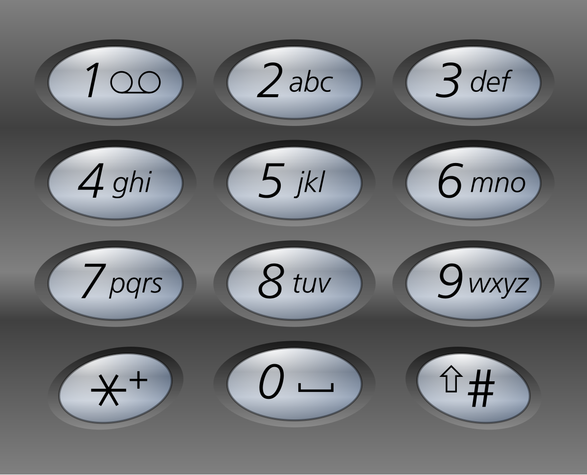

# [Letter Combinations of a Phone Number](https://leetcode.com/problems/letter-combinations-of-a-phone-number/)

**Medium** | **30 minutes** | **Hash Table, String, Backtracking**

**Pattern:** [Backtracking](../patterns/backtracking_exploration/intuition.md)

**Algorithm:** [Backtracking](https://en.wikipedia.org/wiki/Backtracking)

**Practice:** [`practice/letter_combinations_of_a_phone_number/solution.py`](../../practice/letter_combinations_of_a_phone_number/solution.py)

Given a string containing digits from `2-9` inclusive, return all possible letter combinations that the number could represent. Return the answer in **any order**.

A mapping of digits to letters (just like on the telephone buttons) is given below. Note that `1` does not map to any letters.



## Examples

### Example 1

**Input:** `digits = "23"`

**Output:** `["ad","ae","af","bd","be","bf","cd","ce","cf"]`

### Example 2

**Input:** `digits = ""`

**Output:** `[]`

**Explanation:** An empty input maps to no combinations.

### Example 3

**Input:** `digits = "2"`

**Output:** `["a","b","c"]`

## Constraints

- `0 <= digits.length <= 4`
- `digits[i]` is a digit in the range `['2', '9']`.

## Deriving the Solution

Every combination picks exactly one letter for each digit, in digit order, so
the answer is the [Cartesian product](https://en.wikipedia.org/wiki/Cartesian_product)
of the per-digit letter sets (the [Formula](#formula) below states it). The
output itself is exponential in the number of digits, so every approach shares
the same complexity; what separates them is the order in which they visit the
product and the intermediate state they carry.

1. **Start literal.** Build the product one digit at a time: keep the list of
   all combinations of the digits processed so far, and extend every entry by
   every letter of the next digit: see
   [Iterative Build-up](#iterative-build-up). It holds an entire generation of
   partial combinations at every step.
2. **Write the product as an equation.** The same product can be stated
   recursively: the combinations for `digits[index:]` are each letter of
   `digits[index]` prepended to every combination of `digits[index + 1:]`. The
   code becomes a transcription of the math, at the cost of recursion and a
   suffix list per level: see
   [Recursive Suffix Expansion](#recursive-suffix-expansion).
3. **Make the tree explicit.** The build-up is really a level-order walk of a
   choice tree, one level per digit; a queue makes the levels concrete, at the
   cost of queue management: see [Queue-based BFS](#queue-based-bfs).
4. **Carry one path instead of a generation.** All of the above keep every
   partial combination of the current length alive at once. Walking the same
   tree depth-first with a single shared `path` buffer keeps only one partial
   alive beside the finished results, and is the canonical interview form: see
   [Backtracking](#backtracking).
5. **Let the library do it.** The Cartesian product is a standard-library
   primitive, so the entire enumeration collapses to one call, at the cost of
   demonstrating no algorithm at all: see
   [Built-in itertools.product](#built-in-itertoolsproduct).

## Solutions

### Iterative Build-up

#### Derivation

Build the combinations one digit at a time. Start with a single empty
combination, then for each digit replace the current list with an expanded list
that [appends every letter of that digit to every existing combination](https://en.wikipedia.org/wiki/Cartesian_product).
The invariant is that after processing a prefix of the digits, the working list
holds exactly the combinations of that prefix.

1. Return `[]` immediately for empty input, since no combinations exist.
2. Seed `combinations` with one empty string.
3. For each digit, look up its `letters` and build `new_combinations` by
   appending each letter to each current combination.
4. Replace `combinations` with the expanded list and continue; after the last
   digit it holds the answer.

#### Formula

The answer is the [Cartesian product](https://en.wikipedia.org/wiki/Cartesian_product)
of the letter sets, one factor per digit:

$$
\text{answer} = L(d_1) \times L(d_2) \times \dots \times L(d_n)
= \prod_{i=1}^{n} L(d_i)
$$

```text
answer = digit_to_letters[digits[0]] x digit_to_letters[digits[1]]
         x ... x digit_to_letters[digits[n - 1]]
       = cartesian product over i in 0..n-1 of digit_to_letters[digits[i]]
```

where \(L(d)\) is the letter set for digit `d`. Its size multiplies:

$$
\bigl|\text{answer}\bigr| = \prod_{i=1}^{n} \bigl|L(d_i)\bigr|
$$

```text
len(answer) = product over i in 0..n-1 of len(digit_to_letters[digits[i]])
```

Since each digit maps to 3 or 4 letters, the count sits between \(3^n\) and
\(4^n\), exponential, which is why \(O(4^n \cdot n)\) is the honest bound: one
factor for the number of combinations, and \(n\) for assembling each string.

This solution computes the product left to right, using the fact that a
Cartesian product can be built one factor at a time:

$$
\prod_{i=1}^{k} L(d_i) = \left( \prod_{i=1}^{k-1} L(d_i) \right) \times L(d_k)
$$

```text
combinations(k) = combinations(k - 1) x digit_to_letters[digits[k - 1]]
combinations(0) = [""]
                  (combinations(k) is the value of combinations after k passes)
```

The seed `[""]` is the identity for that operation: the product of zero sets is
the single empty tuple, not the empty set. Starting from `[]` instead would
annihilate everything, since anything crossed with the empty set stays empty.

#### Walkthrough

Trace the **Iterative Build-up** solution on Example 1: `digits = "23"`. The key
state is `combinations`, the working list that gets replaced once per digit.

We start before the loop with a single empty string: `combinations = [""]`. Now
we process each digit, expanding every current combination by every letter.

**Pass 1: digit `"2"`** (`letters = "abc"`). We loop over `combinations`, which is
just `[""]`, and for each combination append every letter. The table shows
`new_combinations` filling up:

| `combination` | `letter` | append | `new_combinations` so far |
|---------------|----------|--------|---------------------------|
| `""` | `a` | `"" + "a"` | `["a"]` |
| `""` | `b` | `"" + "b"` | `["a", "b"]` |
| `""` | `c` | `"" + "c"` | `["a", "b", "c"]` |

After the pass, `combinations = ["a", "b", "c"]`.

**Pass 2: digit `"3"`** (`letters = "def"`). Now every one of the three current
combinations is extended by each of `d`, `e`, `f`:

| `combination` | `letter` | append | `new_combinations` so far |
|---------------|----------|--------|---------------------------|
| `"a"` | `d` | `"a" + "d"` | `["ad"]` |
| `"a"` | `e` | `"a" + "e"` | `["ad", "ae"]` |
| `"a"` | `f` | `"a" + "f"` | `["ad", "ae", "af"]` |
| `"b"` | `d` | `"b" + "d"` | `["ad", "ae", "af", "bd"]` |
| `"b"` | `e` | `"b" + "e"` | `["ad", "ae", "af", "bd", "be"]` |
| `"b"` | `f` | `"b" + "f"` | `["ad", "ae", "af", "bd", "be", "bf"]` |
| `"c"` | `d` | `"c" + "d"` | `[..., "bf", "cd"]` |
| `"c"` | `e` | `"c" + "e"` | `[..., "cd", "ce"]` |
| `"c"` | `f` | `"c" + "f"` | `[..., "ce", "cf"]` |

After the pass, `combinations = ["ad", "ae", "af", "bd", "be", "bf", "cd", "ce", "cf"]`.

No digits remain, so we return `combinations`, which is
`["ad","ae","af","bd","be","bf","cd","ce","cf"]`. This matches the expected
Output for Example 1.

#### Solution

The code is the walkthrough's two nested loops, one generation per digit.

```python
from typing import List


class Solution:
    def letterCombinations(self, digits: str) -> List[str]:
        if not digits:
            return []

        digit_to_letters = {
            '2': 'abc', '3': 'def', '4': 'ghi', '5': 'jkl',
            '6': 'mno', '7': 'pqrs', '8': 'tuv', '9': 'wxyz',
        }

        combinations = [""]
        for digit in digits:
            letters = digit_to_letters[digit]
            new_combinations = []
            for combination in combinations:
                for letter in letters:
                    new_combinations.append(combination + letter)
            combinations = new_combinations

        return combinations
```

#### Time and Space Complexity Analysis

##### Time Complexity: `O(3^n * 4^m)`

Where `n` is the count of digits mapping to three letters and `m` the count
mapping to four letters. The expansion produces exactly this many combinations,
and each is built incrementally.

##### Space Complexity: `O(3^n * 4^m)`

The working list holds every intermediate and final combination during the
build-up, which is dominated by the final result size.

#### Key Insights

- The result is the Cartesian product of the per-digit letter sets, built one
  factor at a time.
- No recursion is required, which avoids recursion-stack overhead.
- Replacing the list each iteration keeps the state to exactly one generation of
  combinations at a time, aside from the new list being constructed.

### Recursive Suffix Expansion

#### Derivation

The iterative build assembles the product front to back with explicit loops.
The same product can instead be written as the equation it satisfies, in
[divide and conquer](https://en.wikipedia.org/wiki/Divide-and-conquer_algorithm)
style: the combinations for `digits[index:]` equal each letter of
`digits[index]` prepended to every combination of `digits[index + 1:]`. The
code becomes a direct transcription of that equation, at the cost of recursion
and a suffix list per level.

1. The base case at `index == len(digits)` returns `[""]`, a single empty suffix.
2. Recurse on the remaining digits to obtain all `suffixes`.
3. Combine each letter of the current digit with each suffix.
4. The top-level call `generate(0)` returns the full set for `digits[0:]`.

#### Walkthrough

Trace `generate` on Example 1: `digits = "23"`. The recursion dives to the base
case first, then builds combinations on the way back up:

```text
generate(0)   digit '2': needs suffixes from generate(1)
  generate(1)   digit '3': needs suffixes from generate(2)
    generate(2)   index == len(digits) -> return [""]
  generate(1)   letters = "def", prepend each to [""]
                -> ["d", "e", "f"]
generate(0)   letters = "abc", prepend each to ["d", "e", "f"]
              -> ["ad","ae","af","bd","be","bf","cd","ce","cf"]
```

The base case returns `[""]` rather than `[]`: prepending `"d"` to the single
empty suffix yields `"d"`, while an empty list would leave nothing to prepend
to and collapse every level to empty. The top-level call returns the nine
combinations, matching the expected Output for Example 1.

#### Solution

The code is the equation from the walkthrough: one recursive call for the
suffixes, one comprehension to prepend the letters.

```python
from typing import List


class Solution:
    def letterCombinations(self, digits: str) -> List[str]:
        if not digits:
            return []

        digit_to_letters = {
            '2': 'abc', '3': 'def', '4': 'ghi', '5': 'jkl',
            '6': 'mno', '7': 'pqrs', '8': 'tuv', '9': 'wxyz',
        }

        def generate(index: int) -> List[str]:
            if index == len(digits):
                return [""]
            suffixes = generate(index + 1)
            letters = digit_to_letters[digits[index]]
            return [letter + suffix for letter in letters for suffix in suffixes]

        return generate(0)
```

#### Time and Space Complexity Analysis

##### Time Complexity: `O(3^n * 4^m)`

Each combination is produced exactly once, with additional linear work combining
suffixes at every recursion level.

##### Space Complexity: `O(3^n * 4^m)`

The combined lists hold every combination, plus `O(k)` recursion-stack depth for
`k = len(digits)`.

#### Key Insights

- Expresses the combinatorial structure recursively:
  `combos(digits) = letters(first) x combos(rest)`.
- Recomputes suffix lists once per level rather than per branch, since each
  `generate(index)` call evaluates `generate(index + 1)` a single time.
- The base case returning `[""]` (not `[]`) is essential; an empty list would
  collapse every product to empty.

### Queue-based BFS

#### Derivation

The recursion builds the product from the last digit back toward the first. The
same choice tree can be walked from the top instead, level by level, in
[breadth-first](https://en.wikipedia.org/wiki/Breadth-first_search) order: the
queue holds all combinations of the current length, and processing one digit
advances every entry to the next length. The one subtlety is keeping levels
separate: snapshotting `len(queue)` before the inner loop guarantees each entry
of the current level is dequeued exactly once and never re-extended within the
same digit's pass.

1. Return `[]` for empty input.
2. Seed the queue with one empty string.
3. For each digit, snapshot the current queue length and dequeue exactly that
   many entries, enqueuing each extended by every letter of the digit.
4. After all digits are processed, the queue holds the full-length combinations.

#### Walkthrough

Trace the queue on Example 1: `digits = "23"`:

```text
start        queue = [""]
digit '2'    snapshot len = 1
             pop ""  -> push "a", "b", "c"
             queue = ["a", "b", "c"]
digit '3'    snapshot len = 3
             pop "a" -> push "ad", "ae", "af"
             pop "b" -> push "bd", "be", "bf"
             pop "c" -> push "cd", "ce", "cf"
             queue = ["ad", "ae", "af", "bd", "be", "bf", "cd", "ce", "cf"]
```

Mid-pass the queue mixes lengths: after `"a"` is processed it holds
`["b", "c", "ad", "ae", "af"]`. The snapshot of `3` is what stops the loop from
dequeuing `"ad"` in the same pass and extending it twice. When the loop ends,
`list(queue)` is the nine combinations, matching the expected Output for
Example 1.

#### Solution

The code is the walkthrough's level advance, one snapshot-bounded pass per
digit.

```python
from collections import deque
from typing import List


class Solution:
    def letterCombinations(self, digits: str) -> List[str]:
        if not digits:
            return []

        digit_to_letters = {
            '2': 'abc', '3': 'def', '4': 'ghi', '5': 'jkl',
            '6': 'mno', '7': 'pqrs', '8': 'tuv', '9': 'wxyz',
        }

        queue = deque([""])
        for digit in digits:
            letters = digit_to_letters[digit]
            for _ in range(len(queue)):
                current = queue.popleft()
                for letter in letters:
                    queue.append(current + letter)

        return list(queue)
```

#### Time and Space Complexity Analysis

##### Time Complexity: `O(3^n * 4^m)`

The level-by-level expansion enqueues each combination exactly once.

##### Space Complexity: `O(3^n * 4^m)`

The queue holds all combinations of the current length, which grows to the full
result size.

#### Key Insights

- Equivalent to the iterative build-up but framed as breadth-first traversal of
  the choice tree.
- The fixed-count inner loop (`range(len(queue))`) is what separates one level
  from the next.
- `deque` gives `O(1)` pops from the front, avoiding the `O(n)` cost of
  `list.pop(0)`.

### Backtracking

#### Derivation

Every approach so far keeps a whole generation of partial combinations alive at
once, up to the full result size. Walking the same choice tree
[depth-first](https://en.wikipedia.org/wiki/Depth-first_search) needs only one
partial at a time: a single shared `path` list accumulates the current choice
for each digit, and finished combinations are copied out at the leaves. The
choose / explore / unchoose discipline (push a letter, recurse, pop it)
restores `path` before the next branch, so one buffer serves the entire tree.
Each digit position has its own independent set of choices, so no
visited-tracking is needed, unlike permutation problems.

1. Return `[]` for empty input.
2. At `index == n`, join the accumulated `path` and append it to `result`.
3. Otherwise, for each letter of the current digit, push it onto `path`, recurse,
   then pop it to restore state for the next letter.

#### Walkthrough

Trace the push and pop events on Example 1: `digits = "23"`, `n = 2`. The `'a'`
branch is shown in full; the `'b'` and `'c'` branches repeat the identical
pattern:

```text
push 'a'        path = ['a']
  push 'd'      path = ['a', 'd']   index == 2 -> record "ad"
  pop  'd'      path = ['a']
  push 'e'      path = ['a', 'e']   index == 2 -> record "ae"
  pop  'e'      path = ['a']
  push 'f'      path = ['a', 'f']   index == 2 -> record "af"
  pop  'f'      path = ['a']
pop  'a'        path = []
push 'b'        ... records "bd", "be", "bf" the same way
push 'c'        ... records "cd", "ce", "cf" the same way
```

Every recursive call is bracketed by a push and a pop, so `path` returns to its
previous state before the next letter is tried; that is why one list can serve
all nine leaves. `result` accumulates the combinations in the order
`["ad","ae","af","bd","be","bf","cd","ce","cf"]`, matching the expected Output
for Example 1.

#### Solution

The code is the walkthrough's choose / explore / unchoose loop around one
shared `path`.

```python
from typing import List


class Solution:
    def letterCombinations(self, digits: str) -> List[str]:
        if not digits:
            return []

        digit_to_letters = {
            '2': 'abc', '3': 'def', '4': 'ghi', '5': 'jkl',
            '6': 'mno', '7': 'pqrs', '8': 'tuv', '9': 'wxyz',
        }

        result: List[str] = []
        n = len(digits)

        def backtrack(index: int, path: List[str]) -> None:
            if index == n:
                result.append("".join(path))
                return
            for letter in digit_to_letters[digits[index]]:
                path.append(letter)
                backtrack(index + 1, path)
                path.pop()

        backtrack(0, [])
        return result
```

#### Time and Space Complexity Analysis

##### Time Complexity: `O(3^n * 4^m)`

Every leaf of the decision tree corresponds to one combination, and each is
produced once.

##### Space Complexity: `O(3^n * 4^m)`

The result stores all combinations, plus `O(k)` for the recursion stack and the
shared `path` of length `k = len(digits)`.

#### Key Insights

- The canonical interview answer: it makes the choose / explore / unchoose
  structure explicit.
- Accumulating into a list and joining once avoids repeated string concatenation
  along the path.
- Popping after each recursive call (`path.pop()`) is the backtracking step that
  reuses one buffer across all branches.

### Built-in itertools.product

#### Derivation

The Formula in the Iterative Build-up section names the answer outright: the
Cartesian product of the per-digit letter sets. The standard library computes
exactly that, so the whole enumeration collapses to a single
[`itertools.product`](https://docs.python.org/3/library/itertools.html) call.

1. Return `[]` for empty input.
2. Map each digit to its letter group.
3. Spread the groups into `product`, which yields one tuple per combination, and
   join each tuple into a string.

#### Walkthrough

Here the library call is the technique, so the trace shows what `product`
receives and the order in which it yields tuples: rightmost factor fastest,
like an odometer. On Example 1, `digits = "23"`:

```text
letter_groups = ["abc", "def"]
product(*letter_groups) yields:
    ('a','d')  ('a','e')  ('a','f')
    ('b','d')  ('b','e')  ('b','f')
    ('c','d')  ('c','e')  ('c','f')
join each tuple -> ["ad","ae","af","bd","be","bf","cd","ce","cf"]
```

Each row is one first-digit letter crossed with all three second-digit letters.
Joining the tuples gives the nine combinations, matching the expected Output
for Example 1.

#### Solution

The code is the walkthrough's single `product` call plus the join.

```python
from itertools import product
from typing import List


class Solution:
    def letterCombinations(self, digits: str) -> List[str]:
        if not digits:
            return []

        digit_to_letters = {
            '2': 'abc', '3': 'def', '4': 'ghi', '5': 'jkl',
            '6': 'mno', '7': 'pqrs', '8': 'tuv', '9': 'wxyz',
        }

        letter_groups = [digit_to_letters[digit] for digit in digits]
        return ["".join(combo) for combo in product(*letter_groups)]
```

#### Time and Space Complexity Analysis

##### Time Complexity: `O(3^n * 4^m)`

`product` enumerates exactly the combinations of the Cartesian product.

##### Space Complexity: `O(3^n * 4^m)`

The returned list stores every combination.

#### Key Insights

- The shortest expression of the solution, leaning on the standard library to do
  the combinatorial work.
- Maps the mathematical view (Cartesian product) onto a single library call.
- Less suitable when an interviewer wants to see the underlying algorithm.

## Comparison of Solutions

### Time Complexity

- **Iterative Build-up**: `O(3^n * 4^m)` - expands every existing combination per digit, producing the full set.
- **Recursive Suffix Expansion**: `O(3^n * 4^m)` - same combination count, with extra work combining suffixes at each level.
- **Queue-based BFS**: `O(3^n * 4^m)` - level-by-level expansion generates the identical set.
- **Backtracking**: `O(3^n * 4^m)` - generates each combination once across the leaves of the decision tree.
- **Built-in itertools.product**: `O(3^n * 4^m)` - enumerates the Cartesian product directly.

### Space Complexity

- **Iterative Build-up**: `O(3^n * 4^m)` - holds intermediate and final combinations during build-up.
- **Recursive Suffix Expansion**: `O(3^n * 4^m)` - stores all combinations plus `O(k)` recursion stack.
- **Queue-based BFS**: `O(3^n * 4^m)` - the queue holds all combinations of the current length.
- **Backtracking**: `O(3^n * 4^m)` - stores the result plus `O(k)` recursion stack and a shared `path`.
- **Built-in itertools.product**: `O(3^n * 4^m)` - stores the resulting combinations.

### Trade-offs

- **Iterative Build-up**: Avoids recursion with a step-by-step build, at the cost of intermediate space.
- **Recursive Suffix Expansion**: Offers a clean divide-and-conquer view, with more involved combination logic.
- **Queue-based BFS**: Frames the work as level-order traversal, but adds queue-management overhead.
- **Backtracking**: Clear, educational, and buffer-efficient, but carries recursion overhead.
- **Built-in itertools.product**: Most concise, but depends on a library and reveals little of the algorithm.

### When to Use Each

- **Iterative Build-up**: When recursion is undesirable or for step-by-step visualization.
- **Recursive Suffix Expansion**: To demonstrate divide-and-conquer thinking on combinatorial generation.
- **Queue-based BFS**: When modeling the problem as level-order tree traversal.
- **Backtracking**: Best for interviews (recommended); it demonstrates the core algorithmic pattern.
- **Built-in itertools.product**: For production code where conciseness matters more than demonstration.

### Optimization Notes

- All approaches share the same asymptotic complexity because the work is bounded
  by producing the output; they differ mainly in intermediate space and clarity.
- String concatenation with `+` allocates a new string each time. For the
  constrained input (at most four digits) this is negligible, but accumulating
  characters in a list and joining once (as in the backtracking solution) scales
  better for longer inputs.
- Prefer `itertools.product` in production for conciseness and speed, but choose a
  from-scratch approach in interviews where demonstrating the algorithm matters.
