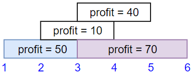
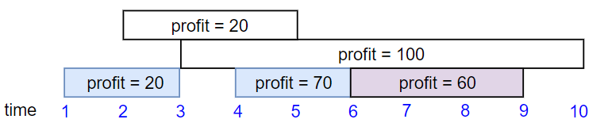

# [Maximum Profit in Job Scheduling](https://leetcode.com/problems/maximum-profit-in-job-scheduling/)

**Hard** | **40 minutes** | **Array, Binary Search, Dynamic Programming, Sorting**

**Pattern:** [Binary Search](../patterns/binary_search/intuition.md)

**Algorithm:** [Interval scheduling](https://en.wikipedia.org/wiki/Interval_scheduling) · [Dynamic programming](https://en.wikipedia.org/wiki/Dynamic_programming) · [Binary search](https://en.wikipedia.org/wiki/Binary_search_algorithm)

**Practice:** [`practice/maximum_profit_in_job_scheduling/solution.py`](../../practice/maximum_profit_in_job_scheduling/solution.py)

We have `n` jobs, where every job is scheduled to be done from `startTime[i]` to `endTime[i]`, obtaining a profit of `profit[i]`.

You're given the `startTime`, `endTime` and `profit` arrays, return the maximum profit you can take such that there are no two jobs in the subset with overlapping time range.

If you choose a job that ends at time `X` you will be able to start another job that starts at time `X`.

## Examples

### Example 1



**Input:** `startTime = [1,2,3,3]`, `endTime = [3,4,5,6]`, `profit = [50,10,40,70]`

**Output:** `120`

**Explanation:** The subset chosen is the first and fourth job. Time range `[1-3]+[3-6]` , we get profit of `120 = 50 + 70`.

### Example 2



**Input:** `startTime = [1,2,3,4,6]`, `endTime = [3,5,10,6,9]`, `profit = [20,20,100,70,60]`

**Output:** `150`

**Explanation:** The subset chosen is the first, fourth and fifth job. Profit obtained `150 = 20 + 70 + 60`.

### Example 3


**Input:** `startTime = [1,1,1]`, `endTime = [2,3,4]`, `profit = [5,6,4]`

**Output:** `6`

## Constraints

- `1 <= startTime.length == endTime.length == profit.length <= 5 * 10^4`
- `1 <= startTime[i] < endTime[i] <= 10^9`
- `1 <= profit[i] <= 10^4`

## Deriving the Solution

This is weighted interval scheduling: pick a set of pairwise non-overlapping
jobs of maximum total profit, where a job ending at `X` may sit next to one
starting at `X`. Every solution below decides each job the same way, take it or
skip it; they differ in how much repeated work that decision costs.

1. **Start literal.** Branch take-or-skip on each job in input order, carrying
   the intervals already chosen and rejecting any candidate that overlaps one.
   That enumerates every legal subset and costs `O(2^n × n)`: see
   [Brute Force](#brute-force).
2. **Order the decisions.** Sorted by end time, the jobs admit a
   one-dimensional state: the best profit from the first `i` jobs depends only
   on `i`, because every legal predecessor of job `i` sits to its left. The
   recurrence `best[i] = max(best[i - 1], best[p(i)] + gain)`, with `p(i)` the
   latest job ending no later than job `i` starts, replaces the exponential
   branching. Locating `p(i)` with a linear backward scan gives `O(n^2)`: see
   [Quadratic DP](#quadratic-dp).
3. **Search instead of scanning.** The backward scan ignores that the sorted
   end times are, well, sorted: the predecessor can be found by binary search
   in `O(log n)`, bringing the whole DP to `O(n log n)`: see
   [DP with Manual Binary Search](#dp-with-manual-binary-search).
4. **Let the library search.** The hand-written search is exactly what
   `bisect.bisect_right` implements, giving the idiomatic Python form at the
   same bound: see [DP with bisect](#dp-with-bisect).

## Solutions

### Brute Force

#### Derivation

Solve the problem head-on by enumerating every subset of jobs that can legally be
chosen, then keeping the most profitable one. Walk the jobs in their given order and,
at each one, [branch on two choices: take it or skip it](https://en.wikipedia.org/wiki/Backtracking). We carry along `chosen`, the
intervals already committed on the current path, so a candidate can be rejected the
moment it overlaps any of them.

Because the jobs are not sorted, the last-added job is not necessarily the latest in
time, so the take branch must compare the candidate against the whole `chosen` set.
Treating each job as the half-open interval `[start, end)`, the candidate `[s, e)` is
compatible with a chosen `[cs, ce)` when `e <= cs` or `ce <= s`; a shared boundary is
allowed, matching the rule that a job ending at `X` may precede one starting at `X`.

The steps:

1. If we have walked past the last job, the selection is finished: return `0`.
2. Compute the best profit from skipping job `i` (recurse with `chosen` unchanged).
3. If job `i` overlaps none of the `chosen` intervals, also compute the take branch:
   `profit[i]` plus the best from the remaining jobs with job `i` added to `chosen`.
4. Return the larger of the two branches.
5. Start the search at job `0` with an empty `chosen` set.

Processing jobs in input order without sorting makes this the most literal search of
the solution space, at the cost of exponential time.

#### Walkthrough

Let us watch the Brute Force run on Example 1: `startTime = [1,2,3,3]`,
`endTime = [3,4,5,6]`, `profit = [50,10,40,70]`. Label the jobs `j0 = [1,3) p=50`,
`j1 = [2,4) p=10`, `j2 = [3,5) p=40`, `j3 = [3,6) p=70`. Each call branches: first
skip job `i`, then take it if it overlaps nothing in `chosen`. The recursion is an
indented call tree. Each call shows what it returns, and results combine on the way
back up (`take` adds `profit[i]` to the child's return; the call keeps the larger of
skip and take).

The winning path takes `j0` then `j3`. Here is that path, with the decisions at each
job shown:

```
search(0, [])                        -> max(skip 70, take j0 120) = 120
├─ skip: search(1, [])               -> 70   (best without j0 is j3 alone)
└─ take j0 [1,3): 50 + search(1, [(1,3)])
   search(1, [(1,3)])                -> 70
   ├─ skip: search(2, [(1,3)])       -> max(skip 70, take j2 40) = 70
   │  ├─ skip: search(3, [(1,3)])    -> 70
   │  │  ├─ skip: search(4, [(1,3)])             -> 0   (past the last job)
   │  │  └─ take j3 [3,6): shares boundary 3, ok -> 70 + 0 = 70
   │  └─ take j2 [3,5): shares boundary 3, ok    -> 40
   │     (j3 [3,6) then overlaps the chosen [3,5), so this branch reaches only 40)
   └─ take j1 [2,4): overlaps [1,3), not allowed
   take j0 total = 50 + 70 = 120
```

Reading the returns back up: `search(4, ...)` returns `0` because we walked past the
last job. Adding `j3` gives `70`, so `search(3, [(1,3)])` returns `70`. Its sibling,
the take-`j2` branch, reaches only `40` (once `j2` is chosen, `j3` overlaps it and is
rejected), so `search(2, [(1,3)])` keeps the larger `70`. Job `j1` overlaps the
already-chosen `[1,3)` and cannot be taken, so `search(1, [(1,3)])` returns `70`. Back
at the top, taking `j0` is `50 + 70 = 120`; the skip branch yields only `70`, so the
larger wins.

`search(0, [])` returns `120`, which matches the example's expected Output of `120`
(the subset `j0` and `j3`, profit `50 + 70`).

#### Solution

The code is the walkthrough's take-or-skip recursion with the all-interval
overlap check.

```python
class Solution:
    def jobScheduling(
        self, startTime: List[int], endTime: List[int], profit: List[int]
    ) -> int:
        n = len(startTime)

        # Walk the jobs in input order, branching take/skip at each one. `chosen`
        # holds the (start, end) of jobs already committed on this path. The jobs
        # arrive unsorted, so a candidate must be checked against every chosen job,
        # not just the most recently added one.
        def search(i: int, chosen: List[tuple]) -> int:
            if i == n:
                return 0

            # Skip job i.
            best = search(i + 1, chosen)

            # Take job i only if it overlaps no already-chosen job. Treating each
            # job as the half-open interval [start, end), two jobs are disjoint
            # when one ends at or before the other starts. A job ending at X may
            # sit next to one starting at X, so a shared boundary is allowed.
            s, e = startTime[i], endTime[i]
            if all(e <= cs or ce <= s for cs, ce in chosen):
                best = max(best, profit[i] + search(i + 1, chosen + [(s, e)]))

            return best

        return search(0, [])
```

#### Time and Space Complexity Analysis

##### Time Complexity: `O(2^n × n)`

Each job independently contributes a take-or-skip branch, so the recursion explores up
to `2^n` selections in the worst case (when no jobs overlap, every subset is legal).
Each take branch scans the `chosen` set, up to `n` intervals, to check compatibility,
adding the `n` factor.

##### Space Complexity: `O(n)`

The recursion is at most `n` frames deep, and the `chosen` list along any path holds at
most `n` intervals, so the extra space is linear.

#### Key Insights

- With unsorted jobs the candidate must be tested against every chosen interval; a
  single `latestEnd` scalar would wrongly reject non-overlapping jobs that happen to
  appear out of time order in the input.
- The disjointness test `e <= cs or ce <= s` allows a shared endpoint, matching the
  problem's rule that a job ending at `X` is compatible with one starting at `X`.
- This direct enumeration needs no sorting or library helpers, which makes it the
  clearest baseline to verify the faster DP variants against.

### Quadratic DP

#### Derivation

The Brute Force explodes because unsorted jobs offer no useful order to decide
in: each path must remember every interval it committed to, so no two paths can
share work. This is the weighted
[interval scheduling](https://en.wikipedia.org/wiki/Interval_scheduling)
problem, and sorting jobs by end time is what repairs the search. It gives a
clean dynamic programming order: when we consider a job, every job that could
legally precede it (one that ends at or before this job's start) appears earlier
in the sorted list, so its answer is already computed, and the whole history
collapses into a single index.

Let `best[i]` be the maximum profit using only the first `i` jobs in end-time
order. For the `i`-th job (with start `start` and profit `gain`) we have two
choices:

- **Skip it:** the answer is `best[i - 1]`.
- **Take it:** add `gain` to the best profit achievable from jobs that finish by
  `start`.

This version locates the latest non-conflicting predecessor with a plain linear
backward scan instead of any library helper. Starting at the current position
and walking left, it stops at the first index whose end time is at most `start`.

The steps:

1. Zip `(endTime, startTime, profit)` and sort by end time.
2. Extract the sorted end times into `ends` for scanning.
3. For each job `i`, scan backward over `ends` to find the last non-conflicting job
   `j`.
4. Set `best[i] = max(best[i - 1], best[j] + gain)`.
5. Return `best[n]`.

#### Recurrence

Sort the jobs so that \(\text{end}_1 \le \text{end}_2 \le \dots \le
\text{end}_n\), and let \(p(i)\) be the latest job that finishes no later than
job `i` starts:

$$
p(i) = \max\bigl\{\, j < i \ :\ \text{end}_j \le \text{start}_i \,\bigr\},
\qquad p(i) = 0 \ \text{ if no such job exists}
$$

```text
p(i) = max { j < i : ends[j - 1] <= start of job i }   (jobs 1-indexed)
p(i) = 0   if no such j exists
```

Let `best[i]` be the maximum profit obtainable from the first `i` jobs. Each job
is either skipped or taken:

$$
\text{best}[i] =
\begin{cases}
0, & i = 0 \\[4pt]
\max\bigl(\underbrace{\text{best}[i-1]}_{\text{skip}},\ \underbrace{\text{best}[p(i)] + \text{profit}_i}_{\text{take}}\bigr), & i \ge 1
\end{cases}
$$

```text
best[0] = 0
best[i] = max(best[i - 1], best[p(i)] + gain)   for i >= 1
              skip         take
```

Taking job `i` jumps the state all the way back to \(p(i)\), discarding every
job in between: those overlap job `i` and cannot be combined with it. Sorting
by *end* time is what makes \(p(i)\) well defined and monotone; sorting by start
time would leave a job's legal predecessors scattered on both sides of it. The
three solutions differ only in how they evaluate \(p(i)\): a backward scan here
(\(O(n)\) per job), binary search in the two that follow (\(O(\log n)\)).

#### Walkthrough

Let us fill `best` by hand on Example 1: `startTime = [1,2,3,3]`,
`endTime = [3,4,5,6]`, `profit = [50,10,40,70]`. Sorting the zipped
`(end, start, gain)` triples by end time changes nothing here, since the input
already arrives in end order:

```text
setup   jobs = [(3,1,50), (4,2,10), (5,3,40), (6,3,70)]
        ends = [3, 4, 5, 6]        best = [0, 0, 0, 0, 0]

i=1  (end=3, start=1, gain=50)   j = 0  (scan starts at j=0, guard j > 0 fails)
     take = best[0] + 50 = 50    best[1] = max(best[0]=0, 50) = 50
i=2  (end=4, start=2, gain=10)   scan: ends[0]=3 > 2 -> j=0
     take = best[0] + 10 = 10    best[2] = max(best[1]=50, 10) = 50
i=3  (end=5, start=3, gain=40)   scan: ends[1]=4 > 3 -> j=1; ends[0]=3 <= 3 stop
     take = best[1] + 40 = 90    best[3] = max(best[2]=50, 90) = 90
i=4  (end=6, start=3, gain=70)   scan: ends[2]=5 > 3 -> j=2; ends[1]=4 > 3 -> j=1;
                                 ends[0]=3 <= 3 stop
     take = best[1] + 70 = 120   best[4] = max(best[3]=90, 120) = 120
```

At `i=3` and `i=4` the scan stops at `ends[0] = 3`, which equals the job's
start: the strict `>` in the loop admits the shared boundary, exactly the rule
that a job ending at `3` may precede one starting at `3`. The winning take at
`i=4` pairs the fourth sorted job with `best[1] = 50`, the first job: profit
`50 + 70 = 120`, the Explanation's chosen subset.

The function returns `best[4] = 120`, matching the expected Output of `120`.

#### Solution

The code is the walkthrough's loop: sort, backward scan for `j`, then the
skip/take maximum.

```python
class Solution:
    def jobScheduling(
        self, startTime: List[int], endTime: List[int], profit: List[int]
    ) -> int:
        # Bundle and sort the jobs by end time so a job's best predecessor
        # always lies to its left in the sorted order.
        jobs = sorted(zip(endTime, startTime, profit))
        ends = [job[0] for job in jobs]

        n = len(jobs)
        # best[i] = max profit using only the first i sorted jobs (1-indexed).
        best = [0] * (n + 1)

        for i in range(1, n + 1):
            end, start, gain = jobs[i - 1]

            # Linear backward scan: find the latest job j (in sorted order)
            # whose end time is <= this job's start time.
            j = i - 1
            while j > 0 and ends[j - 1] > start:
                j -= 1

            # best[j] is the best profit using jobs that finish by `start`.
            take = best[j] + gain
            best[i] = max(best[i - 1], take)

        return best[n]
```

#### Time and Space Complexity Analysis

##### Time Complexity: `O(n^2)`

Sorting the `n` jobs costs `O(n log n)`. The DP loop runs `n` times, and each
iteration may scan back across up to `n` earlier jobs, contributing `O(n^2)` which
dominates the overall bound.

##### Space Complexity: `O(n)`

We store the sorted jobs, the `ends` array, and the `best` DP array, each of size
`O(n)`.

#### Key Insights

- Sorting by end time guarantees that the optimal predecessor of any job is already
  resolved, which is the linchpin of weighted interval scheduling.
- The DP keeps a running prefix maximum (`best` is non-decreasing), so `best[j]`
  already represents the best of all compatible earlier jobs, not just job `j`.
- The linear backward scan is simple to reason about but redoes work the sorted
  order makes unnecessary, which is exactly what the binary-search variant fixes.

### DP with Manual Binary Search

#### Derivation

The dynamic programming structure is identical to the Quadratic DP approach: sort
jobs by end time, then for each job choose the better of skipping it or taking it
plus the best compatible earlier job. Its flaw is the predecessor lookup: the
backward scan walks a *sorted* array one step at a time, paying `O(n)` for an
answer the ordering could give in `O(log n)`.

Because `ends` is sorted ascending, replace the scan with a hand-written
[binary search](https://en.wikipedia.org/wiki/Binary_search_algorithm) for the
first index whose end time is strictly greater than `start`. That index equals
the number of jobs ending at or before `start`, which is exactly the `best` slot
we want (jobs ending at `X` may precede a job starting at `X`). The search
restricts itself to the window `[0, i - 1)` so the current job can never pair
with itself or a later-sorted job sharing the same end time.

The steps:

1. Sort the zipped jobs, extract `ends`, and initialize `best`, exactly as in
   the Quadratic DP.
2. For each job `i`, search with `lo, hi = 0, i - 1`: probe
   `mid = lo + (hi - lo) // 2`, and move `lo = mid + 1` when
   `ends[mid] <= start`, otherwise `hi = mid`.
3. When `lo == hi`, set `j = lo`: the count of jobs ending at or before
   `start`, and thus the predecessor's `best` index.
4. Set `best[i] = max(best[i - 1], best[j] + gain)` and finally return
   `best[n]`.

#### Walkthrough

Let us re-run Example 1 with the probes spelled out: `jobs = [(3,1,50), (4,2,10),
(5,3,40), (6,3,70)]` and `ends = [3, 4, 5, 6]` as before. Each probe tests
`ends[mid] <= start` and discards half the window:

```text
i=1  start=1   lo=0, hi=0   window empty, loop skipped         -> j=0
     take = best[0] + 50 = 50      best[1] = max(0, 50) = 50
i=2  start=2   lo=0, hi=1
     probe mid=0: ends[0]=3 <= 2? no  -> hi=0                  -> j=0
     take = best[0] + 10 = 10      best[2] = max(50, 10) = 50
i=3  start=3   lo=0, hi=2
     probe mid=1: ends[1]=4 <= 3? no  -> hi=1
     probe mid=0: ends[0]=3 <= 3? yes -> lo=1                  -> j=1
     take = best[1] + 40 = 90      best[3] = max(50, 90) = 90
i=4  start=3   lo=0, hi=3
     probe mid=1: ends[1]=4 <= 3? no  -> hi=1
     probe mid=0: ends[0]=3 <= 3? yes -> lo=1                  -> j=1
     take = best[1] + 70 = 120     best[4] = max(90, 120) = 120
```

The searches land on the same `j` values the Quadratic DP's scans found, but at
`i=4` the first probe discards `ends[1]` and `ends[2]` in one comparison instead
of stepping over each. The `ends[0] = 3 <= start = 3` probe moving `lo` past
index `0` is the shared-boundary rule at work: a job ending at `3` counts as a
legal predecessor of one starting at `3`, so `j = 1` includes it.

The function returns `best[4] = 120`, matching the expected Output of `120`.

#### Solution

The code is the Quadratic DP with the backward scan replaced by the
walkthrough's probe loop.

```python
class Solution:
    def jobScheduling(
        self, startTime: List[int], endTime: List[int], profit: List[int]
    ) -> int:
        # Bundle and sort the jobs by end time so a job's best predecessor
        # always lies to its left in the sorted order.
        jobs = sorted(zip(endTime, startTime, profit))
        ends = [job[0] for job in jobs]

        n = len(jobs)
        # best[i] = max profit using only the first i sorted jobs (1-indexed).
        best = [0] * (n + 1)

        for i in range(1, n + 1):
            end, start, gain = jobs[i - 1]

            # Hand-written binary search over ends[0 .. i-2] for the rightmost
            # job whose end time is <= start. `lo` ends as the count of such jobs.
            lo, hi = 0, i - 1
            while lo < hi:
                mid = lo + (hi - lo) // 2
                if ends[mid] <= start:
                    lo = mid + 1
                else:
                    hi = mid
            j = lo

            take = best[j] + gain
            best[i] = max(best[i - 1], take)

        return best[n]
```

#### Time and Space Complexity Analysis

##### Time Complexity: `O(n log n)`

Sorting the `n` jobs costs `O(n log n)`. The DP loop runs `n` times, and each
iteration performs one `O(log n)` binary search, contributing another `O(n log n)`.

##### Space Complexity: `O(n)`

We store the sorted jobs, the `ends` array, and the `best` DP array, each of size
`O(n)`.

#### Key Insights

- Searching for the first end time strictly greater than `start` lands on the count
  of compatible jobs, which doubles as the predecessor's `best` index.
- Using `lo + (hi - lo) // 2` for the midpoint avoids any risk of integer overflow
  and keeps the bound-tracking search clean.
- Honoring the half-open window `[0, i - 1)` is what correctly enforces the rule
  that a job ending at `X` allows another to start at `X` without self-pairing.

### DP with bisect

#### Derivation

The dynamic programming structure is identical to the previous two approaches: sort
jobs by end time, then for each job choose the better of skipping it or taking it plus
the best compatible earlier job.

The only difference from the DP with Manual Binary Search approach is that the manual
search loop is replaced by [`bisect.bisect_right`](https://docs.python.org/3/library/bisect.html),
the standard library's implementation of the very same search. Searching the
sorted `ends` array for `start` returns the insertion point just past every entry
that is `<= start`, which is the number of jobs ending at or before this job's
start. Because a job ending at `X` may precede a job starting at `X`, that count
is precisely the `best` index we want. The `hi` argument is set to `i - 1` so
the search stays within the half-open window `[0, i - 1)`, restricting the
lookup to jobs decided before the current one.

The steps:

1. Sort the zipped jobs, extract `ends`, and initialize `best`, exactly as
   before.
2. For each job `i`, set `j = bisect.bisect_right(ends, start, 0, i - 1)`: the
   count of windowed jobs ending at or before `start`.
3. Set `best[i] = max(best[i - 1], best[j] + gain)` and return `best[n]`.

#### Walkthrough

Let us re-run Example 1 once more: `ends = [3, 4, 5, 6]`. Internally
`bisect_right` performs the mirror image of the manual search's probes, testing
`start < ends[mid]` at the same midpoints:

```text
i=1  bisect_right(ends, 1, 0, 0)   window empty                       -> j=0
     best[1] = max(0, best[0] + 50) = 50
i=2  bisect_right(ends, 2, 0, 1)   probe mid=0: 2 < ends[0]=3 -> hi=0 -> j=0
     best[2] = max(50, best[0] + 10) = 50
i=3  bisect_right(ends, 3, 0, 2)   probe mid=1: 3 < ends[1]=4 -> hi=1
                                   probe mid=0: 3 < ends[0]=3? no -> lo=1 -> j=1
     best[3] = max(50, best[1] + 40) = 90
i=4  bisect_right(ends, 3, 0, 3)   probe mid=1: 3 < ends[1]=4 -> hi=1
                                   probe mid=0: 3 < ends[0]=3? no -> lo=1 -> j=1
     best[4] = max(90, best[1] + 70) = 120
```

Each call returns the same `j` the hand-written loop converged on, because
`start < ends[mid]` failing is exactly `ends[mid] <= start` succeeding: the
shared boundary at `3` again moves the insertion point past index `0`. With the
lookups delegated, only the recurrence `best[i] = max(best[i - 1],
best[j] + gain)` remains in view.

The function returns `best[4] = 120`, matching the expected Output of `120`.

#### Solution

The code is the previous solution with the probe loop delegated to
`bisect_right`.

```python
import bisect


class Solution:
    def jobScheduling(
        self, startTime: List[int], endTime: List[int], profit: List[int]
    ) -> int:
        # Bundle and sort the jobs by end time so a job's best predecessor
        # always lies to its left in the sorted order.
        jobs = sorted(zip(endTime, startTime, profit))
        ends = [job[0] for job in jobs]

        n = len(jobs)
        # best[i] = max profit using only the first i sorted jobs (1-indexed).
        best = [0] * (n + 1)

        for i in range(1, n + 1):
            end, start, gain = jobs[i - 1]

            # bisect_right over the already-decided window ends[0 .. i-2] returns
            # the count of jobs whose end time is <= start, which is exactly the
            # best slot of the latest non-conflicting predecessor.
            j = bisect.bisect_right(ends, start, 0, i - 1)

            take = best[j] + gain
            best[i] = max(best[i - 1], take)

        return best[n]
```

#### Time and Space Complexity Analysis

##### Time Complexity: `O(n log n)`

Sorting the `n` jobs costs `O(n log n)`. The DP loop runs `n` times, and each
iteration performs one `O(log n)` `bisect_right` call, contributing another
`O(n log n)`.

##### Space Complexity: `O(n)`

We store the sorted jobs, the `ends` array, and the `best` DP array, each of size
`O(n)`.

#### Key Insights

- `bisect_right` directly returns the count of compatible jobs, so no manual bound
  tracking or off-by-one reasoning is required.
- Passing the `lo` and `hi` bounds to `bisect_right` confines the search to the
  already-decided window without slicing, so no temporary copies are created.
- This is the idiomatic Python form: the standard library handles the search that the
  earlier approaches spell out by hand, leaving only the DP recurrence to read.

## Comparison of Solutions

### Time Complexity

- **Brute Force**: `O(2^n × n)` - every job branches into take or skip, and each take
  scans the chosen set to check overlap.
- **Quadratic DP**: `O(n^2)` - the per-job linear backward scan dominates after the
  initial sort.
- **DP with Manual Binary Search**: `O(n log n)` - each predecessor lookup drops from
  linear to logarithmic, matching the sort cost.
- **DP with bisect**: `O(n log n)` - identical to the manual search, with the lookup
  delegated to `bisect_right`.

### Space Complexity

- **Brute Force**: `O(n)` - recursion stack only, no auxiliary structures.
- **Quadratic DP**: `O(n)` - sorted jobs, end times, and the DP array.
- **DP with Manual Binary Search**: `O(n)` - identical auxiliary storage.
- **DP with bisect**: `O(n)` - identical auxiliary storage.

### Trade-offs

- The brute force is the most direct to reason about: it just tries taking or skipping
  each job, but its exponential branching makes it usable only for small inputs.
- The quadratic solution is the easiest DP to read and verify: a plain scan walks back
  until it finds a compatible job, with no index arithmetic to get wrong.
- The manual binary search scales to the largest inputs the constraints allow, but
  requires careful handling of the search window and the off-by-one boundary.
- The bisect version matches the manual search's speed while hiding the boundary
  details inside `bisect_right`, leaving only the DP recurrence in view.

### When to Use Each

- **Brute Force**: Suitable only for tiny inputs or as a reference oracle to validate
  the DP solutions, since it has no sorting and no library dependencies.
- **Quadratic DP**: Suitable for small inputs, teaching the DP recurrence, or sanity
  checking the faster variant.
- **DP with Manual Binary Search**: Useful when the search must be understood or
  ported to a language without a standard binary-search helper.
- **DP with bisect**: Preferred in Python for the full constraint range (`n` up to
  `5 * 10^4`), since it is the shortest correct form and the standard choice.

### Optimization Notes

- The three DP solutions share the same DP recurrence and the same sort-by-end-time
  setup; the predecessor lookup is the only piece that changes.
- The sorted `ends` array is what makes binary search legal, so it is worth extracting
  once rather than re-deriving it inside the loop.
- The manual and bisect searches are interchangeable: `bisect_right(ends, start, 0, i - 1)`
  computes the same index the hand-written loop converges on.
- Because `best` is non-decreasing, the predecessor's stored value already folds in
  every compatible earlier job, so no extra prefix-maximum bookkeeping is needed.
