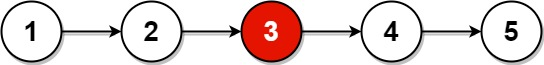

# [Middle of the Linked List](https://leetcode.com/problems/middle-of-the-linked-list/)

**Easy** | **10 minutes** | **Linked List, Two Pointers**

**Pattern:** [Two Pointers](../patterns/two_pointers/intuition.md)

**Algorithm:** [Two-pointer technique](https://www.geeksforgeeks.org/dsa/two-pointers-technique/) · [Linked list](https://en.wikipedia.org/wiki/Linked_list)

**Practice:** [`practice/middle_of_the_linked_list/solution.py`](../../practice/middle_of_the_linked_list/solution.py)

Given the `head` of a singly linked list, return the middle node of the linked list.

If there are two middle nodes, return the second middle node.

## Examples

### Example 1



**Input:** `head = [1,2,3,4,5]`

**Output:** `[3,4,5]`

**Explanation:** The middle node of the list is node 3.

### Example 2


**Input:** `head = [1,2,3,4,5,6]`

**Output:** `[4,5,6]`

**Explanation:** Since the list has two middle nodes with values 3 and 4, we return the second one.

## Constraints

- The number of nodes in the list is in the range `[1, 100]`.
- `1 <= Node.val <= 100`

## Deriving the Solution

The middle node is the one at index `n // 2` (numbering from `0`), where the
floor division picks the second of the two middles when `n` is even, exactly as
the problem requires. Every solution is a way of landing on that index without
being told `n` up front.

1. **Measure, then walk.** Traverse once to learn the length `count`, then walk
   `count // 2` steps from the head again. Two passes over the list: see
   [Count and Find](#count-and-find).
2. **Spot the waste.** The second pass re-reads nodes the first pass just
   visited, and the only thing the first pass hands over is a single number
   that is immediately halved.
3. **Fold the passes together.** Halving a distance can be done by speed
   instead of arithmetic: a pointer moving half as fast covers half the ground.
   Send two pointers in one pass, `fast` at two nodes per step doing the
   measuring and `slow` at one node per step doing the walking; when `fast`
   runs out of list, `slow` stands on index `n // 2`: see
   [Fast and Slow Pointers](#fast-and-slow-pointers).

## Solutions

### Count and Find

#### Derivation

The question this approach asks is the literal one: which index holds the
middle, and how do I reach it? The index is `count // 2`, so the plan is to
first learn how long the list is, then walk back to the midpoint. This takes
two passes:

1. First pass: traverse the entire list, counting the nodes into `count`.
2. Compute the middle index as `count // 2`.
3. Second pass: start again from `head` and advance `middle` steps to land on the
   target node.

For an odd-length list of size `n`, `count // 2` lands exactly on the central
node. For an even-length list, integer division biases toward the higher index,
so the second of the two middle nodes is returned, which matches the required
behavior.

#### Walkthrough

Let us trace Count and Find on Example 1: `head = [1,2,3,4,5]`.

**First pass: counting the nodes.** Start with `count = 0` and `current = head`
(the node holding `1`). The loop advances `current` one node at a time, adding
`1` to `count` each time, until `current` falls off the end (`None`):

| Step | `current.val` before step | `count` after step | `current` after step |
| ---- | ------------------------- | ------------------ | -------------------- |
| 1    | `1`                       | `1`                | node `2`             |
| 2    | `2`                       | `2`                | node `3`             |
| 3    | `3`                       | `3`                | node `4`             |
| 4    | `4`                       | `4`                | node `5`             |
| 5    | `5`                       | `5`                | `None`               |

The loop ends because `current` is now `None`, so `count = 5`.

**Compute the midpoint.** `middle = count // 2 = 5 // 2 = 2`. This is how many
steps we must advance from `head` to reach the answer.

**Second pass: walking to the middle.** Reset `current = head` (back to node `1`),
then advance it `middle = 2` times:

| Step | `current` before step | `current` after step |
| ---- | --------------------- | -------------------- |
| 1    | node `1`              | node `2`             |
| 2    | node `2`              | node `3`             |

After `2` steps, `current` points at node `3`. The function returns this node,
and since a returned node carries the rest of the list with it, the result is
`[3,4,5]`, which matches the expected Output.

#### Solution

The code is the two passes from the walkthrough written down: the counting
loop, the halving, and the walk.

```python
# Definition for singly-linked list.
# class ListNode:
#     def __init__(self, val=0, next=None):
#         self.val = val
#         self.next = next
class Solution:
    def middleNode(self, head: Optional[ListNode]) -> Optional[ListNode]:
        count = 0
        current = head
        while current:
            count += 1
            current = current.next

        middle = count // 2
        current = head
        for _ in range(middle):
            current = current.next
        return current
```

#### Time and Space Complexity Analysis

##### Time Complexity: `O(n)`

We traverse the list once to count and once more to reach the middle, giving
`2n` steps, which is `O(n)`.

##### Space Complexity: `O(1)`

Only a counter and a pointer are kept, regardless of the input size.

#### Key Insights

- Counting first removes all guesswork: once the length is known, the midpoint is
  a plain index calculation.
- `count // 2` cleanly yields the second middle node for even-length lists, so no
  special casing is needed.
- The approach is easy to reason about, but it reads the list twice.

### Fast and Slow Pointers

#### Derivation

Count and Find pays for its clarity with a second pass: the walk re-reads nodes
the count just visited, and the entire first pass exists only to produce a
number that is immediately halved. The repair is to notice that halving can be
done by speed instead of arithmetic. A pointer moving at half the speed of
another covers half the distance, so the "measuring" and the "walking" can
happen simultaneously in a single pass. This is the
[fast-and-slow pointer technique](https://www.geeksforgeeks.org/dsa/two-pointers-technique/) (also known as the
"tortoise and hare"). Both pointers start at `head`:

1. Advance `slow` by one node and `fast` by two nodes on each iteration.
2. Continue while `fast` and `fast.next` are both non-null, so `fast` always has
   two nodes available to step over.
3. When `fast` runs off the end, `slow` has covered exactly half the distance and
   sits on the middle node.

Because `fast` travels at twice the speed of `slow`, `fast` sits at index `2k`
whenever `slow` sits at index `k`, so the loop exits with `slow` at index
`n // 2` for both parities: the central node when `n` is odd, and the second of
the two middle nodes when `n` is even. The Invariant below states that formally,
along with why the guard has to be `fast and fast.next` rather than
`fast.next and fast.next.next`, which would return the first middle instead.

#### Invariant

Number the nodes \(0\) through \(n - 1\) from the head. After \(k\) iterations,
both pointers have advanced in lockstep at their fixed speeds:

$$
\textit{slow} = k, \qquad \textit{fast} = 2k
$$

```text
after k iterations:  slow = k,  fast = 2 * k
                     (node indices, numbered 0 through n - 1 from the head)
```

Each pass preserves this because `slow` gains one index and `fast` gains two, so
`fast` is always exactly twice as far from the head as `slow`.

The guard `while fast and fast.next` decides where that stops, and therefore
which middle we return. It fails in one of two ways:

- Odd \(n\): `fast` lands on the last node, index \(n - 1\), so `fast.next` is
  null. Then \(2k = n - 1\), giving \(k = (n - 1)/2\).
- Even \(n\): `fast` steps past the last index and becomes null. Then \(2k = n\),
  giving \(k = n/2\).

Both cases read off the same answer:

$$
\textit{slow} = \left\lfloor n/2 \right\rfloor
$$

```text
at loop exit:  slow = floor(n / 2)   for both parities of n
```

For \(n = 5\) that is index \(2\), the single central node. For \(n = 6\) it is
index \(3\), the *second* of the two middles, which is what the problem asks for.
The floor does the parity work, so no branch is needed.

This is why the guard is the specification rather than a formality. Writing
`while fast.next and fast.next.next` instead stops one iteration earlier
whenever \(n\) is even, leaving `slow` at \(\lceil n/2 \rceil - 1\): index \(2\)
for \(n = 6\), the *first* middle. Identical loop body, wrong node, and nothing
else in the code would flag it.

#### Walkthrough

Let us run both pointers on Example 1: `head = [1,2,3,4,5]`, so `n = 5`. Both
`slow` and `fast` start at node `1`. Each iteration moves `slow` one node and
`fast` two, and the loop continues only while `fast` and `fast.next` are both
non-null:

```text
start        slow = node 1   fast = node 1    fast.next = node 2, enter loop
iteration 1  slow = node 2   fast = node 3    fast.next = node 4, continue
iteration 2  slow = node 3   fast = node 5    fast.next = None, stop
```

`fast` has landed on the last node (the odd-`n` exit: the guard fails on
`fast.next`), and `slow` sits at index `2 = 5 // 2`, node `3`. Returning that
node yields `[3,4,5]`, the expected Output for Example 1.

Example 2, `head = [1,2,3,4,5,6]` with `n = 6`, shows the guard's other exit:

```text
start        slow = node 1   fast = node 1    fast.next = node 2, enter loop
iteration 1  slow = node 2   fast = node 3    fast.next = node 4, continue
iteration 2  slow = node 3   fast = node 5    fast.next = node 6, continue
iteration 3  slow = node 4   fast = None      guard fails on fast, stop
```

This time `fast` steps past the end entirely (the even-`n` exit: the guard
fails on `fast` itself), and `slow` sits at index `3 = 6 // 2`, node `4`: the
second of the two middles. Returning it yields `[4,5,6]`, the expected Output
for Example 2.

#### Solution

The code is the two-speed walk from the trace: one loop, two pointers, and the
guard that decides which middle survives.

```python
# Definition for singly-linked list.
# class ListNode:
#     def __init__(self, val=0, next=None):
#         self.val = val
#         self.next = next
class Solution:
    def middleNode(self, head: Optional[ListNode]) -> Optional[ListNode]:
        slow = fast = head
        while fast and fast.next:
            slow = slow.next
            fast = fast.next.next
        return slow
```

#### Time and Space Complexity Analysis

##### Time Complexity: `O(n)`

The list is traversed a single time; `fast` covers the full list while `slow`
covers half, so the total work is `O(n)`.

##### Space Complexity: `O(1)`

Only the two pointers are used, independent of the input size.

#### Key Insights

- A single pass replaces the count-then-walk pattern: the relative speed of the
  two pointers encodes the midpoint directly.
- The loop guard `fast and fast.next` is what produces the second middle node for
  even-length lists without any extra branching.
- This pattern generalizes to many linked-list problems, including cycle
  detection (Floyd's algorithm) and finding the start of a cycle.

## Comparison of Solutions

### Time Complexity

- **Count and Find**: `O(n)` - two passes through the list.
- **Fast and Slow Pointers**: `O(n)` - one pass through the list.

### Space Complexity

- **Count and Find**: `O(1)` - only a counter and a pointer.
- **Fast and Slow Pointers**: `O(1)` - only two pointers.

### Trade-offs

- Both approaches share the same asymptotic bounds, but Fast and Slow Pointers
  does half the traversal work of Count and Find because it never re-reads the
  list from the start.
- Count and Find is often more approachable for those new to linked lists, since
  it relies on a familiar count-then-index pattern rather than a two-speed walk.

### When to Use Each

- **Fast and Slow Pointers**: The right call in most situations, given its
  single-pass efficiency and reuse across other linked-list problems (Recommended).
- **Count and Find**: A reasonable choice when clarity for a beginner audience
  matters more than shaving a pass off the traversal.

### Optimization Notes

- The Fast and Slow Pointers technique is a classic tool for linked-list problems
  and underlies Floyd's cycle-detection algorithm.
- Moving two pointers at different speeds reveals positional relationships, such
  as the midpoint or a cycle entry point, without knowing the length in advance.
