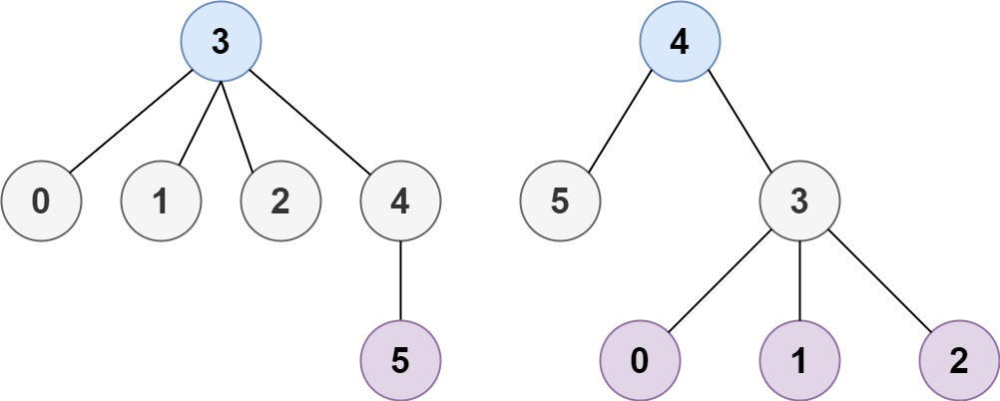

# [Minimum Height Trees](https://leetcode.com/problems/minimum-height-trees/)

**Medium** | **30 minutes** | **Depth-First Search, Breadth-First Search, Graph, Topological Sort**

**Pattern:** [Topological Sort](../patterns/topological_sort/intuition.md)

**Algorithm:** [Topological sorting](https://en.wikipedia.org/wiki/Topological_sorting) · [Breadth-first search](https://en.wikipedia.org/wiki/Breadth-first_search)

**Practice:** [`practice/minimum_height_trees/solution.py`](../../practice/minimum_height_trees/solution.py)

A tree is an undirected graph in which any two vertices are connected by exactly one path. In other words, any connected graph without simple cycles is a tree.

Given a tree of n nodes labelled from 0 to n - 1, and an array of n - 1 edges where `edges[i] = [ai, bi]` indicates that there is an undirected edge between the two nodes ai and bi in the tree, you can choose any node of the tree as the root. When you pick a node x as the root, the resulting tree has height h. Among all possible rooted trees, those with minimum height h are called **minimum height trees** (MHTs).

Return a list of all MHTs' root labels. You can return the answer in **any order**.

The **height** of a rooted tree is the number of edges on the longest downward path between the root and a leaf.

## Examples

### Example 1


**Input:** n = 4, edges = `[[1,0],[1,2],[1,3]]`

**Output:** `[1]`

**Explanation:** As shown, the height of the tree is 1 when the root is the node with label 1 which is the only MHT.

### Example 2



**Input:** n = 6, edges = `[[3,0],[3,1],[3,2],[3,4],[5,4]]`

**Output:** `[3,4]`

**Explanation:** The tree can be rooted at nodes 3 or 4 to achieve minimum height of 2.

## Constraints

- `1 <= n <= 2 * 10^4`
- `edges.length == n - 1`
- `0 <= ai, bi < n`
- `ai != bi`
- All the pairs `(ai, bi)` are distinct.
- The given input is **guaranteed** to be a tree and there will be **no repeated** edges.

## Deriving the Solution

The roots that minimize height are the *centroids* of the tree: the one or two
nodes that sit at the exact middle of its longest path. Each solution below is
a different level of commitment to that fact, from ignoring it entirely to
exploiting it directly.

1. **Start literal.** Measure the height from every candidate root with a BFS
   and keep the minimizers. Each BFS costs `O(n)` and there are `n` of them,
   `O(n^2)` in total: see
   [Brute Force BFS From Every Root](#brute-force-bfs-from-every-root).
2. **Spot the structure.** The `n` traversals treat every root as equally
   promising, but they are not: a root near one end of the tree's longest path
   is far from the other end, so only the middle of that path can win. A tree
   has exactly one or two such centroids, so the answer can be located without
   measuring every candidate.
3. **Peel toward the center.** Remove all current leaves, layer by layer: each
   round strips one node from both ends of every longest path, so the survivors
   once 1 or 2 nodes remain are exactly the centroids. Every node and edge is
   handled once, so this is linear: see
   [Leaf-Trimming BFS](#leaf-trimming-bfs).
4. **Or walk straight to the middle.** Instead of shrinking the tree around the
   center, find one longest path explicitly (two BFS passes locate a diameter)
   and read off its middle one or two nodes. Also linear: see
   [Diameter Midpoint via Two BFS Passes](#diameter-midpoint-via-two-bfs-passes).

## Solutions

### Brute Force BFS From Every Root

#### Derivation

The problem asks directly for the roots that minimize tree height, so the most
literal solution is to compute that height for every candidate root and keep the
minimizers.

1. Handle `n == 1` up front: a lone node has height 0 and is the only root.
2. Build an undirected adjacency list from the edge list.
3. For each node, run a [breadth-first search](https://en.wikipedia.org/wiki/Breadth-first_search) from that node and record how many
   layers it takes to reach the farthest node. That layer count is the height of
   the tree rooted there.
4. Find the minimum height across all roots and return every root that achieves
   it.

This is the definition translated straight into code. It is easy to reason about
and trivially correct, but it pays for that simplicity by re-traversing the whole
tree once per node.

#### Walkthrough

Let us trace the brute force solution on Example 1: `n = 4` and
`edges = [[1,0],[1,2],[1,3]]`. The expected output is `[1]`.

First we skip the `n == 1` guard (here `n` is 4) and build the adjacency list: a
preallocated array with one list per label, so `adj[node]` is a direct index and
no hashing is involved (the labels run over exactly `0..n-1`). Both directions of
every edge are added:

- `[1,0]`: `adj[1] = [0]`, `adj[0] = [1]`
- `[1,2]`: `adj[1] = [0, 2]`, `adj[2] = [1]`
- `[1,3]`: `adj[1] = [0, 2, 3]`, `adj[3] = [1]`

So node `1` is the center connected to the three leaves `0`, `2`, and `3`. Now we
call `height_from(root)` once per root. Each call runs a BFS layer by layer and
returns `depth`, the number of layers minus one.

Tracing `height_from(0)`: `seen = {0}`, `queue = [0]`, `depth = -1`.

| Layer | `depth` | nodes popped this layer | neighbors enqueued | `queue` after |
| --- | --- | --- | --- | --- |
| 1 | `0` | `0` | `1` | `[1]` |
| 2 | `1` | `1` | `2`, `3` (0 already seen) | `[2, 3]` |
| 3 | `2` | `2`, `3` | none | `[]` |

The queue empties, so `height_from(0)` returns `depth = 2`. Rooting at a leaf, the
farthest node is two edges away.

Tracing `height_from(1)`: `seen = {1}`, `queue = [1]`, `depth = -1`.

| Layer | `depth` | nodes popped this layer | neighbors enqueued | `queue` after |
| --- | --- | --- | --- | --- |
| 1 | `0` | `1` | `0`, `2`, `3` | `[0, 2, 3]` |
| 2 | `1` | `0`, `2`, `3` | none | `[]` |

`height_from(1)` returns `depth = 1`. Rooting at the center, every leaf is just one
edge away. By symmetry `height_from(2)` and `height_from(3)` each behave like
`height_from(0)` and return `2`.

Collecting the results gives `heights = [2, 1, 2, 2]`. Then `best = min(heights) = 1`,
and we keep every root whose height equals `best`. Only index `1` qualifies, so we
return `[1]`, which matches the expected Output.

#### Solution

The code is the walkthrough written down: one layered BFS per root, then a
sweep for the minimizers.

```python
from typing import List


from collections import deque


class Solution:
    def findMinHeightTrees(self, n: int, edges: List[List[int]]) -> List[int]:
        # A single node has height 0 and is the only possible root.
        if n == 1:
            return [0]

        # Build an undirected adjacency list.
        adj = [[] for _ in range(n)]
        for a, b in edges:
            adj[a].append(b)
            adj[b].append(a)

        def height_from(root: int) -> int:
            # BFS layer by layer; the depth of the last layer is the height.
            seen = {root}
            queue = deque([root])
            depth = -1
            while queue:
                depth += 1
                for _ in range(len(queue)):
                    node = queue.popleft()
                    for nxt in adj[node]:
                        if nxt not in seen:
                            seen.add(nxt)
                            queue.append(nxt)
            return depth

        heights = [height_from(root) for root in range(n)]
        best = min(heights)
        return [root for root in range(n) if heights[root] == best]
```

#### Time and Space Complexity Analysis

##### Time Complexity: `O(n^2)`

Each BFS visits all `n` nodes and `n - 1` edges, costing `O(n)`. Running one BFS
per root multiplies that by `n`, giving `O(n^2)`. For `n` up to `2 * 10^4` this
is on the order of `4 * 10^8` operations, which is too slow for the largest
inputs but fine for understanding the problem.

##### Space Complexity: `O(n)`

The adjacency list stores `2(n - 1)` endpoints, and each BFS uses a `seen` set and
a queue holding at most `O(n)` nodes. The `heights` array adds another `O(n)`.

#### Key Insights

- The height of a rooted tree equals the number of BFS layers minus one, so a
  single level-order traversal yields it without any extra bookkeeping.
- Multiple roots can tie for the minimum height, so the answer is collected as
  every root matching `best`, not just the first one found.
- This approach never exploits the structure of a tree beyond connectivity, which
  is exactly why it is quadratic and motivates the leaf-trimming refinement.

### Leaf-Trimming BFS

#### Derivation

The brute force is quadratic because it measures every candidate, yet almost
every candidate is doomed from the start: a root near one end of the tree's
longest path is far from the other end. The roots that minimize height are the
*centroids* of the tree, the nodes that sit in the middle of its longest path,
and a tree always has exactly one or two of them. So instead of measuring, we
locate the centroids directly by repeatedly trimming the outermost layer of
leaves, which is [topological sorting](https://en.wikipedia.org/wiki/Topological_sorting) specialized to an
undirected tree.

1. Handle the tiny cases: if `n <= 2`, every node is a valid root, so return all
   of them.
2. Build an adjacency set for each node so leaf removal is `O(1)`.
3. Collect all current leaves (nodes of degree 1) into a queue.
4. Peel one full layer of leaves at a time. Removing a leaf decrements its
   neighbor's degree; a neighbor that drops to degree 1 becomes a leaf in the
   next layer.
5. Stop when 2 or fewer nodes remain. Those survivors are the centroids and thus
   the MHT roots.

Trimming layer by layer shrinks the tree symmetrically from both ends of its
longest path. The last nodes standing are the midpoints of that path, which is
precisely where a root minimizes the maximum distance to any leaf.

#### Walkthrough

Let us peel Example 2 by hand: `n = 6` and
`edges = [[3,0],[3,1],[3,2],[3,4],[5,4]]`, expected output `[3,4]`. Since
`n > 2`, we build the adjacency sets and read off each node's degree as
`len(adj[node])`; the degree-1 nodes seed the `leaves` queue:

```text
degrees      node:    0  1  2  3  4  5
             degree:  1  1  1  4  2  1     leaves = [0, 1, 2, 5], remaining = 6

peel layer 1            layer_size = 4, remaining 6 -> 2
  remove 0   adj[3] loses 0, degree 4 -> 3
  remove 1   adj[3] loses 1, degree 3 -> 2
  remove 2   adj[3] loses 2, degree 2 -> 1   node 3 becomes a leaf, enqueued
  remove 5   adj[4] loses 5, degree 2 -> 1   node 4 becomes a leaf, enqueued
             leaves = [3, 4]

loop check   remaining = 2, not > 2 -> stop
```

One layer strips all four outer leaves at once. Node `3` loses three neighbors
but only drops to degree 1 (becoming a leaf) when its last outer leaf `2` is
removed; node `4` becomes a leaf as soon as `5` goes. The loop then halts
because `remaining = 2`, and the queue's survivors are the two centroids.
`list(leaves)` returns `[3, 4]`, matching the expected Output: the two
midpoints of the longest path `0-3-4-5` (or `1-3-4-5`, or `2-3-4-5`).

#### Solution

The code is the peeling loop from the trace: a degree-1 queue, one
`layer_size` ring per round, and a stop at two survivors.

```python
from typing import List


from collections import deque


class Solution:
    def findMinHeightTrees(self, n: int, edges: List[List[int]]) -> List[int]:
        # A single node (and trivially two nodes) is its own centroid.
        if n <= 2:
            return list(range(n))

        # Build the adjacency list and track each node's degree.
        adj = [set() for _ in range(n)]
        for a, b in edges:
            adj[a].add(b)
            adj[b].add(a)

        # Start from all current leaves (degree-1 nodes).
        leaves = deque(node for node in range(n) if len(adj[node]) == 1)

        # Peel leaves layer by layer until 1 or 2 centroids remain.
        remaining = n
        while remaining > 2:
            layer_size = len(leaves)
            remaining -= layer_size
            for _ in range(layer_size):
                leaf = leaves.popleft()
                # Detach this leaf; its single neighbor may become a new leaf.
                neighbor = adj[leaf].pop()
                adj[neighbor].remove(leaf)
                if len(adj[neighbor]) == 1:
                    leaves.append(neighbor)

        # Whatever survives are the roots of the minimum height trees.
        return list(leaves)
```

#### Time and Space Complexity Analysis

##### Time Complexity: `O(n)`

Building the adjacency structure visits each of the `n - 1` edges once. During
trimming, every node is enqueued and removed at most once, and each edge is
detached once, so the peeling phase is also linear. The total is `O(n)`.

##### Space Complexity: `O(n)`

The adjacency sets store `2(n - 1)` endpoint entries (`O(n)`), and the leaf queue
holds at most `O(n)` nodes at once.

#### Key Insights

- A tree has at most two centroids, which is why trimming halts at 1 or 2 nodes
  and why the answer never has more than two roots.
- Peeling leaves layer by layer is equivalent to advancing inward from both ends
  of the tree's longest path simultaneously; the centroids are its midpoints.
- Tracking a per-layer `layer_size` (instead of just emptying the queue) ensures
  we remove exactly one ring of leaves per round, which keeps the symmetric
  shrinking correct.
- The `n <= 2` guard is essential: with one or two nodes there are no degree-1
  leaves to peel in the usual sense, so the loop would never start.
- Using adjacency *sets* rather than lists makes detaching a leaf from its
  neighbor an O(1) operation instead of a linear scan.

### Diameter Midpoint via Two BFS Passes

#### Derivation

The leaf-trimming approach closes in on the middle of the tree's longest path
implicitly, from all sides at once. This approach takes the same observation
literally: find the longest path (the *diameter*) explicitly, then return its
middle one or two nodes.

1. Handle the tiny cases: if `n <= 2`, every node is a valid root, so return all
   of them.
2. Build an undirected adjacency list.
3. Run a BFS from any node (node 0 works). The farthest node it reaches, `u`, is
   guaranteed to be one endpoint of a diameter.
4. Run a second BFS from `u`, recording each node's parent. The farthest node it
   reaches, `v`, is the opposite endpoint, and the parent links trace the
   diameter path between them.
5. Walk the parent links from `v` back to `u` to reconstruct the path, then
   return its middle node (odd number of path nodes) or middle two nodes (even).

Why the midpoint is optimal: whichever node is chosen as root, its height is at
least the distance to the farther of `u` and `v`, and those two distances sum to
at least the diameter `d`. So every root has height at least `ceil(d / 2)`, and
only a node sitting at the exact center of a diameter path achieves that bound.
This is the same answer the leaf-trimming solution converges to; trimming closes
in on the center implicitly from all sides, while this version walks straight to
it along one longest path.

#### Walkthrough

Let us run both passes on Example 2: `n = 6` and
`edges = [[3,0],[3,1],[3,2],[3,4],[5,4]]`, expected output `[3,4]`. Building
the adjacency list in edge order gives `adj[3] = [0, 1, 2, 4]`,
`adj[4] = [3, 5]`, and single-entry lists for the leaves. BFS pops nodes in
nondecreasing distance order, so `last`, the final node popped, is a farthest
node from the start:

```text
first BFS    bfs_farthest(0)
  pop 0      enqueue 3
  pop 3      enqueue 1, 2, 4
  pop 1
  pop 2
  pop 4      enqueue 5
  pop 5      queue empty -> last = 5         u = 5, a diameter endpoint

second BFS   bfs_farthest(5), recording parents
  pop 5      enqueue 4                       parent[4] = 5
  pop 4      enqueue 3                       parent[3] = 4
  pop 3      enqueue 0, 1, 2                 parent[0] = parent[1] = parent[2] = 3
  pop 0
  pop 1
  pop 2      queue empty -> last = 2         v = 2, the opposite endpoint

path         node = 2 -> 3 -> 4 -> 5 -> -1   walk parent links from v
             path = [2, 3, 4, 5]

midpoint     length = 4, even
             return [path[1], path[2]] = [3, 4]
```

The first BFS climbs out of node `0` and ends farthest away at `u = 5`. The
second BFS from `5` ends at `v = 2`, and its parent links spell out the
diameter `2-3-4-5` (three edges, so `d = 3`). The path holds an even number of
nodes, so its two middle nodes `3` and `4` are both centers, and the function
returns `[3, 4]`, matching the expected Output and the leaf-trimming result.

#### Solution

The code is the trace in three acts: two `bfs_farthest` calls, the parent walk,
and the parity split on the path length.

```python
from typing import List


from collections import deque


class Solution:
    def findMinHeightTrees(self, n: int, edges: List[List[int]]) -> List[int]:
        # One or two nodes: every node is already a centroid.
        if n <= 2:
            return list(range(n))

        # Build an undirected adjacency list.
        adj = [[] for _ in range(n)]
        for a, b in edges:
            adj[a].append(b)
            adj[b].append(a)

        def bfs_farthest(start: int) -> tuple[int, List[int]]:
            # BFS pops nodes in nondecreasing distance order, so the last
            # node popped is a farthest node from start.
            parent = [-1] * n
            seen = [False] * n
            seen[start] = True
            queue = deque([start])
            last = start
            while queue:
                node = queue.popleft()
                last = node
                for nxt in adj[node]:
                    if not seen[nxt]:
                        seen[nxt] = True
                        parent[nxt] = node
                        queue.append(nxt)
            return last, parent

        # First BFS from any node reaches one endpoint of a diameter.
        u, _ = bfs_farthest(0)
        # Second BFS from that endpoint reaches the opposite endpoint and
        # records parent links along the way.
        v, parent = bfs_farthest(u)

        # Reconstruct the u-v diameter path by walking parents back from v.
        path = []
        node = v
        while node != -1:
            path.append(node)
            node = parent[node]

        # The middle one or two nodes of the diameter path are the MHT roots.
        length = len(path)
        if length % 2 == 1:
            return [path[length // 2]]
        return [path[length // 2 - 1], path[length // 2]]
```

#### Time and Space Complexity Analysis

##### Time Complexity: `O(n)`

Building the adjacency list visits each of the `n - 1` edges once. Each of the
two BFS passes visits every node and edge once, costing `O(n)` apiece, and the
path reconstruction walks at most `n` parent links. The total is three linear
passes, which is `O(n)`.

##### Space Complexity: `O(n)`

The adjacency list stores `2(n - 1)` endpoint entries, and each BFS keeps a
`parent` array, a `seen` array, and a queue of at most `O(n)` nodes. The
reconstructed path holds at most `n` nodes.

#### Key Insights

- The two-BFS diameter technique is a classic on its own: a BFS from *any* node
  ends at a diameter endpoint, and a second BFS from that endpoint finds the
  full diameter. It reappears in many longest-path problems on trees.
- The parity of the diameter decides the answer size: a diameter path with an
  odd number of nodes (even edge count) has one exact center, while an even
  number of nodes yields two adjacent centers. This is the same 1-or-2 centroid
  fact the leaf-trimming solution relies on.
- Every root's height is at least `ceil(d / 2)` where `d` is the diameter, so
  the center of a longest path is not just a good root but provably the best
  possible one.
- Leaf trimming and this approach are two mechanics for the same theorem: one
  peels inward from all leaves at once, the other locates a single longest path
  and jumps to its midpoint. On any tree they return the same set of roots.
- Recording parents only in the second BFS is enough; the first BFS exists
  solely to find a diameter endpoint, so its traversal order can be discarded.

## Comparison of Solutions

### Time Complexity

- **Brute Force BFS From Every Root**: `O(n^2)` - one BFS per node, each linear in
  the tree size.
- **Leaf-Trimming BFS**: `O(n)` - every node is enqueued once and every edge is
  detached once across the whole peeling process.
- **Diameter Midpoint via Two BFS Passes**: `O(n)` - two full BFS traversals plus
  a linear walk to reconstruct the diameter path.

### Space Complexity

- **Brute Force BFS From Every Root**: `O(n)` - adjacency list plus the per-BFS
  `seen` set, queue, and the `heights` array.
- **Leaf-Trimming BFS**: `O(n)` - adjacency sets plus a leaf queue.
- **Diameter Midpoint via Two BFS Passes**: `O(n)` - adjacency list plus per-BFS
  `parent` and `seen` arrays, a queue, and the reconstructed path.

### Trade-offs

- The brute force version maps the problem statement directly onto code, so it is
  easy to write and verify, but it discards the tree structure and re-traverses
  the entire graph from every node.
- The leaf-trimming version trades a small conceptual leap (the answer is the one
  or two centroids of the tree) for a linear runtime, making it viable near the
  upper constraint of `n = 2 * 10^4`.
- The diameter-midpoint version matches leaf trimming asymptotically but leans on
  a different classic technique (two-BFS diameter finding). It needs the extra
  `ceil(d / 2)` optimality argument to justify why the path's center is the
  answer, and it must handle path reconstruction and the 1-vs-2 center parity
  explicitly, whereas trimming gets both for free from the peeling loop.

### When to Use Each

- **Brute Force BFS From Every Root**: A small `n`, an interview warm-up, or a
  reference implementation to validate the optimized solution against.
- **Leaf-Trimming BFS** (recommended): Any input that can approach the constraint
  ceiling, where the quadratic approach would time out.
- **Diameter Midpoint via Two BFS Passes**: An equally valid linear alternative,
  especially natural if you already know the two-BFS diameter trick or the
  interview follows up with diameter-related questions; also useful as an
  independent cross-check of the leaf-trimming answer.

### Optimization Notes

- Both solutions can share the same adjacency build; the leaf-trimming variant
  additionally needs degree information, which adjacency sets provide for free via
  `len(adj[node])`.
- The leaf-trimming loop stops at `remaining <= 2` rather than emptying the queue,
  which is what guarantees the survivors are the centroids instead of an empty
  set.
- In the diameter approach, parents only need to be recorded during the second
  BFS; the first pass exists solely to locate a diameter endpoint, which keeps
  the bookkeeping to one `parent` array.
- For correctness checks, the brute force result can be compared against the
  leaf-trimming and diameter-midpoint results on random trees; all three must
  agree on every input (up to ordering of the returned roots).
- A fourth linear technique exists: rerooting DP. One post-order pass records
  each node's two tallest downward child heights, then a pre-order pass pushes
  the height seen *through the parent* down to each child (using the second-best
  value when the child owns the best), giving every node's full height in
  `O(n)`; the answers are the nodes whose height equals the minimum. It
  generalizes to many "compute X for every root" problems, but both of its
  passes are naturally recursive, so a Python version needs an explicit stack or
  a raised recursion limit to survive a path-shaped tree at `n = 2 * 10^4`,
  which is why the BFS-based solutions above are preferred here.
