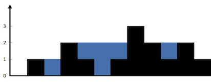

# [Trapping Rain Water](https://leetcode.com/problems/trapping-rain-water/)

**Hard** | **35 minutes** | **Array, Two Pointers, Dynamic Programming, Stack, Monotonic Stack**

**Pattern:** [Monotonic Stack](../patterns/monotonic_stack/intuition.md)

**Algorithm:** [Dynamic programming](https://en.wikipedia.org/wiki/Dynamic_programming) · [Monotonic stack](https://usaco.guide/gold/stacks) · [Two-pointer technique](https://usaco.guide/silver/two-pointers)

**Practice:** [`practice/trapping_rain_water/solution.py`](../../practice/trapping_rain_water/solution.py)

Given `n` non-negative integers representing an elevation map where the width of each bar is `1`, compute how much water it can trap after raining.

## Examples

### Example 1



**Input:** `height = [0,1,0,2,1,0,1,3,2,1,2,1]`

**Output:** `6`

**Explanation:** The above elevation map (black section) is represented by array `[0,1,0,2,1,0,1,3,2,1,2,1]`. In this case, 6 units of rain water (blue section) are being trapped.

### Example 2

**Input:** `height = [4,2,0,3,2,5]`

**Output:** `9`

## Constraints

- `n == height.length`
- `1 <= n <= 2 * 10^4`
- `0 <= height[i] <= 3 * 10^4`

## Deriving the Solution

Water above bar `i` rises exactly to `min(left_max, right_max)`, the shorter of the
tallest walls to its left and right, and the bar itself fills `height[i]` of that
column. Every solution below computes `min(left_max, right_max) - height[i]` in some
form; they differ only in how the two wall heights are obtained.

1. **Start literal.** For each bar, rescan the whole array for the tallest wall on
   its left and the tallest on its right, then add the difference. Correct, but the
   two full scans per bar cost `O(n^2)`: see [Brute Force](#brute-force).
2. **Cache the scans.** The rescans keep recomputing the same maxima, which obey
   one-step recurrences (`left_max[i] = max(left_max[i - 1], height[i])`). Two
   linear sweeps precompute every wall once, cutting time to `O(n)` for two `O(n)`
   arrays: see [Prefix and Suffix Maximums](#prefix-and-suffix-maximums).
3. **Account by layers instead of columns.** The same water can be summed
   horizontally: keep a stack of bars in decreasing height (unresolved dips), and
   let each taller arrival close a basin and settle one layer. Still `O(n)` time
   and `O(n)` space, but the per-basin amounts come out as a bonus: see
   [Monotonic Stack](#monotonic-stack).
4. **Drop the arrays.** Only the smaller of the two maxima decides the water level,
   and walking inward from both ends always knows which side is smaller. Two
   pointers with two running maxima reach `O(n)` time and `O(1)` space: see
   [Two Pointers](#two-pointers).
5. **Hand the sweeps to the library.** Both prefix-maximum loops are the same fold
   of `max` over a sequence, which is what `itertools.accumulate` is for. Swapping
   them out deletes the seeding, the index arithmetic, and the descending range,
   while the `min(left_max[i], right_max[i]) - height[i]` summation stays written
   out in full: see
   [Prefix and Suffix Maximums with accumulate](#prefix-and-suffix-maximums-with-accumulate).

## Solutions

### Brute Force

#### Derivation

The question to ask first is local: how much water sits directly above bar `i`?
Water can only rest there if taller bars hem it in on both sides, and it rises to
the level of the shorter of those two walls. So for each bar, find the tallest bar
on its left and the tallest on its right, take the smaller of the two, and subtract
the bar's own height. Nothing beyond those two walls matters, and the literal way to
find them is to scan for them:

1. For every index `i`, scan left from the start to find `left_max`, the tallest
   bar at or before `i`.
2. Scan right to the end to find `right_max`, the tallest bar at or after `i`.
3. Add `min(left_max, right_max) - height[i]` to the running `trapped` total.

Because `left_max` and `right_max` both include `height[i]` itself, the contribution
is never negative: a bar that is the tallest on one side traps nothing and adds `0`.

#### Walkthrough

Let us run the Brute Force on Example 1: `height = [0,1,0,2,1,0,1,3,2,1,2,1]`. For every
bar `i` we scan left to find `left_max` (tallest at or before `i`), scan right to find
`right_max` (tallest at or after `i`), and add `min(left_max, right_max) - height[i]` to
`trapped`. Both maxima include `height[i]` itself, so a bar that is its own side's tallest
contributes `0`.

| `i` | `height[i]` | `left_max` | `right_max` | `min - height[i]` | `trapped` |
|-----|-------------|------------|-------------|-------------------|-----------|
| 0 | 0 | 0 | 3 | `0 - 0 = 0` | 0 |
| 1 | 1 | 1 | 3 | `1 - 1 = 0` | 0 |
| 2 | 0 | 1 | 3 | `1 - 0 = 1` | 1 |
| 3 | 2 | 2 | 3 | `2 - 2 = 0` | 1 |
| 4 | 1 | 2 | 3 | `2 - 1 = 1` | 2 |
| 5 | 0 | 2 | 3 | `2 - 0 = 2` | 4 |
| 6 | 1 | 2 | 3 | `2 - 1 = 1` | 5 |
| 7 | 3 | 3 | 3 | `3 - 3 = 0` | 5 |
| 8 | 2 | 3 | 2 | `2 - 2 = 0` | 5 |
| 9 | 1 | 3 | 2 | `2 - 1 = 1` | 6 |
| 10 | 2 | 3 | 2 | `2 - 2 = 0` | 6 |
| 11 | 1 | 3 | 1 | `1 - 1 = 0` | 6 |

Notice the deep dip from `i = 2` through `i = 6`: those low bars sit between the wall of
height `2` on the left (at `i = 3`) and the wall of height `3` on the right (at `i = 7`),
so each one banks water up to the shorter wall, height `2`. Past the tallest bar at
`i = 7`, `right_max` drops to `2` and the remaining bars trap little. The loop ends with
`trapped = 6`, which matches the expected Output of `6`.

#### Solution

The code is the walkthrough's table computed row by row: two scans and one
subtraction per bar.

```python
from typing import List


class Solution:
    def trap(self, height: List[int]) -> int:
        n = len(height)
        trapped = 0

        for i in range(n):
            # Tallest bar at or to the left of i
            left_max = 0
            for j in range(i + 1):
                left_max = max(left_max, height[j])

            # Tallest bar at or to the right of i
            right_max = 0
            for j in range(i, n):
                right_max = max(right_max, height[j])

            # Water above this bar is bounded by the shorter wall on each side.
            trapped += min(left_max, right_max) - height[i]

        return trapped
```

#### Time and Space Complexity Analysis

##### Time Complexity: `O(n^2)`

For each of the `n` bars we rescan the entire array to recompute both maxima, so the work
is quadratic.

##### Space Complexity: `O(1)`

Only a few scalar accumulators are tracked; no auxiliary array is allocated.

#### Key Insights

- Encodes the core definition directly: trapped water above a bar is
  `min(maxLeft, maxRight) - height[i]`.
- Simple to derive under pressure because it mirrors the physical intuition of walls
  holding water.
- Wasteful: every bar recomputes the same prefix and suffix maxima from scratch, which the
  next approach caches away.

### Prefix and Suffix Maximums

#### Derivation

The brute force recomputes the same information over and over: `left_max` at `i`
differs from `left_max` at `i - 1` by at most one comparison, yet every bar rebuilds
it from scratch. That one-step dependence is the signature of
[dynamic programming](https://en.wikipedia.org/wiki/Dynamic_programming): `left_max`
and `right_max` are DP tables in which each entry comes from its neighbor
(`left_max[i] = max(left_max[i - 1], height[i])`), so two linear sweeps cache every
wall height the trapping formula needs, and a third pass sums the water:

1. Build `left_max` in a forward sweep: `left_max[0] = height[0]`, then each entry
   is `max(left_max[i - 1], height[i])`.
2. Build `right_max` in a backward sweep, the mirror image.
3. For each bar, add `min(left_max[i], right_max[i]) - height[i]` to `trapped`.

It refines the brute force by computing each prefix and suffix maximum once and
reusing it, turning the quadratic rescans into two linear sweeps, at the cost of two
auxiliary arrays.

#### Formula

Water above a single bar is decided locally, by the tallest wall on each side:

$$
L[i] = \max_{0 \le k \le i} \text{height}[k],
\qquad
R[i] = \max_{i \le k < n} \text{height}[k]
$$

```text
left_max[i]  = max(height[0 .. i])
right_max[i] = max(height[i .. n - 1])
```

$$
\text{water}[i] = \max\bigl(0,\ \min(L[i], R[i]) - \text{height}[i]\bigr),
\qquad
\text{total} = \sum_{i=0}^{n-1} \text{water}[i]
$$

```text
water[i] = max(0, min(left_max[i], right_max[i]) - height[i])
trapped  = sum over i = 0 .. n - 1 of water[i]
```

The \(\min\) is the water level: a column can only hold up to its shorter wall,
since anything above that spills over the lower side. Both prefix maxima satisfy
one-step recurrences, which is what makes the precomputation linear:

$$
L[0] = \text{height}[0],
\qquad
L[i] = \max\bigl(L[i-1],\ \text{height}[i]\bigr) \quad (1 \le i < n)
$$

```text
left_max[0] = height[0]
left_max[i] = max(left_max[i - 1], height[i])   for 1 <= i < n
```

$$
R[n-1] = \text{height}[n-1],
\qquad
R[i] = \max\bigl(R[i+1],\ \text{height}[i]\bigr) \quad (0 \le i \le n-2)
$$

```text
right_max[n - 1] = height[n - 1]
right_max[i] = max(right_max[i + 1], height[i])   for 0 <= i <= n - 2
```

The outer \(\max(0, \cdot)\) is redundant here: \(\min(L[i], R[i]) \ge
\text{height}[i]\) always holds, because `height[i]` is itself a candidate in
both maxima, which is why the code adds the difference unguarded.

#### Walkthrough

Let us fill the arrays on Example 2: `height = [4,2,0,3,2,5]`. The forward sweep
carries the running maximum left to right, the backward sweep right to left:

```text
height       [4, 2, 0, 3, 2, 5]
left_max     [4, 4, 4, 4, 4, 5]     forward: tallest so far from the left
right_max    [5, 5, 5, 5, 5, 5]     backward: tallest so far from the right
```

The tallest bar `5` sits at the right edge, so `right_max` is `5` everywhere and
every column's water level is set by `left_max`. The summation pass then applies the
formula bar by bar:

```text
i=0   min(4, 5) - 4 = 0    trapped = 0
i=1   min(4, 5) - 2 = 2    trapped = 2
i=2   min(4, 5) - 0 = 4    trapped = 6
i=3   min(4, 5) - 3 = 1    trapped = 7
i=4   min(4, 5) - 2 = 2    trapped = 9
i=5   min(5, 5) - 5 = 0    trapped = 9
```

The dip between the wall of height `4` at `i = 0` and the wall of height `5` at
`i = 5` fills up to level `4`, giving `2 + 4 + 1 + 2 = 9` units. The final
`trapped = 9` matches Example 2's Output.

#### Solution

The code is the three passes from the walkthrough: forward sweep, backward
sweep, then the summation.

```python
from typing import List


class Solution:
    def trap(self, height: List[int]) -> int:
        n = len(height)
        if n == 0:
            return 0

        left_max = [0] * n
        right_max = [0] * n

        left_max[0] = height[0]
        for i in range(1, n):
            left_max[i] = max(left_max[i - 1], height[i])

        right_max[n - 1] = height[n - 1]
        for i in range(n - 2, -1, -1):
            right_max[i] = max(right_max[i + 1], height[i])

        trapped = 0
        for i in range(n):
            trapped += min(left_max[i], right_max[i]) - height[i]

        return trapped
```

#### Time and Space Complexity Analysis

##### Time Complexity: `O(n)`

Three linear passes over the array.

##### Space Complexity: `O(n)`

Two arrays of size `n` store the prefix and suffix maxima.

#### Key Insights

- Directly encodes the `min(maxLeft, maxRight) - height` definition, making
  correctness self-evident.
- Decoupling the max computations from the summation makes the logic easy to verify.
- The `O(n)` space is the price for clarity; the two-pointer method removes it.

### Monotonic Stack

#### Derivation

Both approaches so far account for water column by column, which forces each column
to know its two walls. Flip the accounting: fill the water in horizontal layers, and
settle each layer the moment its right wall arrives. The
[stack](https://usaco.guide/gold/stacks)
holds indices of bars whose heights are decreasing from bottom to top, so the top is
always the most recent unresolved dip. When a bar taller than the stack top arrives,
it acts as a right wall: the popped top becomes the `floor` of a basin, and the new
stack top (if any) is the `left` wall.

1. Walk left to right, treating the stack as a record of unresolved dips.
2. While the current bar `h` is taller than the bar at the top of the stack, pop
   the top as `floor`.
3. If the stack is now empty there is no left wall, so that water escapes;
   otherwise the settled layer holds
   `(i - left - 1) * (min(height[left], h) - height[floor])` units: the width
   between the walls times the depth of the shorter wall above the floor.
4. Push the current index `i` and continue.

A single bar may settle several layers as it pops successively taller floors, and
each index is pushed and popped at most once.

#### Walkthrough

Let us run the stack on Example 2: `height = [4,2,0,3,2,5]`. Each line is one event:
a push, or a pop that settles a layer of `width * bounded` water:

```text
i=0 h=4   push 0                                      stack [0]      heights [4]
i=1 h=2   push 1                                      stack [0,1]    heights [4,2]
i=2 h=0   push 2                                      stack [0,1,2]  heights [4,2,0]
i=3 h=3   pop floor=2  left=1  1 * (min(2,3)-0) = 2   trapped 2
          pop floor=1  left=0  2 * (min(4,3)-2) = 2   trapped 4
          push 3                                      stack [0,3]    heights [4,3]
i=4 h=2   push 4                                      stack [0,3,4]  heights [4,3,2]
i=5 h=5   pop floor=4  left=3  1 * (min(3,5)-2) = 1   trapped 5
          pop floor=3  left=0  4 * (min(4,5)-3) = 4   trapped 9
          pop floor=0  stack empty -> break           water escapes left
          push 5                                      stack [5]      heights [5]
```

The bar of height `3` at `i = 3` settles two layers on arrival: first the thin layer
above the floor of height `0` up to its left wall of height `2`, then the wider
layer above the floor of height `2`, capped at `min(4, 3) = 3`. The final bar of
height `5` settles the remaining layers the same way, and when it pops the bar of
height `4` with nothing left beneath it, the empty-stack check discards that water:
with no left wall it would spill off the edge. The total is `trapped = 9`, matching
Example 2's Output.

#### Solution

The code is the event log above: the `while` loop performs the pops that
settle layers, and every index is pushed exactly once.

```python
from typing import List


class Solution:
    def trap(self, height: List[int]) -> int:
        # Stack holds indices of bars in strictly decreasing height order.
        stack = []
        trapped = 0

        for i, h in enumerate(height):
            # While the current bar is taller than the bar at the top, that top
            # bar forms the floor of a basin bounded by its left neighbor and i.
            while stack and height[stack[-1]] < h:
                floor = stack.pop()

                # No left wall means water spills off the left edge: nothing trapped.
                if not stack:
                    break

                left = stack[-1]
                width = i - left - 1
                # Water height is the shorter of the two walls minus the floor.
                bounded = min(height[left], h) - height[floor]
                trapped += width * bounded

            stack.append(i)

        return trapped
```

#### Time and Space Complexity Analysis

##### Time Complexity: `O(n)`

Each index is pushed onto the stack once and popped at most once, so the total work
across the whole scan is linear.

##### Space Complexity: `O(n)`

In the worst case (a strictly decreasing elevation map) every index sits on the stack at
once before any pops occur.

#### Key Insights

- The decreasing-height invariant guarantees that when a taller bar arrives, the popped
  bar is genuinely a local floor with a known left wall.
- Water is accumulated layer by layer between walls rather than column by column, which
  is what makes the per-segment breakdown available if it is ever needed.
- The empty-stack check after a pop is essential: it discards water that would spill off
  the left edge when no left wall exists.

### Two Pointers

#### Derivation

The prefix and suffix arrays store every wall height, yet the formula only ever
consumes `min(left_max[i], right_max[i])`: the larger side is computed and then
ignored. The [two-pointer method](https://usaco.guide/silver/two-pointers)
exploits that slack. Walk inward from both ends carrying just two running maxima. If
`left_max <= right_max`, the water level at the left pointer is already decided:
some bar on the right reaches `right_max >= left_max`, so the true minimum at that
position is `left_max` no matter what stands between the pointers. The symmetric
claim holds on the right, so whichever side carries the smaller running max can be
settled and stepped inward immediately:

1. Place `left` and `right` at the two ends and seed `left_max` / `right_max` with
   the endpoint heights.
2. While `left < right`, compare the running maxima. If `left_max <= right_max`,
   advance `left`, fold the new bar into `left_max`, and add
   `left_max - height[left]`; otherwise mirror the step on the right side.
3. Stop when the pointers meet: every column has been settled from one side or the
   other.

This computes the correct trapped water in a single pass with constant extra
memory.

#### Walkthrough

Let us walk the pointers on Example 1: `height = [0,1,0,2,1,0,1,3,2,1,2,1]`. Start
with `left = 0`, `right = 11`, `left_max = 0`, `right_max = 1`. Each line shows the
`left_max <= right_max` comparison, the pointer that moves, and the water settled at
its new position:

```text
0 <= 1   left  -> 1    left_max 1    + 1-1 = 0   trapped 0
1 <= 1   left  -> 2    left_max 1    + 1-0 = 1   trapped 1
1 <= 1   left  -> 3    left_max 2    + 2-2 = 0   trapped 1
2 >  1   right -> 10   right_max 2   + 2-2 = 0   trapped 1
2 <= 2   left  -> 4    left_max 2    + 2-1 = 1   trapped 2
2 <= 2   left  -> 5    left_max 2    + 2-0 = 2   trapped 4
2 <= 2   left  -> 6    left_max 2    + 2-1 = 1   trapped 5
2 <= 2   left  -> 7    left_max 3    + 3-3 = 0   trapped 5
3 >  2   right -> 9    right_max 2   + 2-1 = 1   trapped 6
3 >  2   right -> 8    right_max 2   + 2-2 = 0   trapped 6
3 >  2   right -> 7    right_max 3   + 3-3 = 0   trapped 6
```

The left pointer settles the deep dip at indices `2` through `6` using only
`left_max = 2`, which is safe because `right_max = 2` guarantees a wall at least
that tall further right. Once `left_max` reaches `3` at the tallest bar, the right
side becomes the smaller one and settles indices `10` down to `8`. The pointers meet
at `i = 7`, the tallest bar, which is its own wall and contributes `0` from either
side. The loop exits with `trapped = 6`, matching Example 1's Output.

#### Solution

The code is the two-branch step from the walkthrough, repeated until the
pointers meet.

```python
from typing import List


class Solution:
    def trap(self, height: List[int]) -> int:
        if not height:
            return 0

        left, right = 0, len(height) - 1
        left_max, right_max = height[left], height[right]
        trapped = 0

        while left < right:
            # Advance the side with the smaller running max. The water level at
            # that pointer is fully determined by its own side's max.
            if left_max <= right_max:
                left += 1
                left_max = max(left_max, height[left])
                trapped += left_max - height[left]
            else:
                right -= 1
                right_max = max(right_max, height[right])
                trapped += right_max - height[right]

        return trapped
```

#### Time and Space Complexity Analysis

##### Time Complexity: `O(n)`

Each pointer moves inward at most `n` times total, so we touch every bar once.

##### Space Complexity: `O(1)`

Only a fixed number of scalars are tracked regardless of input size.

#### Key Insights

- The water above a bar depends on the minimum of the max heights to its left and
  right; the two-pointer trick obtains that minimum implicitly.
- Always moving the smaller-max side is what makes the local decision provably safe.
- No auxiliary arrays are needed, beating the prefix/suffix approach on space.

### Prefix and Suffix Maximums with accumulate

#### Derivation

The two sweeps in [Prefix and Suffix Maximums](#prefix-and-suffix-maximums) are
both instances of one shape: seed an accumulator with the first element, then fold
each next element into it with `max`. That fold is precisely
[`itertools.accumulate`](https://docs.python.org/3/library/itertools.html#itertools.accumulate)
with `max` as the binary operation. Substituting it changes nothing about the
algorithm: `left_max` and `right_max` hold the same values they held before, and
the water is still summed column by column with the explicit
`min(left_max[i], right_max[i]) - height[i]`. What disappears is the index
arithmetic, the manual seeding of `left_max[0]` and `right_max[n - 1]`, and the
descending `range(n - 2, -1, -1)` that is easy to get wrong by one.

1. Build `left_max = list(accumulate(height, max))`. `accumulate` yields the
   running maximum of every prefix, which is the forward sweep verbatim.
2. Build the suffix maxima by accumulating over `reversed(height)` and reversing
   the result with `[::-1]`. Running maxima always flow left to right, so a suffix
   maximum is a prefix maximum of the reversed array, read back in the original
   order.
3. Sum `min(left_max[i], right_max[i]) - height[i]` over every index, unchanged
   from the hand-rolled version.

The reversal is the one place this form asks something of the reader that the
explicit loop did not. It buys a genuine simplification anyway: the backward loop
it replaces carried both a descending range and a seeded final slot, two separate
chances for an off-by-one.

#### Walkthrough

Let us build the arrays on Example 1: `height = [0,1,0,2,1,0,1,3,2,1,2,1]`. The
forward `accumulate` gives the prefix maxima directly. For the suffix maxima, the
middle row below shows what `accumulate(reversed(height), max)` produces, and the
last row shows it after `[::-1]` puts it back in index order:

```text
height                          [0, 1, 0, 2, 1, 0, 1, 3, 2, 1, 2, 1]
left_max   accumulate(height)   [0, 1, 1, 2, 2, 2, 2, 3, 3, 3, 3, 3]
           accumulate(reversed) [1, 2, 2, 2, 3, 3, 3, 3, 3, 3, 3, 3]
right_max  reversed back        [3, 3, 3, 3, 3, 3, 3, 3, 2, 2, 2, 1]
```

Reading the middle row right to left is the same as reading `right_max` left to
right, which is what the trailing `[::-1]` performs. The tallest bar `3` sits at
`i = 7`, so `right_max` is `3` for every index up to it and then falls away to the
right. The summation pass applies the formula bar by bar:

```text
i=0    min(0, 3) - 0 = 0    trapped = 0
i=1    min(1, 3) - 1 = 0    trapped = 0
i=2    min(1, 3) - 0 = 1    trapped = 1
i=3    min(2, 3) - 2 = 0    trapped = 1
i=4    min(2, 3) - 1 = 1    trapped = 2
i=5    min(2, 3) - 0 = 2    trapped = 4
i=6    min(2, 3) - 1 = 1    trapped = 5
i=7    min(3, 3) - 3 = 0    trapped = 5
i=8    min(3, 2) - 2 = 0    trapped = 5
i=9    min(3, 2) - 1 = 1    trapped = 6
i=10   min(3, 2) - 2 = 0    trapped = 6
i=11   min(3, 1) - 1 = 0    trapped = 6
```

Index `2` is capped by its own weak left wall, the `1` at `i = 1`, so it holds a
single unit. Indices `4` through `6` sit in the wide dip between the `2` at
`i = 3` and the `3` at `i = 7`, filling to the shorter of those walls for
`1 + 2 + 1 = 4` units. Index `9` adds the last unit, banked behind the `2` at
`i = 10`. The final `trapped = 6` matches Example 1's Output.

#### Solution

The same three passes, with the two running-max recurrences delegated to the
standard library.

```python
from itertools import accumulate
from typing import List


class Solution:
    def trap(self, height: List[int]) -> int:
        # Running maximum of every prefix: the forward sweep, folded by max.
        left_max = list(accumulate(height, max))
        # A suffix maximum is a prefix maximum of the reversed array, so
        # accumulate backwards and flip the result into index order.
        right_max = list(accumulate(reversed(height), max))[::-1]

        trapped = 0
        for i in range(len(height)):
            # Water above a bar rises to its shorter wall, minus the bar itself.
            trapped += min(left_max[i], right_max[i]) - height[i]

        return trapped
```

#### Time and Space Complexity Analysis

##### Time Complexity: `O(n)`

Still three linear passes: one `accumulate` forward, one `accumulate` backward
plus its `[::-1]` copy, and one summation. The reversal and the slice each cost
`O(n)` and fold into the same linear bound, and `accumulate` runs its `max` fold
in C rather than through a Python-level loop.

##### Space Complexity: `O(n)`

Two arrays of size `n` hold the prefix and suffix maxima, exactly as the
hand-rolled version allocates. The backward pass briefly holds one extra `n`-sized
list, the pre-reversal accumulation, before `[::-1]` produces the final
`right_max`, which leaves the bound at `O(n)`.

#### Key Insights

- A running maximum is a fold, so `accumulate(height, max)` is not a shortcut
  around the recurrence but a direct spelling of it: `left_max[i] =
  max(left_max[i - 1], height[i])` is what `accumulate` computes.
- The trapping formula stays fully explicit. `accumulate` absorbs only how the wall
  heights are obtained, which is exactly the part that was identical in both
  directions and therefore the part worth factoring out.
- `accumulate` seeds itself from the first element, so the manual `left_max[0]` and
  `right_max[n - 1]` assignments and the `if n == 0` guard all become unnecessary:
  an empty input yields empty arrays and a `trapped` of `0`.
- Suffix maxima have no direct `accumulate` form, so the backward sweep costs a
  `reversed` going in and a `[::-1]` coming out. That asymmetry is the honest price
  of this version and the one line a reader must pause on.

## Comparison of Solutions

### Time Complexity

- **Brute Force**: `O(n^2)` - every bar rescans the whole array for both maxima.
- **Prefix and Suffix Maximums**: `O(n)` - three linear passes.
- **Monotonic Stack**: `O(n)` - each index is pushed and popped at most once.
- **Two Pointers**: `O(n)` - single inward sweep.
- **Prefix and Suffix Maximums with accumulate**: `O(n)`, the same three linear
  passes, with the two folds and the reversal running in C.

### Space Complexity

- **Brute Force**: `O(1)` - only scalar accumulators.
- **Prefix and Suffix Maximums**: `O(n)` - two precomputed arrays.
- **Monotonic Stack**: `O(n)` - the stack can hold every index for a decreasing map.
- **Two Pointers**: `O(1)` - a handful of scalars.
- **Prefix and Suffix Maximums with accumulate**: `O(n)`, the same two arrays,
  plus one transient `n`-sized list before the backward result is reversed.

### Trade-offs

- The Brute Force approach is the easiest to derive and uses no extra space, but its
  quadratic rescans make it too slow for the upper constraint of `2 * 10^4` bars.
- The Prefix and Suffix Maximums approach trades `O(n)` space for a transparent, formula-driven implementation
  that caches the brute force's repeated maxima into two linear sweeps.
- The Monotonic Stack approach also uses `O(n)` space but fills water in horizontal
  layers, which is the natural fit when a per-segment breakdown is wanted.
- The Two Pointers approach achieves optimal constant space but relies on the subtler invariant
  that the smaller running max bounds its side's water level.
- The accumulate variant keeps the prefix and suffix approach's transparency and its
  `O(n)` space while removing the two most error-prone lines of it, the seeded final
  slot and the descending range. It charges for that a `reversed` and a `[::-1]` on
  the backward sweep, which is one idiom a reader has to recognize.

### When to Use Each

- **Brute Force**: As a first correctness check or to derive the trapping formula before
  optimizing; not viable at full input size.
- **Prefix and Suffix Maximums**: When clarity matters most or as a stepping
  stone to first establish correctness before optimizing.
- **Monotonic Stack**: When a layer-by-layer or per-segment view of the trapped water
  is useful, or to practice the broader monotonic-stack pattern.
- **Two Pointers**: When memory is constrained or the interviewer asks
  for the optimal space solution.
- **Prefix and Suffix Maximums with accumulate**: The Pythonic default whenever the
  `O(n)` space is acceptable and readability is the deciding factor, since it states
  both sweeps as the folds they are and leaves only the trapping formula to read.
  Prefer the explicit loops when the reversal idiom would obscure things for the
  audience, such as teaching the recurrence itself or porting to a language with no
  equivalent helper.

### Optimization Notes

- The Brute Force recomputes the same prefix and suffix maxima for every bar; the Prefix
  and Suffix Maximums approach caches them, dropping the time from `O(n^2)` to `O(n)`.
- The four linear approaches differ only in space and in how the trapped water is
  accounted for (per column, per layer, or implicitly).
- The Prefix and Suffix Maximums and Two Pointers solutions short-circuit on an empty
  input to avoid indexing errors, while the Monotonic Stack handles it naturally because
  the loop body never runs.
- The accumulate variant needs no empty-input guard either: `accumulate` seeds itself
  from the first element, so an empty `height` yields empty maxima arrays and the
  summation loop never runs.
- The accumulate variant is a constant-factor optimization rather than an asymptotic
  one: both `max` folds and the reversal run in C instead of a Python-level loop,
  while the summation stays interpreted.
