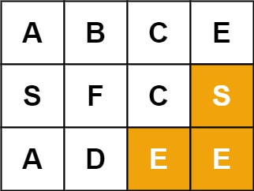
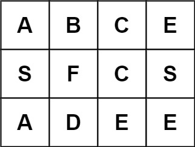

# [Word Search](https://leetcode.com/problems/word-search/)

**Medium** | **30 minutes** | **Array, Backtracking, Matrix**

**Pattern:** [Graph Traversal](../patterns/graph/intuition.md), [Backtracking](../patterns/backtracking_exploration/intuition.md)

**Algorithm:** [Backtracking](https://en.wikipedia.org/wiki/Backtracking) · [Depth-first search](https://en.wikipedia.org/wiki/Depth-first_search)

**Practice:** [`practice/word_search/solution.py`](../../practice/word_search/solution.py)

Given an `m x n` grid of characters `board` and a string `word`, return `true` if `word` exists in the grid.

The word can be constructed from letters of sequentially adjacent cells, where adjacent cells are horizontally or vertically neighboring. The same letter cell may not be used more than once.

## Examples

### Example 1


**Input:** `board = [["A","B","C","E"],["S","F","C","S"],["A","D","E","E"]]`, `word = "ABCCED"`

**Output:** `true`

### Example 2



**Input:** `board = [["A","B","C","E"],["S","F","C","S"],["A","D","E","E"]]`, `word = "SEE"`

**Output:** `true`

### Example 3



**Input:** `board = [["A","B","C","E"],["S","F","C","S"],["A","D","E","E"]]`, `word = "ABCB"`

**Output:** `false`

## Constraints

- `m == board.length`
- `n = board[i].length`
- `1 <= m, n <= 6`
- `1 <= word.length <= 15`
- `board` and `word` consists of only lowercase and uppercase English letters.

## Follow-up

Could you use search pruning to make your solution faster with a larger `board`?

## Deriving the Solution

A placement of `word` in the grid is a self-avoiding walk: a path through
horizontally or vertically adjacent cells that never revisits a cell. Every
solution below explores those walks with the same depth-first search, extending a
partial match one neighbor at a time and undoing each choice when a branch fails.

1. **Start literal.** From every cell, try to match `word` letter by letter
   through the four neighbors, marking each cell on the current path so it cannot
   be reused and unmarking it on the way back. Overwriting the cell in place with
   a sentinel character makes the mark free: `O(m × n × 4^L)` in the worst case:
   see [DFS Backtracking](#dfs-backtracking).
2. **Keep the board intact.** Overwriting cells mid-search mutates the input,
   which is unacceptable when the board is read-only or shared. Tracking the
   current path in an explicit set of coordinates is the identical search without
   touching the data: see [DFS with Visited Set](#dfs-with-visited-set).
3. **Prune before searching.** The worst case stays exponential, and the
   follow-up asks about larger boards. Two cheap checks skip doomed work: reject
   the word outright when the board lacks enough copies of some letter, and
   search from the word's rarer end so failing paths die early: see
   [DFS with Frequency Pruning](#dfs-with-frequency-pruning).

## Solutions

### DFS Backtracking

#### Derivation

Each path that spells `word` is a self-avoiding walk through the grid, so we
explore those walks with [depth-first search](https://en.wikipedia.org/wiki/Depth-first_search) and undo our choices on the way back
up (backtracking). The index `i` tracks how many characters of `word` we have
matched so far along the current path.

1. From every cell, launch a DFS that tries to match `word[i]` at the current
   cell.
2. If `i` has reached `len(word)`, every character matched and we return `True`.
3. If the cell is off the board or its letter is not `word[i]`, this path fails.
4. Otherwise, temporarily overwrite the cell with a sentinel (`"#"`) so it cannot
   be reused later on the same path, then recurse into the four neighbors for
   `word[i + 1]`.
5. Restore the original letter before returning so sibling and ancestor searches
   can use that cell freely. This restoration is the backtracking step.

Overwriting the cell in place serves as an O(1) visited marker that is scoped to
the current path, which is exactly what "the same letter cell may not be used
more than once" requires.

#### Walkthrough

Let us trace the search on Example 1: `board = [["A","B","C","E"],["S","F","C","S"],["A","D","E","E"]]`
and `word = "ABCCED"` (rows are indexed `0-2` top to bottom, columns `0-3` left
to right). Drawn once, the board is:

```text
    c0  c1  c2  c3
r0   A   B   C   E
r1   S   F   C   S
r2   A   D   E   E
```

The outer loops try every starting cell, but the very first one,
`(0, 0)`, holds an `"A"` that matches `word[0]`, so the winning path begins there.

The successful walk threads through the grid one matched letter at a time. Each
matched cell is overwritten with `"#"` so it cannot be reused on this path:

| Step `i` | Need `word[i]` | Cell `(r, c)` | Letter | Action |
|----------|----------------|---------------|--------|--------|
| 0 | `A` | `(0, 0)` | `A` | match, mark `(0,0)` as `#` |
| 1 | `B` | `(0, 1)` | `B` | match, mark `(0,1)` as `#` |
| 2 | `C` | `(0, 2)` | `C` | match, mark `(0,2)` as `#` |
| 3 | `C` | `(1, 2)` | `C` | match, mark `(1,2)` as `#` |
| 4 | `E` | `(2, 2)` | `E` | match, mark `(2,2)` as `#` |
| 5 | `D` | `(2, 1)` | `D` | match, mark `(2,1)` as `#` |
| 6 | (end) | `(3, 1)` | (off board) | `i == len(word)` reached: return `True` |

The search does not glide straight there. At each cell it tries the four
neighbors in order (down, up, right, left) and abandons branches that do not
match. For instance, from `(0, 0)` matching `A`, it first tries down to `(1, 0)`,
finds `S != B`, fails, then tries up `(-1, 0)` (out of bounds), before turning
right to `(0, 1)` where `B` matches. The same dead-end-then-recover pattern
plays out at `(2, 2)` matching `E`: down `(3, 2)` is off the board, up `(1, 2)`
is now a `#`, right `(2, 3)` holds `E != D`, and only left `(2, 1)` yields the
final `D`.

Once `(2, 1)` is matched, the recursion calls `dfs` for `i = 6`, which equals
`len(word)`, so it returns `True`. That `True` propagates back up through every
frame: each cell restores its saved letter as it returns (backtracking), but
because the answer is already `True`, the outer loop short-circuits and the
function returns `True`, matching the expected Output for Example 1.

#### Solution

The code is the walkthrough's search written down: base cases, sentinel mark,
four-neighbor fork, restore.

```python
from typing import List


class Solution:
    def exist(self, board: List[List[str]], word: str) -> bool:
        rows, cols = len(board), len(board[0])

        def dfs(r: int, c: int, i: int) -> bool:
            # Matched every character: the word exists.
            if i == len(word):
                return True
            # Out of bounds or the cell does not match the needed letter.
            if (r < 0 or r >= rows or c < 0 or c >= cols or
                    board[r][c] != word[i]):
                return False

            # Mark this cell used so the same letter is not reused on this path.
            saved = board[r][c]
            board[r][c] = "#"

            found = (dfs(r + 1, c, i + 1) or
                     dfs(r - 1, c, i + 1) or
                     dfs(r, c + 1, i + 1) or
                     dfs(r, c - 1, i + 1))

            # Restore the cell for other search paths (backtrack).
            board[r][c] = saved
            return found

        # Try starting the search from every cell.
        for r in range(rows):
            for c in range(cols):
                if dfs(r, c, 0):
                    return True
        return False
```

#### Time and Space Complexity Analysis

##### Time Complexity: `O(m × n × 4^L)`

Let `L` be the length of `word`. Each of the `m × n` starting cells can branch
into up to four directions at every step, and a path has up to `L` steps. The
first step has four choices and each subsequent step has at most three (we never
walk straight back), so the bound is `O(m × n × 4^L)`. The matching-letter check
prunes most branches in practice, but this is the worst case.

##### Space Complexity: `O(L)`

The recursion depth is bounded by the word length, since each frame matches one
additional character. We mutate the board in place rather than allocating a
separate visited matrix, so no extra grid-sized storage is used.

#### Key Insights

- Mutating the cell to a sentinel and restoring it gives a per-path visited mark
  in O(1) space, avoiding a separate boolean grid.
- The letter-match check at the top of `dfs` prunes aggressively: a branch dies
  the moment a cell does not match the next required character.
- Restoring `board[r][c]` before returning is essential; skipping it would leak
  the `"#"` marker into other search paths and produce wrong answers.
- Checking `i == len(word)` before the bounds check lets the final character
  match succeed even when it sits on the board edge.
- For the follow-up, search pruning (for example, counting letter frequencies in
  the board versus the word, or reversing the word to start from the rarer end)
  cuts wasted exploration on larger boards.

### DFS with Visited Set

#### Derivation

The sentinel trick works, but it mutates the board mid-search, which is the wrong
move when the input must not be modified, even temporarily: a shared, read-only,
or concurrently accessed grid rules it out. The search itself does not care how
"used on this path" is represented, so keep the same depth-first
[backtracking](https://en.wikipedia.org/wiki/Backtracking) and move the marker
out of the data: an explicit `set` of `(row, col)` coordinates named `visited`
records the cells on the current path, and a membership check replaces the
sentinel comparison:

1. From every cell, launch a DFS that tries to match `word[i]` at the current
   cell.
2. If `i` has reached `len(word)`, every character matched and we return `True`.
3. If the cell is off the board, already in `visited`, or its letter is not
   `word[i]`, this path fails.
4. Otherwise, add `(r, c)` to `visited`, recurse into the four neighbors for
   `word[i + 1]`, and remove `(r, c)` on the way back up.

The `set` membership check replaces the sentinel overwrite as the "used on this
path" test, so the board is never altered.

#### Walkthrough

Let us trace the search on Example 2: the same board with `word = "SEE"`,
expected Output `true`. Drawn once, the board is:

```text
    c0  c1  c2  c3
r0   A   B   C   E
r1   S   F   C   S
r2   A   D   E   E
```

The outer loop scans cells in row order. All of row `0` fails instantly (`A`,
`B`, `C`, `E`, none is `S`), so the first real start is `(1, 0)`. Neighbors are
tried in the code's order: down, up, right, left:

```text
dfs(1,0,0)   'S' matches word[0]      visited = {(1,0)}
  dfs(2,0,1)  'A' != 'E'              fail
  dfs(0,0,1)  'A' != 'E'              fail
  dfs(1,1,1)  'F' != 'E'              fail
  dfs(1,-1,1) off board               fail
  remove (1,0) -> False               dead end: no neighboring 'E'
dfs(1,1,0), dfs(1,2,0)                'F' and 'C' are not 'S': fail at once
dfs(1,3,0)   'S' matches word[0]      visited = {(1,3)}
  dfs(2,3,1)  'E' matches word[1]     visited = {(1,3), (2,3)}
    dfs(3,3,2)  off board             fail
    dfs(1,3,2)  in visited            fail: the path may not revisit (1,3)
    dfs(2,4,2)  off board             fail
    dfs(2,2,2)  'E' matches word[2]   visited = {(1,3), (2,3), (2,2)}
      dfs(3,2,3) -> True              i == len(word): every letter matched
      remove (2,2) -> True
    remove (2,3) -> True
  remove (1,3) -> True
```

The winning walk is `S(1,3) -> E(2,3) -> E(2,2)`, which spells `SEE`. Note the
`in visited` line: stepping back up to `(1, 3)` is rejected by the set membership
test, which is the self-avoidance rule in action. Each frame removes its
coordinate before returning, on the success path too, so `visited` is empty again
when the `True` reaches the outer loop and the function returns `True`, matching
the expected Output for Example 2.

#### Solution

The code is the walkthrough's search with `visited.add` and `visited.remove`
bracketing the four-neighbor fork.

```python
from typing import List


class Solution:
    def exist(self, board: List[List[str]], word: str) -> bool:
        rows, cols = len(board), len(board[0])
        visited = set()

        def dfs(r: int, c: int, i: int) -> bool:
            # Matched every character: the word exists.
            if i == len(word):
                return True
            # Out of bounds, already on this path, or wrong letter.
            if (r < 0 or r >= rows or c < 0 or c >= cols or
                    (r, c) in visited or board[r][c] != word[i]):
                return False

            # Record the cell as used for the current path.
            visited.add((r, c))

            found = (dfs(r + 1, c, i + 1) or
                     dfs(r - 1, c, i + 1) or
                     dfs(r, c + 1, i + 1) or
                     dfs(r, c - 1, i + 1))

            # Release the cell so other paths may use it (backtrack).
            visited.remove((r, c))
            return found

        for r in range(rows):
            for c in range(cols):
                if dfs(r, c, 0):
                    return True
        return False
```

#### Time and Space Complexity Analysis

##### Time Complexity: `O(m × n × 4^L)`

Identical to the in-place variant. Each of the `m × n` starting cells branches
into up to four directions per step over a path of up to `L` steps, giving
`O(m × n × 4^L)` in the worst case before letter-mismatch pruning trims branches.

##### Space Complexity: `O(L)`

The recursion stack is bounded by `L`, and the `visited` set holds at most `L`
coordinates at once because entries are removed on backtrack. This is a constant
factor more memory than the in-place approach but the same asymptotic bound.

#### Key Insights

- A separate `visited` set keeps the input immutable, which matters when the
  board is shared, read-only, or accessed concurrently.
- Adding and removing the coordinate must bracket the recursive calls exactly,
  mirroring the choose/unchoose structure of backtracking.
- The set never exceeds `L` entries, so the extra space is proportional to the
  word length, not the board size.

### DFS with Frequency Pruning

#### Derivation

Both searches above still face an exponential worst case, and the follow-up asks
what helps on a larger board. This solution answers it by adding two cheap prunes
around the same in-place DFS. Neither prune changes the set of reachable answers;
they only avoid work the plain search would eventually waste:

1. Build a letter-frequency table of the board (`board_counts`) and of `word`
   (`word_counts`). If the board lacks enough copies of any required letter, no
   path can exist, so return `False` immediately without any DFS.
2. Compare how often `word`'s first and last letters appear in `word` itself, and
   reverse `word` when the last letter is rarer. Anchoring the search on the end
   whose letter repeats less within the word makes early mismatches likelier, so
   doomed paths die near the top of the search tree where branching is most
   expensive. A stronger standard variant compares the two end letters'
   frequencies in the board instead, which directly reduces how many cells
   qualify as starting points.
3. Run the in-place sentinel DFS exactly as before.

The [`Counter`](https://docs.python.org/3/library/collections.html#collections.Counter) here only powers an optional precheck and the symmetric reversal
decision; the core search is hand-written, so the algorithm does not depend on a
library to do its real work.

#### Walkthrough

The first prune fires on an official input: Example 3, the same board with
`word = "ABCB"`, expected Output `false`. Counting letters by hand over the
board's twelve cells and over `word`:

```text
board_counts = {A:2, B:1, C:2, E:3, S:2, F:1, D:1}
word_counts  = {A:1, B:2, C:1}                       word = "ABCB"
check A: need 1, board has 2    ok
check B: need 2, board has 1    -> return False      no DFS runs at all
```

The word needs two `B`s but the board holds only one, so the precheck settles in
`O(m × n + L)` time what the plain DFS discovers only after exploring and
rejecting paths: the answer `false`, matching the expected Output for Example 3.

No official Example triggers the reversal: in `"ABCCED"` the first and last
letters each occur once in the word, and in `"SEE"` the last letter is the more
frequent one. To show the mechanism we use the tailored word `"EES"` on the same
board (Example 2's word reversed, so its answer must also be `true`):

```text
word = "EES"     word_counts = {E:2, S:1}
precheck: E need 2 (board 3), S need 1 (board 2)     both ok
word_counts['S'] = 1 < word_counts['E'] = 2          -> reverse: word = "SEE"
dfs(1,0,0)   'S' matches, but no neighbor holds 'E'  dead end, restore
dfs(1,3,0)   'S' = word[0], mark board[1][3] = '#'
  dfs(2,3,1)   'E' = word[1], mark board[2][3] = '#'
    down (3,3) off board; up (1,3) is '#'; right (2,4) off board
    dfs(2,2,2)   'E' = word[2], mark board[2][2] = '#'
      dfs(3,2,3) -> True             i == len(word)
    restore board[2][2] = 'E' -> True
  restore board[2][3] = 'E' -> True
restore board[1][3] = 'S' -> True
```

Instead of hunting for the word's frequent `E`s first, the reversed search
anchors on the single `S` and finds the walk `S(1,3) -> E(2,3) -> E(2,2)`. A walk
that spells `"SEE"` forward spells `"EES"` backward, so the reversal preserves
the answer and the function returns `True`.

#### Solution

The code is the two prunes from the walkthrough stacked in front of the sentinel
DFS from the first solution.

```python
from collections import Counter
from typing import List


class Solution:
    def exist(self, board: List[List[str]], word: str) -> bool:
        rows, cols = len(board), len(board[0])

        # Fast fail: the board must contain enough of every letter in word.
        board_counts = Counter(ch for row in board for ch in row)
        word_counts = Counter(word)
        for ch, need in word_counts.items():
            if board_counts[ch] < need:
                return False

        # Start from the end whose letter repeats less within the word,
        # so failing paths tend to mismatch sooner.
        if word_counts[word[-1]] < word_counts[word[0]]:
            word = word[::-1]

        def dfs(r: int, c: int, i: int) -> bool:
            if i == len(word):
                return True
            if (r < 0 or r >= rows or c < 0 or c >= cols or
                    board[r][c] != word[i]):
                return False

            saved = board[r][c]
            board[r][c] = "#"

            found = (dfs(r + 1, c, i + 1) or
                     dfs(r - 1, c, i + 1) or
                     dfs(r, c + 1, i + 1) or
                     dfs(r, c - 1, i + 1))

            board[r][c] = saved
            return found

        for r in range(rows):
            for c in range(cols):
                if dfs(r, c, 0):
                    return True
        return False
```

#### Time and Space Complexity Analysis

##### Time Complexity: `O(m × n × 4^L)`

The worst-case bound is unchanged because the prunes can fail to eliminate
anything (for example, a uniform board). The frequency precheck costs
`O(m × n + L)`, which is dominated by the search. In practice the prunes can turn
a near-timeout into an instant answer on adversarial inputs.

##### Space Complexity: `O(L + Σ)`

Recursion depth is `O(L)` as before. The two counters add `O(Σ)` space, where `Σ`
is the alphabet size (at most 52 here), so the extra storage is effectively
constant.

#### Key Insights

- The letter-count precheck rejects impossible words in linear time before any
  recursion, which is the cheapest possible prune.
- Starting from the end whose letter is rarer within the word makes early
  mismatches likelier, a classic backtracking optimization for symmetric search;
  comparing the end letters' board frequencies instead is the stronger variant.
- The prunes are heuristics layered on top of the base algorithm: they speed up
  common adversarial cases without affecting correctness or the worst-case bound.

## Comparison of Solutions

### Time Complexity

- **DFS Backtracking**: `O(m × n × 4^L)` - up to four branches per step over an
  `L`-length path from each of `m × n` starts.
- **DFS with Visited Set**: `O(m × n × 4^L)` - same search tree, with a set
  lookup replacing the sentinel check.
- **DFS with Frequency Pruning**: `O(m × n × 4^L)` - same worst case, with prunes
  that often help in practice.

### Space Complexity

- **DFS Backtracking**: `O(L)` - recursion depth only; the board doubles as the
  visited marker.
- **DFS with Visited Set**: `O(L)` - recursion depth plus a set of at most `L`
  coordinates.
- **DFS with Frequency Pruning**: `O(L + Σ)` - recursion depth plus two
  fixed-alphabet counters.

### Trade-offs

- **DFS Backtracking** uses the least memory but mutates the board mid-search
  (restoring it before returning), which is unacceptable if the input is
  read-only or shared.
- **DFS with Visited Set** leaves the input untouched at the cost of a small
  auxiliary set and slightly slower membership checks.
- **DFS with Frequency Pruning** adds setup cost and code for a large speedup on
  adversarial boards, without improving the asymptotic bound.

### When to Use Each

- **DFS Backtracking**: The default interview answer when mutating the board
  temporarily is allowed.
- **DFS with Visited Set**: When the board must stay immutable, or when separating
  state from data makes the code clearer.
- **DFS with Frequency Pruning**: The follow-up answer for larger boards or when
  many queries run against the same grid (Recommended when inputs are
  adversarial).

### Optimization Notes

- The sentinel `"#"` works only because it is guaranteed not to appear in `word`;
  for arbitrary alphabets, prefer the visited set.
- Checking `i == len(word)` before the bounds check lets a final character on the
  board edge match correctly.
- The frequency precheck and rarer-end reversal are independent prunes; either can
  be applied alone, and both leave correctness intact.
