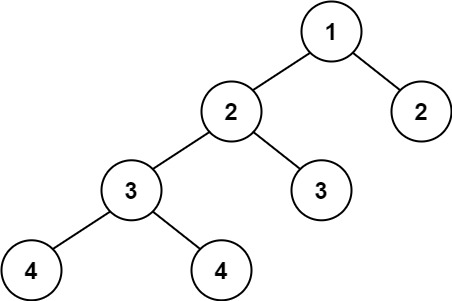

# [Balanced Binary Tree](https://leetcode.com/problems/balanced-binary-tree/)

Easy - 20 minutes - Tree, DFS, Binary Tree

Given a binary tree, determine if it is height-balanced.

A height-balanced binary tree is defined as a binary tree in which the left and right subtrees of every node differ in height by no more than `1`.

## Examples

### Example 1

**Input:** `root = [3,9,20,null,null,15,7]`

**Output:** `true`

### Example 2

**Input:** root = `[1,2,2,3,3,null,null,4,4]`

**Output:** `false`

### Example 3

**Input:** `root = []`

**Output:** `true`

## Constraints

- The number of nodes in the tree is in the range `[0, 5000]`.
- `-10^4 <= Node.val <= 10^4`

## Solutions
