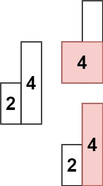

# [Largest Rectangle in Histogram](https://leetcode.com/problems/largest-rectangle-in-histogram/)

**Hard** | **60 minutes** | **Array, Stack, Monotonic Stack**

Given an array of integers `heights` representing the histogram's bar height where the width of each bar is `1`, return the area of the largest rectangle in the histogram.

## Examples

### Example 1


**Input:** `heights = [2,1,5,6,2,3]`

**Output:** `10`

**Explanation:** The above is a histogram where width of each bar is `1`.
The largest rectangle is shown in the red area, which has an area = `10` units.

### Example 2



**Input:** `heights = [2,4]`

**Output:** `4`

## Constraints

- `1 <= heights.length <= 10^5`
- `0 <= heights[i] <= 10^4`

## Solutions

```python
class Solution(object):
    def largestRectangleArea(self, heights):
        """
        :type heights: List[int]
        :rtype: int
        """
        pass
```

