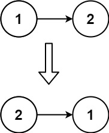

# [Reverse Linked List](https://leetcode.com/problems/reverse-linked-list/)

Easy - 15 minutes - Linked List, Recursion

Given the `head` of a singly linked list, reverse the list, and return the reversed list.

## Examples

### Example 1

**Input:** `head = [1,2,3,4,5]`

**Output:** `[5,4,3,2,1]`

### Example 2

**Input:** `head = [1,2]`

**Output:** `[2,1]`

### Example 3

**Input:** `head = []`

**Output:** `[]`

## Constraints

- The number of nodes in the list is the range `[0, 5000]`.
- `-5000 <= Node.val <= 5000`

## Solutions
